# Architecture

This document describes the internal structure, dependency rules, and runtime data flows of `iam-audit-log`.

`iam-audit-log` is a **private Go service** (`github.com/BCBP-SOLUTIONS-FZC-LLC/iam-audit-log`, Go 1.26.6) deployed as a containerised microservice (3 replicas by default; HPA 3–6, CPU 70% / memory 80%, off by default in `deploy/helm/values.yaml`). It refines the IAM HLD (`iam-hld-tender-saas-v1.41.md`, header version 1.47) through the LLD at `docs/lld/iam-lld-audit-log-service.md` (**rev 0.26**; where LLD and HLD disagree, HLD is authoritative, and every deviation this build took is recorded in `docs/implementation/BUILD_PLAN.md` §C as a decision `D-n` or `gap n`). It is the platform's **compliance system of record**: a single append-only, tenant-scoped store answering *who did what, to what, when and from where* across every IAM and domain service. It is a **pure sink**: it consumes 11 SNS→SQS queues and a mesh-only direct-write API, and **publishes nothing** (AL-INV-10). It ships as **two binaries from one image**: `cmd/server` (the query/export and ingest HTTP API, the 11-queue platform-events consumer fleet, and four background workers: the CAT-I2 plan poller, the export worker, the ops-gauge monitor and the consumer fleet itself) and `cmd/reconciler` (a single binary dispatched by `--job=<name>`, covering 4 CronJobs: `reconcile`, `redaction-retry`, `redaction-sweep`, `processed-events-prune`).

All eight build phases (LLD §19) are implemented. Phases 0–8 are committed as `13c96bd`, `9d62133`, `612ccd6`, `c96ad3c` and `b64f932`. The platform-library confinement and the Enterprise Platform Observability Standard alignment (gaps 43–46) sit on top of them; see `CHANGELOG.md` and `git log`.

**Does not own:** the audited business state itself; every producer owns its own tables and publishes through its own platform-events outbox. It does not own identity or credentials (Keycloak / Realm Provisioner), the plan catalogue and `audit_query_window_days` (Catalog / Admin Config — read here over CAT-I2 only), tenant lifecycle (Realm Provisioner / Org & Membership, observed here as events), GDPR erasure orchestration (User Profile emits the per-user `UserDeleted` fan-out; this service only redacts its own `security_3y` rows), the SNS topics (producers), or the S3 bucket and KMS key policy, Object Lock defaults and lifecycle rules (infrastructure; see `docs/implementation/RELEASE_CHECKLIST.md`).

---

## Layer model

The service is organised in concentric Clean Architecture layers. Inner layers have **zero knowledge** of outer layers; dependencies always point inward.

> Source: [`docs/architecture/mermaid/layer-model.mmd`](docs/architecture/mermaid/layer-model.mmd)

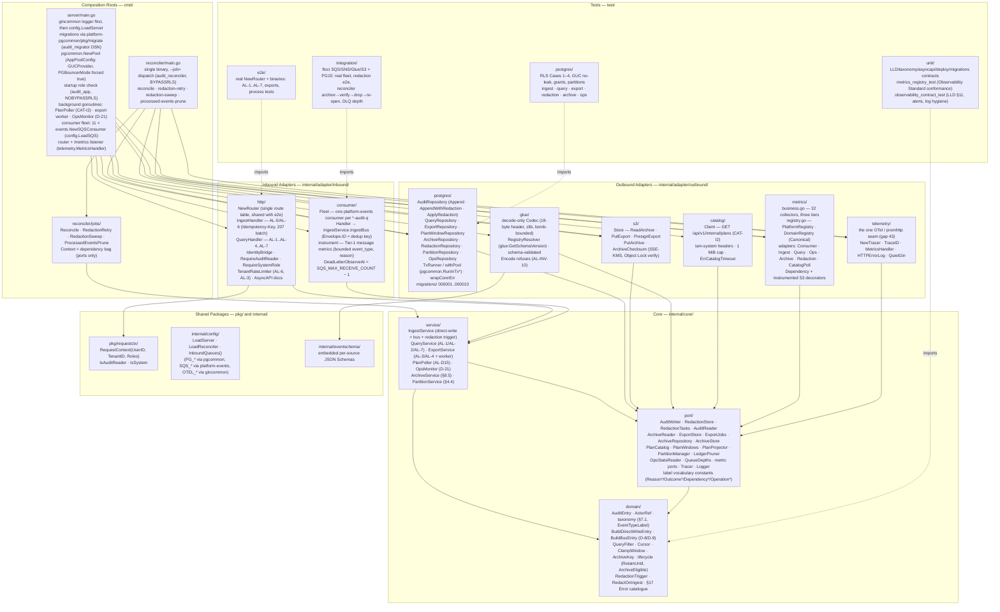

**Rule:** `domain` ← `port` ← `service` ← `adapter` ← `cmd`. `core/domain` imports nothing outside the standard library, and `core/port` imports `core/domain` only, with **no vendor at all**. The trace-id helper that used to import `otel/trace` is now injected from the telemetry adapter (`port.TraceIDFunc`, gap 43, which retired the gap-21 exception). `core/service` imports `domain` and `port` only. Adapters implement ports and never import each other: S3 timing, for example, is added by decorators in `outbound/metrics` that wrap `port` interfaces, not by the S3 adapter importing metrics. Only the composition roots (`cmd/server`, `cmd/reconciler`) meet adapters. This is enforced in CI by `go-arch-lint` (`.go-arch-lint.yml`, `depOnAnyVendor: false`, `deepScan: false`) and by `.github/scripts/arch-lint.sh`:
- **database invariant:** only pgx-via-pgcommon; no raw pool, connection, Begin or Acquire; no `pgconn.PgError` classification in production; no hand-built `pgcommon.Config`; no `PG_*` reads (gap 44);
- **AWS SDK transport confinement:** SQS only in `cmd/server/main.go`, for the DLQ-depth gauge only; S3 only in `outbound/s3` and the roots; Glue only in `outbound/glue` and `cmd/server`;
- **DB-role confinement:** each root binds only its own role (rule 5);
- the transaction-local GUC rule.

`check-observability-confinement.sh` adds the logging, metrics and tracing rule (gap 43): only `internal/adapter/outbound/telemetry` may import OpenTelemetry or `promhttp`.

---

## Package dependency graph

Arrows represent Go `import` relationships (module-internal only). The graph mirrors `.go-arch-lint.yml` component by component.

> Source: [`docs/architecture/mermaid/package-dependencies.mmd`](docs/architecture/mermaid/package-dependencies.mmd)

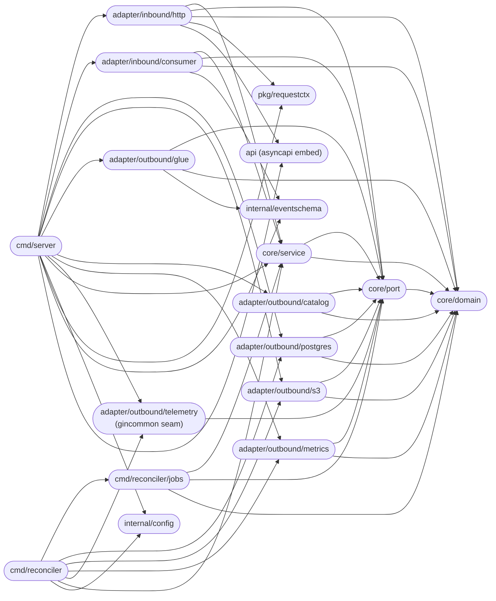

`core/domain`, `internal/config`, `internal/eventschema` and `api` (`apispec`, embedding `api/asyncapi.yaml`) are leaves: they are omitted from the `deps` map, so they may depend on nothing in the project. `pkg/requestctx` is a leaf with `anyVendorDeps: true`. `telemetry` may depend on `port` only; it is the single seam onto gincommon's tracer provider and metrics registry. `cmd/reconciler/jobs` depends on `domain`, `port` and `service`, and receives adapters through its `jobs.Context` dependency bag. `test/`, `scripts/`, `deploy/` and `docs/` are excluded from the linter's scope (`exclude: [test, scripts, deploy, docs]`), and `_test.go` files are excluded too, so test harnesses importing adapters are not part of the checked graph.

---

## Request flow

Every HTTP request passes through the full middleware stack before reaching a handler. The public query API sits behind gateway-injected identity headers (`x-user-id` / `x-tenant-id` / `x-tenant-roles`); the service never parses a JWT. `/api/v1/internal/*` additionally requires the `iam-system` role and is reachable only over the mesh (the gateway does not route it; `TestHelm_IngressExposesOnlyPublicAuditAPI`).

> Source: [`docs/architecture/mermaid/request-flow.mmd`](docs/architecture/mermaid/request-flow.mmd)

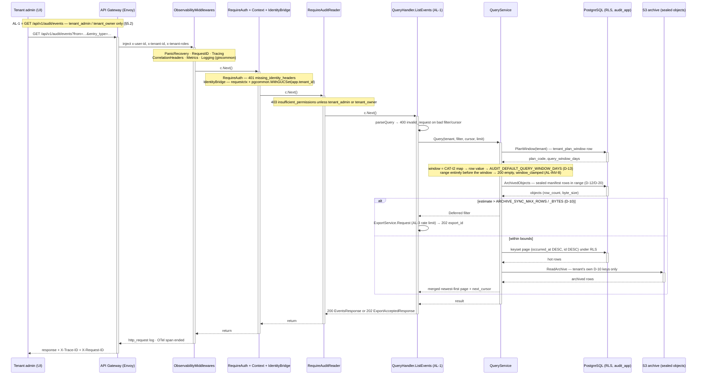

**Middleware execution model.** The router (`internal/adapter/inbound/http/router.go`, `NewRouter`) is the single source of truth for every path, method and middleware. `cmd/server/main.go` and the e2e harness share it, so the two can never drift:

```
8 MiB body cap (inline MaxBytesReader)
  gincommon.TimeoutMiddleware(30s)
    gincommon.ObservabilityMiddlewares (PanicRecovery · RequestID · Tracing · CorrelationHeaders · Metrics · Logging)
      [/api/v1/audit group]    gincommon.ProtectedMiddlewares (RequireAuth · Context)
                               IdentityBridgeMiddleware          — requestctx + pgcommon.WithGUCSet (AL-INV-3)
                               RequireJSONContentType            — 400 on a non-JSON POST body
                               RequireAuditReader                — 403 insufficient_permissions (tenant_admin | tenant_owner)
                                 AL-1 GET /events · AL-2 GET /events/:id · AL-3 POST /exports (rate-limited in handler) · AL-4 GET /exports/:id
      [/api/v1/internal group] gincommon.ProtectedMiddlewares · IdentityBridge · RequireJSONContentType
                               RequireSystemRole                 — 403 forbidden_peer unless iam-system
                                 AL-5 POST /audit-entries          (RequireIdempotencyKey)
                                 AL-6 POST /audit-entries:batch    (RequireIdempotencyKey · TenantRateLimiter → 429)
                                 AL-7 GET  /audit/events           (explicit tenant_id, no plan clamp; 422 range_too_large)
```

`/healthz`, `/readyz` (`registerInfraRoutes`) and the AsyncAPI docs (`registerDocsRoutes`, gated by `DocsConfig.active()`) are registered **before** this chain, so a probe with no headers still gets `200`. `/healthz` is pure liveness and never inspects a dependency. `/readyz` runs its checks concurrently (the consumer fleet's liveness and `pool.Health` on the `audit_app` pool) and returns `503` on any failure. `/metrics` is **not** on this router: it is served on the separate `METRICS_PORT` listener by `telemetry.MetricsHandler`, which exposes exactly gincommon's registry. `net/http`'s own error lines go to the gincommon logger (`telemetry.HTTPErrorLog`), and gin itself writes nothing (`telemetry.QuietGin`).

---

## Write flow and processed-message ledger

Every audit row, whether consumed from the bus or written through AL-5/AL-6, is persisted by the **same** `AuditRepository.Append` (AL-INV-2), inside **one** `pgcommon.RunInTx` bound to the *entry's* tenant (so `WITH CHECK` forbids cross-tenant forgery). The dedup ledger insert, the D-18 erased-subject check, the row insert with its unique backstop and, for `UserDeleted`, the redaction task all commit together. There is **no outbox**: nothing is ever published (AL-INV-10), so there is no second write to keep atomic with the first.

> Source: [`docs/architecture/mermaid/write-flow.mmd`](docs/architecture/mermaid/write-flow.mmd)

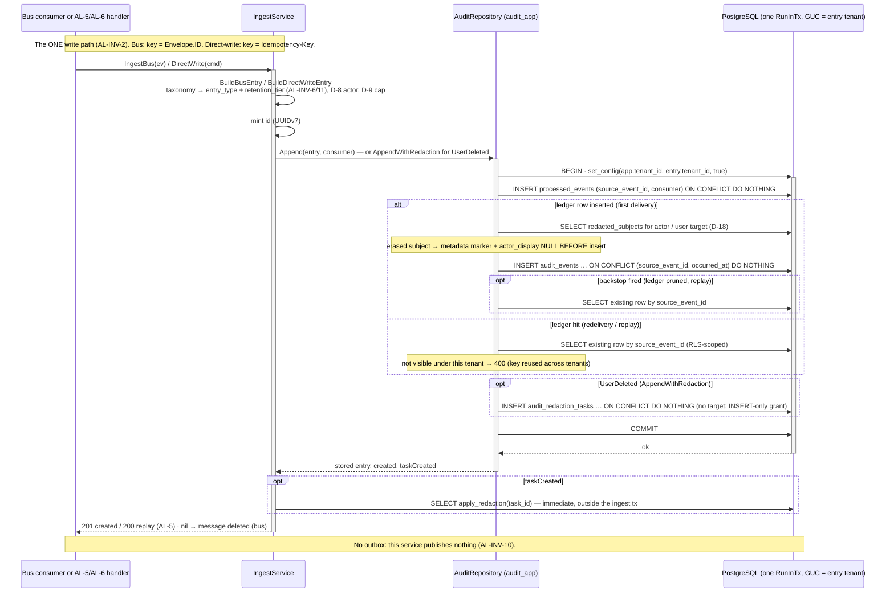

Metadata and `filter` are bound as `string`, never `[]byte`. The app pool runs in PgBouncer mode, and pgx would hex-encode a `[]byte` as bytea, which a `jsonb` column rejects (gap 28). A unique violation on a partition names the partition's own index, so error mapping keys on SQLSTATE 23505 plus that suffix (gap 27). The redaction-task insert uses a **target-less** `ON CONFLICT DO NOTHING`, because a conflict target or `RETURNING` needs SELECT, which `audit_app` does not hold (gap 35). AL-6 is always `207` with per-index results (D-4), and its entries are accepted only for the direct-write `entry_type`s (D-6).

---

## Archival flow

The reconciler's `reconcile` job (daily, `0 2 * * *`) keeps partitions ahead of need and moves every month past the hot window to S3. It then drops the month **only** through the database-side AL-INV-9 gate. The drop is provable: both retained tiers are verified, the live counts equal the unsealed manifest, and no pending redaction task touches the partition, all checked under an exclusive lock.

> Source: [`docs/architecture/mermaid/archival-flow.mmd`](docs/architecture/mermaid/archival-flow.mmd)

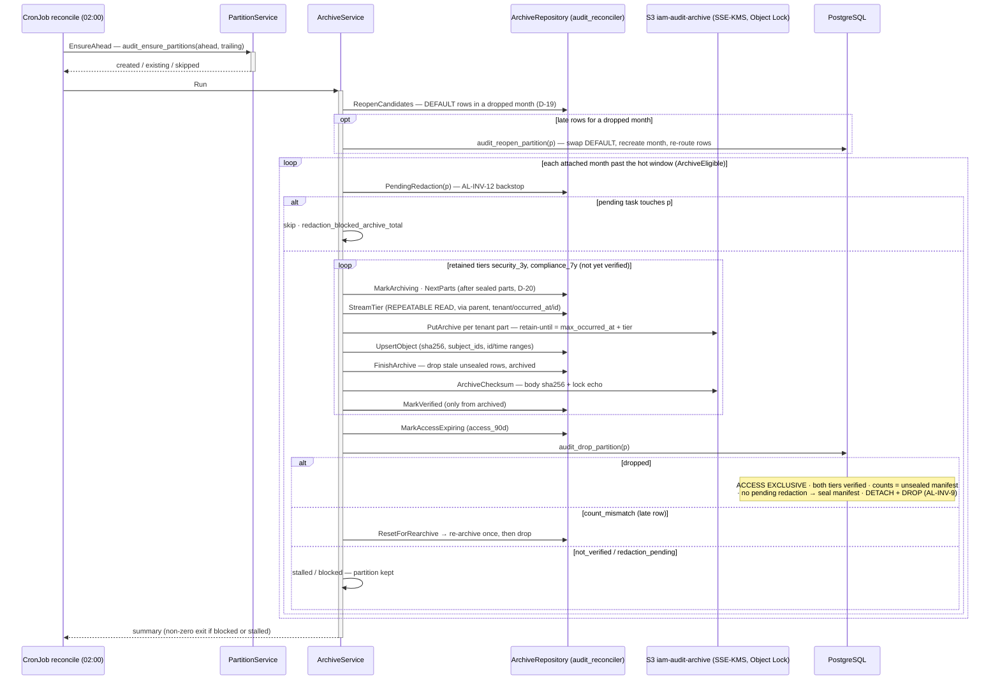

> Source: [`docs/architecture/mermaid/archive-state-machine.mmd`](docs/architecture/mermaid/archive-state-machine.mmd)

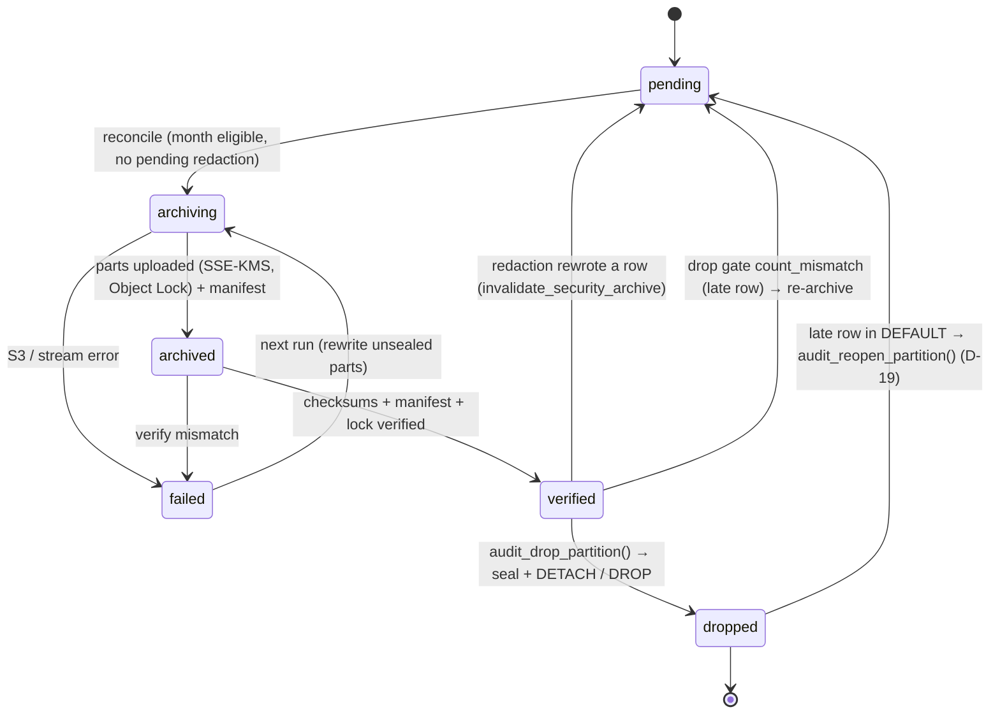

**D-19 (re-open).** A late row for a month that was already dropped lands in `audit_events_default`. `audit_reopen_partition()` detaches DEFAULT, recreates the month, re-routes the rows through the parent (no row is UPDATEd or DELETEd), and resets the tiers to `pending`. DEFAULT rows for a month that was never dropped, such as a bad clock, stay with RB-3.

**D-20 (seal).** `audit_archive_objects.sealed` is set at drop, when the object's rows exist only in S3. Sealed objects are never rewritten; a re-archive rewrites only unsealed parts as new object versions, and a re-opened month appends parts after its sealed ones. Archived reads, AL-2 and redaction's `missed` check all route on `sealed`, which refines D-12's "partition existence" boundary so that a re-opened month never hides its S3-only rows.

**Stale-PII guard.** `apply_redaction()` and `sweep_redactions()` call `invalidate_security_archive()` for every partition whose rows they rewrote. An object uploaded before a redaction can therefore never be sealed.

**Object keys (D-10).** `{tier}/{tenant}/{yyyy}/{mm}/audit_events_{yyyy}_{mm}-part-NNNN.jsonl.gz`. Object Lock retain-until is `max_occurred_at` plus the tier's compiled duration. The reconciler reads partitions **through the parent**, bounded to the month, because grants on `audit_events` do not extend to naming a partition (gap 39).

---

## GDPR redaction touchpoints

Redaction is the one exception to append-only. It never touches `compliance_7y` (AL-INV-7), never deletes, and runs while rows are still hot (AL-INV-12).

> Source: [`docs/architecture/mermaid/redaction-flow.mmd`](docs/architecture/mermaid/redaction-flow.mmd)

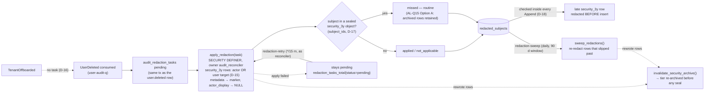

- **Immediate (D-1).** After the `UserDeleted` ingest commits, `cmd/server` (as `audit_app`) calls `apply_redaction(task_id)`, a SECURITY DEFINER **owned by `audit_reconciler`**. The `audit_events` trigger's `current_user` check therefore passes, while `audit_app` itself still has no UPDATE. `audit_reconciler`'s UPDATE is **column-level** (`metadata`, `actor_display`).
- **Scope (D-15).** `security_3y` rows where the subject is the actor **or** the user target. `metadata` becomes `{"_redacted":true,"_redaction_task_id":…,"_redacted_at":…}` (one SQL definition, `redaction_marker()`), and `actor_display` is cleared on the subject's own rows. Ids are kept.
- **Retry.** `redaction-retry` (`*/15 * * * *`) re-applies tasks pending ≥ `REDACTION_RETRY_MIN_AGE`.
- **Late arrivals (D-18).** Every finished task records the subject in RLS-scoped `redacted_subjects`. `Append` checks it inside the insert transaction and redacts a late `security_3y` row *before* insert. `redaction-sweep` (`30 3 * * *`, `REDACTION_SWEEP_WINDOW` 90 d) re-checks as defense in depth.
- **Missed (D-17, AL-Q15 Option A).** If the subject appears in any sealed `security_3y` object (`subject_ids`), the task is `missed`: the hot rows are redacted and the archived rows are retained under Object Lock. For long-lived users this is the **routine** outcome and is not alarmed. Only a stuck `pending` task pages (RB-7). Legal still has to confirm Option A.
- **TenantOffboarded raises no task (D-16).** User Profile already fans out one `UserDeleted` per user (AL-Q14).

---

## Cache strategy

There is **no cache on the request path** (AL-D5) and no Valkey dependency. A compliance store must reflect exactly what happened, and query volume is small. The one in-process structure is the CAT-I2 plan-window map, which is refreshed on a timer and never fetched per query.

> Source: [`docs/architecture/mermaid/cache-strategy.mmd`](docs/architecture/mermaid/cache-strategy.mmd)

```mermaid
flowchart TD
    subgraph none["Request path — NO cache (AL-D5)"]
        Q1([AL-1 / AL-2 / AL-7 read]) --> Q2["PostgreSQL under RLS\n(+ sealed S3 objects for archived months)"]
        Q2 --> Q3["response — always the store's current state\n(a compliance store must not serve stale history)"]
    end

    subgraph plans["In-process CAT-I2 plan-window map (AL-D15) — not a request-path cache"]
        P1["PlanPoller.Run\npoll once at startup, then every CATALOG_PLANS_POLL_INTERVAL (600 s)"] --> P2["GET /api/v1/internal/plans\n(iam-system headers, CATALOG_PLANS_POLL_TIMEOUT 3 s, 1 MiB cap)"]
        P2 --> P3{"valid response and\nrecord_versions changed?"}
        P3 -- yes --> P4["atomic swap of the plan_code → days snapshot"]
        P3 -- "unchanged" --> P5["keep current snapshot"]
        P2 -. "error / timeout / malformed" .-> P6["stale-if-error:\nkeep last good snapshot\ncatalog_plans_stale_seconds climbs (RB-8)"]
        P4 --> W["QueryService / bus projection\nwindow = map → tenant row value → default (D-13)"]
        P5 --> W
        P6 --> W
    end

    subgraph exports["Export downloads (D-11)"]
        E1["export object retained 7 d (EXPORT_SIGNED_URL_TTL)"] --> E2["each AL-4 poll presigns a FRESH short-lived URL\n(EXPORT_DOWNLOAD_URL_TTL, 15 m) — nothing cached"]
    end

    note1["No Valkey dependency (LLD §3.1). Every replica holds its own plan snapshot;\na cold replica falls back to the stored tenant_plan_window value, never shrinking a window."]
```

---

## Data model

Database `audit` on the shared RDS PostgreSQL (PgBouncer transaction pooling). `audit_events` is RANGE-partitioned monthly on `occurred_at` (with a `DEFAULT` partition that must stay empty, RB-3). It is created ahead of need by `audit_ensure_partitions()`, a SECURITY DEFINER bounded to 0..24 months either side, because partition DDL needs table ownership (gap 26). **FORCE RLS** applies to `audit_events`, `audit_export_jobs`, `audit_archive_objects` and `redacted_subjects`. The reconciler-only bookkeeping tables (`audit_event_archive_state`, `audit_redaction_tasks`), the ledger and the projection are RLS-exempt by design (LLD §4.6).

> Source: [`docs/architecture/mermaid/data-model.mmd`](docs/architecture/mermaid/data-model.mmd)

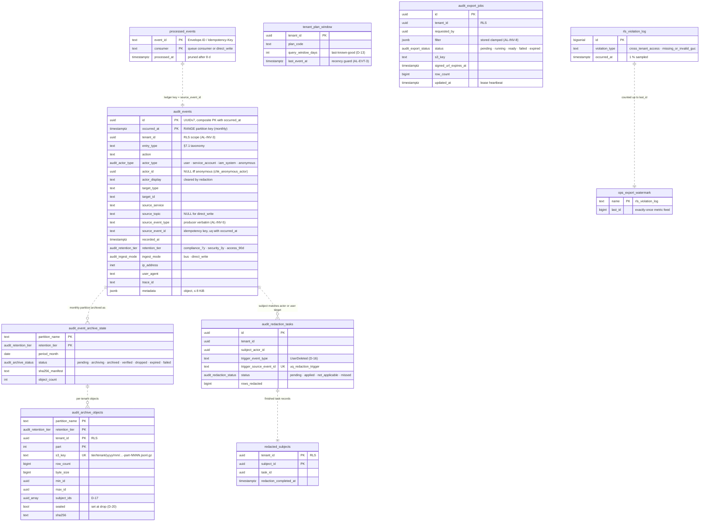

Migrations are `000001`–`000010` under `internal/adapter/outbound/postgres/migrations/`, run at `cmd/server` startup on `MIGRATION_DATABASE_URL`:

| Migration | Adds |
|---|---|
| `000001` | the schema: enums, the tables, indexes |
| `000002` | RLS: `rls_check_tenant`, the policies, `rls_violation_log` |
| `000003` | roles and grants |
| `000004` | triggers: append-only `forbid_audit_mutation`, `touch_row` |
| `000005` | `audit_ensure_partitions()` + bootstrap |
| `000006` | `audit_archive_objects`, `claim_export_job()` |
| `000007` | redaction, `redacted_subjects`, the sweep |
| `000008` | reconciler: `sealed`, the drop and re-open gates, invalidation |
| `000009` | `audit_ops_stats()` |
| `000010` | `audit_rls_violation_counts()` + watermark |

---

## Event consumption flow

The service owns its 11 inbound queues (§7.1). It consumes them only through platform-events (gap 45), and it has no publish side at all.

> Source: [`docs/architecture/mermaid/event-consumption-flow.mmd`](docs/architecture/mermaid/event-consumption-flow.mmd)

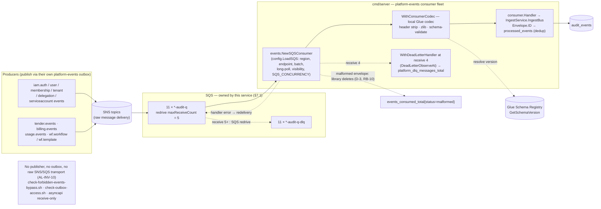

- **Construction.** `events.NewSQSConsumer` builds the SQS client itself. Every `SQS_*` setting comes from platform-events `config.LoadSQS` / `SQSConfigFromEnv` / `SQSConsumerOptions`; the service supplies only each queue's URL, the handler, the codec and the dead-letter observer.
- **Dead-lettering.** `DeadLetterObserveAt(SQS_MAX_RECEIVE_COUNT)` fires one receive short of the queue's redrive count, so SQS itself moves the message.
- **Dedup.** It follows the library's contract: handlers are idempotent on `Envelope.ID` (`processed_events`, AL-INV-4).
- **Codec.** A local, decode-only Glue codec validates every payload against the producer's registered schema version (AL-D12). An unresolvable version or a violation is a decode failure, so the message is redelivered and reaches the DLQ.
- **Unknown types.** An unrecognized type is persisted as `<domain>.unknown` (AL-EVT-4).
- **Known gap (D-3, gap 42).** platform-events v1.4.0 *deletes* a malformed envelope, and logs its body, rather than leaving it for the DLQ. It's alarmed via `events_consumed_total{status="malformed"}` (RB-10) and raised upstream.

---

## Observability stack

Every log, metric and trace goes through platform-gincommon (gap 43), and metrics follow the Enterprise Platform Observability Standard (gap 46).

> Source: [`docs/architecture/mermaid/observability-stack.mmd`](docs/architecture/mermaid/observability-stack.mmd)

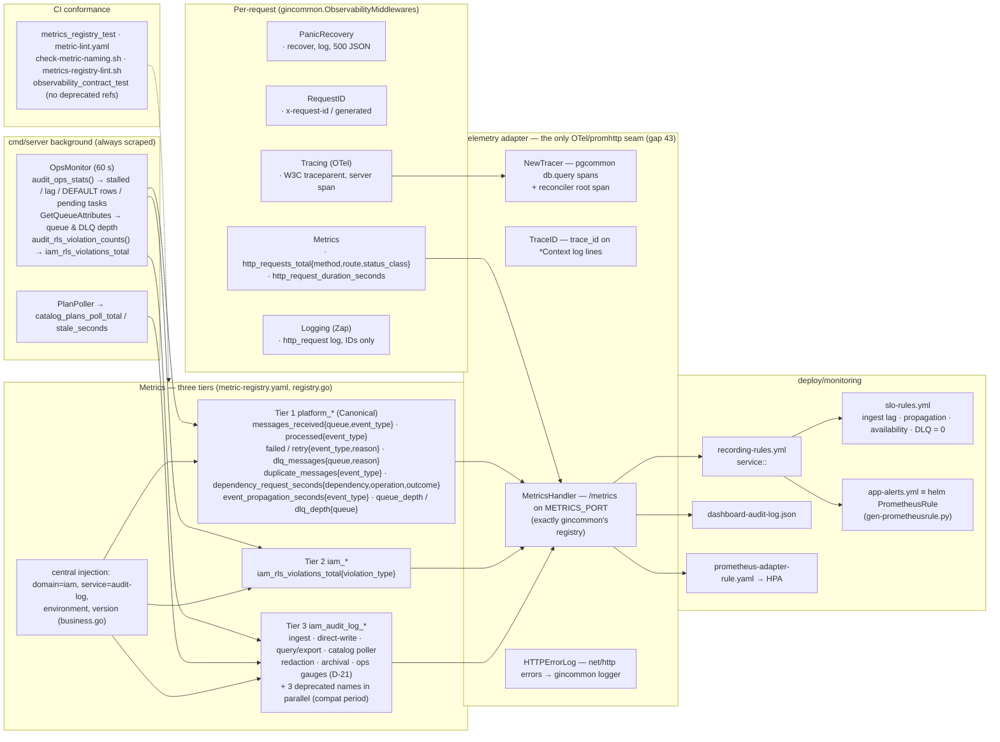

- **Tiers.** Tier 1 is exactly the ten Canonical `platform_*` names and label sets in `metrics/registry.go` (the same ledger iam-event-consumer carries); no platform name is invented. Tier 2 is `iam_rls_violations_total`, fed exactly once fleet-wide through `audit_rls_violation_counts()`. Tier 3 is `iam_audit_log_*`. `domain=iam`, `service=audit-log` and `environment` are injected centrally.
- **Inventory and compatibility.** `deploy/monitoring/metric-registry.yaml` holds the inventory, label vocabulary, cardinality and deprecations. Three renamed gauges emit their old names in parallel until the sunset, and no rule, SLO, dashboard or HPA may reference a deprecated name.
- **D-21 gauges.** `cmd/server` is always scraped, so it publishes the gauges alerting needs: archive stalled and lag, DEFAULT rows, stuck redactions, and queue and DLQ depth. The reconciler CronJob has no scrape endpoint; its own counters stay internal, and a blocked or stalled run exits non-zero (RB-9).
- **Logs.** IDs only, never `metadata` or payload (`TestLogHygiene_NoPayloadFields`). Schema-validation errors carry paths and keywords, never values.

---

## Row-Level Security (RLS) and GUC injection

Every tenant-scoped statement runs with `app.tenant_id` bound **transaction-locally**. A missing or malformed GUC fails closed: RLS returns 0 rows and `WITH CHECK` rejects the write.

> Source: [`docs/architecture/mermaid/rls-guc-flow.mmd`](docs/architecture/mermaid/rls-guc-flow.mmd)

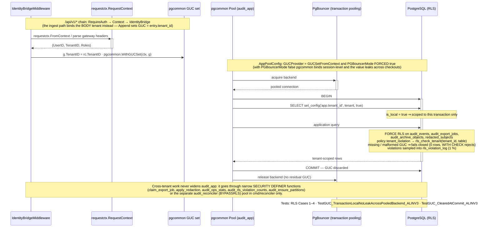

`AppPoolConfig` (`internal/adapter/outbound/postgres/db.go`) sets `GUCProvider = pgcommon.GUCSetFromContext` and **forces `PGBouncerMode = true`**, whatever `PG_BOUNCER_MODE` says. With it off, platform-pgcommon v1.3.0 binds the GUC session-level through a `PrepareConn` hook that nothing clears, so one tenant's `app.tenant_id` would survive COMMIT onto the next checkout. The postgres tier caught this (`TestGUC_*`). The reconciler pool (`ReconcilerPoolConfig`) binds no GUC (`audit_reconciler` is BYPASSRLS), and `cmd/server` never holds that role (rule 5, per-root Secrets, startup role assertion).

---

## Concurrency and idempotency

The data is append-only, so there is no optimistic locking (`record_version`). Concurrency safety comes from unique keys, row locks and narrow definer functions:

- **Ingest dedup (AL-INV-4).** The `processed_events` PK `(event_id, consumer)` with `ON CONFLICT DO NOTHING`, backed by `uq_audit_events_source_id (source_event_id, occurred_at)`, which never expires. A replay after the 8-day ledger prune still returns the stored row (`TestIngest_ReplayAfterLedgerPruneHitsBackstop_ALINV4`); concurrent same-key writes yield one row (`TestIngest_ConcurrentSameKeyYieldsOneRow_ALINV4`).
- **Redaction trigger.** `uq_redaction_trigger (trigger_source_event_id)`: a redelivered `UserDeleted` creates no second task. `apply_redaction()` takes `SELECT … FOR UPDATE` on the task, and a finished task only reports its outcome.
- **Export worker (D-2).** `claim_export_job(lease)` claims the oldest pending, or lease-expired running, job across tenants with `FOR UPDATE SKIP LOCKED`. It returns only the job's own tenant, and the worker then runs under that tenant's GUC. Heartbeats run every lease/3.
- **Drop gate.** `audit_drop_partition()` takes `LOCK TABLE audit_events IN ACCESS EXCLUSIVE MODE` first, in the same lock order as an INSERT so it cannot deadlock. That freezes the counts it compares. A concurrent `apply_redaction` either finishes first, so the drop sees the invalidated tier and refuses, or waits for the drop, so its `missed` check sees the sealed object.
- **Plan projection (AL-EVT-3).** `tenant_plan_window` upserts are guarded by `last_event_at`, so an out-of-order event never regresses a plan.
- **RLS metric.** `audit_rls_violation_counts()` advances `ops_export_watermark` `FOR UPDATE`, so three replicas polling concurrently count each violation once.

---

## Failure domains

**Consistency invariants:**
- **CONS-1 (AL-INV-2).** One write path. A bus event and a direct-write entry produce the identical row shape through the same `Append`.
- **CONS-2.** `wrapConnErr` maps connection-class failures (SQLSTATE 08/53/57/58, a closed pool, network errors) to `503 dependency_unavailable`, so a transport blip is never mistaken for a business rejection.
- **CONS-3.** The audit row and its redaction task commit together. The immediate apply runs *after* commit, so a failed apply never loses the task; it stays `pending` for `redaction-retry`.
- **CONS-4.** Each row is read from exactly one place: RDS while unsealed, S3 once sealed (D-12/D-20). There are never duplicates across hot and archived reads.

**Failure invariants:**
- **FAIL-1.** A handler error redelivers the message. The dead-letter observer fires at the threshold, SQS moves the message to `<queue>-dlq`, and any DLQ depth > 0 pages (RB-1). An audit event is never silently dropped, except the library's malformed-envelope path (D-3).
- **FAIL-2.** A Catalog outage keeps serving the last good plan map (stale-if-error, AL-D15). A cold replica uses the stored tenant row, never shrinking an Enterprise window to the default (D-13).
- **FAIL-3 (AL-INV-9).** An S3, KMS or verify failure marks the tier `failed` and **keeps** the partition; nothing is sealed. The next run rewrites the unsealed parts.
- **FAIL-4.** All four CronJobs are safe to re-run. The archive state machine, `sealed`, the finished-task check and watermarks make them idempotent.
- **FAIL-5.** An archived read over the D-10 bounds becomes an export (`202`), or a `422` on AL-7 (D-14), rather than an unbounded synchronous S3 scan.

---

## Key invariants

| Invariant | Where enforced |
|---|---|
| AL-INV-1 — `audit_app` has INSERT+SELECT only on `audit_events` | `000003` grants, `000004` `forbid_audit_mutation` trigger, `check-grants.sh`, `TestRLS_Case4_AppRoleCannotUpdateOrDelete_ALINV1` |
| AL-INV-2 — one write path for bus and direct-write | `AuditRepository.Append`; `TestBus_SameRowShapeAsDirectWrite_ALINV2` |
| AL-INV-3 — no cross-tenant read or write | FORCE RLS + fail-closed `rls_check_tenant`, transaction-local GUC with PgBouncer mode forced; RLS Cases 1–3, `TestGUC_*`, `TestQuery_TenantIsolation_ALINV3` |
| AL-INV-4 — exactly-once persistence | `processed_events` + `uq_audit_events_source_id`; `TestIngest_*_ALINV4` |
| AL-INV-5 — provenance preserved | NOT NULL `source_service` / `source_event_type` / `source_event_id`; `TestBuildBusEntry_ProvenanceAndUnknown_ALINV5_ALEVT4` |
| AL-INV-6 / AL-INV-11 — tier from taxonomy, caller tier ignored | `domain.TierFor` / `BuildDirectWriteEntry`; `TestCreateEntry_StatusAndMapping_ALINV11` |
| AL-INV-7 — compliance_7y never redacted | `apply_redaction()` / `sweep_redactions()` `WHERE retention_tier='security_3y'`; `TestRedaction_Compliance7yUntouched_ALINV7` |
| AL-INV-8 — the plan window limits queries, never storage | `domain.ClampWindow` in the service layer, export filter stored clamped; `TestQuery_WindowClampIndependentOfTier_ALINV8` |
| AL-INV-9 — drop only after every retained tier is verified | `audit_drop_partition()`; `TestReconciler_DropBlockedWhenUnverified_ALINV9`, `TestReconciler_S3FailureNoDrop_ALINV9` |
| AL-INV-10 — publishes nothing | `check-forbidden-events-bypass.sh`, `check-outbox-access.sh`, `check-asyncapi-receive-only.sh`, glue `Encode` refuses |
| AL-INV-12 — redaction before archival | immediate `apply_redaction` + the drop gate's `redaction_pending`; `TestReconciler_RefusesPendingRedaction_ALINV12` |
| Logs, metrics and traces only through platform-gincommon | `check-observability-confinement.sh` (gap 43) |
| DB connection, config and operations only through platform-pgcommon | `arch-lint.sh` database invariant (gap 44) |
| Events, SQS config, outbox and dedup only through platform-events | `check-forbidden-events-bypass.sh` §4 (gap 45) |
| Metrics follow the Enterprise Platform Observability Standard | `test/unit/metrics_registry_test.go` + `metric-lint.yaml`, `observability_contract_test.go`, `metrics-registry-lint.sh`, `check-metric-naming.sh` (gap 46) |

---

## Deployment

> Source: [`docs/architecture/mermaid/components.mmd`](docs/architecture/mermaid/components.mmd)

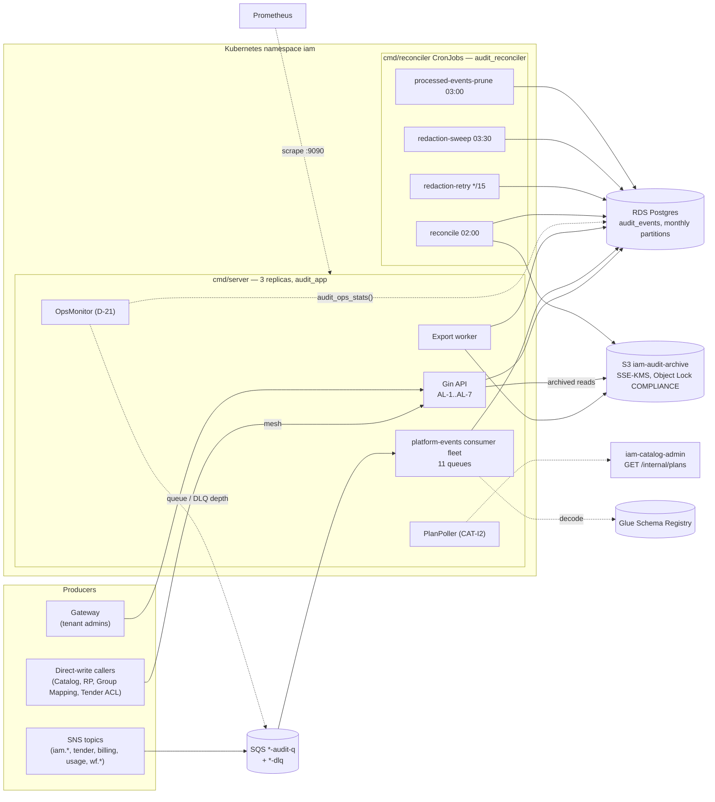

### Container image — two binaries

| Binary | Path in image | Purpose |
|---|---|---|
| `iam-audit-log-server` | `/iam-audit-log-server` | HTTP API (`cmd/server`), the image's `ENTRYPOINT`, exposing `8080` (API) and `9090` (metrics). It runs migrations at startup and hosts the 11-queue consumer fleet, the CAT-I2 poller, the export worker and the OpsMonitor |
| `iam-audit-log-reconciler` | `/iam-audit-log-reconciler` | One-shot reconciler (`cmd/reconciler`), dispatched via `--job=<name>` by the 4 CronJobs |

The `Dockerfile` has two stages: a `golang:1.26.6-bookworm` builder (SHA-pinned; private modules fetched through a BuildKit secret, `-trimpath`, `buildVersion` via `-ldflags`), and a `gcr.io/distroless/static-debian12:nonroot` runtime (SHA-pinned, no shell, `nonroot`) that copies only the two binaries. `api/asyncapi.yaml` and the per-source JSON Schemas are compiled in via `//go:embed`.

### Helm chart

`deploy/helm/` renders:
- one `Deployment` (3 replicas, PDB);
- the 4 `CronJob`s, all `concurrencyPolicy: Forbid`: `reconcile` `0 2 * * *`, `processed-events-prune` `0 3 * * *`, `redaction-sweep` `30 3 * * *`, `redaction-retry` `*/15 * * * *`;
- the `ServiceMonitor`, the `PrometheusRule` (generated from `deploy/monitoring/*.yml` by `scripts/gen-prometheusrule.py`) and the HPA (off by default; CPU/memory, optional RPS and `platform_queue_depth` targets through `deploy/monitoring/prometheus-adapter-rule.yaml`);
- the NetworkPolicy, and Ingress/HTTPRoute for `/api/v1/audit` only.

There is one Secret per composition root: the server secret never carries the reconciler DSN, and vice versa (`TestHelm_PerRootSecretsNeverShareRoleDSNs`).

### Migration safety

`cmd/server` runs `000001`…`000010` at startup through `platform-pgcommon/pkg/migrate` on `MIGRATION_DATABASE_URL`. That DSN is direct, not via PgBouncer, because the runner's advisory lock is session-scoped. The migration table is pgcommon's default `pgcommon_migrations` (gap 13). **Release prerequisite (gap 34):** Terraform must grant `audit_migrator` membership in `audit_reconciler`, or `000007`'s `ALTER FUNCTION apply_redaction … OWNER TO audit_reconciler` fails at startup; see `docs/implementation/RELEASE_CHECKLIST.md`. The service has never been released (no tags), which is why label-set changes on unchanged metric names were applied directly (gap 46).

---

## Testing strategy

- **Unit** (`go test ./test/unit/... ./internal/... ./cmd/... ./pkg/... ./api/...`, no Docker). Domain, service, adapter and handler tests, plus the contract tests in `test/unit/`:
  - LLD §7.1 taxonomy and §25 name inventory parsed from the LLD;
  - AsyncAPI ↔ taxonomy; Helm contract; migrations;
  - `metrics_registry_test.go` (the Observability Standard conformance gate, driven by `metric-lint.yaml`; each of its 12 checks is proven with a planted violation);
  - `observability_contract_test.go` (LLD §11 ↔ registry, alerts/recording/SLO/dashboard ↔ known and non-deprecated metrics, static ↔ Helm rules, log-hygiene AST check).
- **Postgres** (`test/postgres/`, testcontainers PG15, full migrations; tag `integration`):
  - RLS Cases 1–4 and `TestGUC_*`;
  - grants, roles, constraints and partitions;
  - the ingest, query, export, redaction, archive and ops repositories, including `TestReconciler_*`, `TestRedaction_*`, `TestExport_ClaimOldestAcrossTenants_D2` and the `audit_rls_violation_counts` exactly-once test.
- **Integration** (`test/integration/`, floci SQS/SNS/Glue/S3 plus PG15, the real consumer fleet). The package shares **one** floci per run, so a test must purge or filter its own queues. Covers:
  - bus dedup, unknown types, D-7 aliases, the plan projection, the Glue-validated payload and a schema violation → DLQ;
  - `TestRedaction_BusUserDeletedEndToEnd` and the late-event D-18 test;
  - `TestReconciler_ArchiveVerifyDrop_HappyPath`, blocked, S3-failure, late-arrival and re-open tests;
  - the DLQ-depth monitor, and `TestReconciler_FlociObjectLockSupport`, which pins floci's Object Lock behavior (gap 16).
- **E2E** (`test/e2e/`, tag `e2e`, `make test-e2e`). The real `NewRouter` and the built binaries: AL-1..AL-7, exports to a presigned object, the archived AL-2 lookup, the CAT-I2 poller against a fake Catalog, process and security tests, and producer contract replays.

`make test-ci` runs unit, postgres and integration in parallel and merges coverage. `.github/scripts/coverage-gate.sh` enforces **95%** (`COVERAGE_THRESHOLD`), and merged coverage is ~96.5%. The full suite takes more than 10 minutes locally, so run it in the background.

---

## Producer conformance checklist

This service is the **consumer**. Before a producer publishes to an audited topic or calls AL-5/AL-6, verify the following (Go-only, like every sibling):

**Bus envelope** (`api/asyncapi.yaml § components`)
- [ ] Publish through platform-events (outbox + SNS). The subscription uses raw message delivery (`TestTopology_SubscriptionsAreCatchAllRawDelivery_ALEVT2`).
- [ ] `id` (UUID v7) is stable across retries. It is this service's **dedup key** (`processed_events` on `Envelope.ID`), so a re-publish with a new id is a new audit row.
- [ ] `type` matches a §7.1 row for your topic (D-7 lists the workflow aliases). Anything else is kept as `<domain>.unknown` and raises `iam_audit_log_unknown_event_total`.
- [ ] `tenant_id` is a UUID; an unstorable tenant goes to the DLQ. `time` is the business time: it drives the partition, the retention clock and the query window.
- [ ] Actor rules (D-8): a UUID actor for users; `"iam-system"`, the `…00a1` sentinel, the nil UUID or `ip_address="system"` for the system; auth events carry the user in `subject` or `data.user_id`.

**Glue schema**
- [ ] When `dataschema` is set, the payload must validate against **that** registered schema version. A violation is a decode failure → redelivery → DLQ.

**Payload**
- [ ] Payloads over `MAX_METADATA_BYTES` (8 KiB) are kept as a truncation marker (D-9). Don't rely on large payloads being stored whole.
- [ ] For `UserDeleted`, `data.user_id` is required. Without it no redaction task can be created (gap 36).

**Direct-write (AL-5/AL-6)**
- [ ] Mesh-only, with `x-tenant-roles: iam-system` (otherwise `403 forbidden_peer`), the `…00a1` user and a tenant header.
- [ ] `Idempotency-Key` is required, stable across your retries and unique per change (it becomes `source_event_id`). AL-6 also needs a per-entry `idempotency_key` (D-4).
- [ ] Use only the direct-write `entry_type`s (D-6; otherwise `422 unknown_entry_type`). Don't send a retention tier; it is derived and a caller value is ignored (AL-INV-11).
- [ ] Treat `201` and `200` (replay) as success. Retry `5xx` and `429` with the **same** key. Audit failure must never fail your business write (AUDIT-CALLER-1).

---

## Schema lifecycle

The producers own their event schemas in the AWS Glue Schema Registry. This service only **reads** them: `glue:GetSchemaVersion` by the version id in the 18-byte header, compiled once per version and cached (`internal/adapter/outbound/glue`). Because platform-events v1.4.0 has no `GlueCodec` or `ValidatingCodec`, the codec is local (gap 14). It is decode-only, zlib-safe and bomb-bounded, and plugged in through `events.WithConsumerCodec`. `Encode` refuses (AL-INV-10). `api/asyncapi.yaml` declares **only** `receive` operations: 65 messages, each carrying `x-audit-entry-type` / `x-audit-retention-tier`. `check-asyncapi-receive-only.sh`, `TestAsyncAPI_NoSendOperations_ALINV10` and the AsyncAPI ↔ taxonomy contract test keep it in lockstep with the compiled taxonomy.

---

## Threat model

STRIDE analysis of `iam-audit-log`. Every row is grounded in a real mechanism in this repo.

| STRIDE | Threat | Component | Mitigation |
|--------|--------|-----------|------------|
| **Spoofing** | A caller forges a direct-write entry for another tenant, or impersonates a mesh peer | `/api/v1/internal/*` | Mesh-only (the gateway never routes `/internal`), `RequireSystemRole` → `403 forbidden_peer`. The row is bound to the **body** tenant under `WITH CHECK`, and an idempotency key reused across tenants gets `400` without revealing the other tenant's row |
| **Spoofing** | A forged identity header impersonates a tenant admin | IdentityBridge | Envoy strips client identity headers at the trust boundary. The service validates the header shape and role (`RequireAuditReader`) but does not re-authenticate |
| **Tampering** | An audit row is altered or deleted | `audit_events` | `audit_app` INSERT+SELECT only (AL-INV-1). The `forbid_audit_mutation` trigger rejects UPDATE/DELETE from every role but `audit_reconciler`, whose UPDATE is column-level (`metadata`, `actor_display`) and reached only through `apply_redaction()` / `sweep_redactions()` |
| **Tampering** | An archived object is replaced or deleted | S3 archive | SSE-KMS, Object Lock COMPLIANCE retain-until ≥ tier, read-back checksum and lock verification before seal, sealed objects never rewritten (D-20). The IAM policy denies delete and governance bypass |
| **Repudiation** | An action with no auditable actor or provenance | Ingest | NOT NULL provenance (AL-INV-5), the D-8 actor derivation with `_actor_unattributed` markers, and `trace_id` linking to the producer's request |
| **Information Disclosure** | A cross-tenant read through a missing or malformed GUC or a pooled backend | PostgreSQL | FORCE RLS with a fail-closed `rls_check_tenant`, transaction-local GUC with PgBouncer mode forced, and `TestGUC_TransactionLocalNoLeakAcrossPooledBackend_ALINV3` |
| **Information Disclosure** | Archived reads expose other tenants' rows | S3 | Per-tenant object keys (D-10), and the manifest is RLS-scoped. A read touches only the caller's own objects |
| **Information Disclosure** | PII leaks into logs | Logging | IDs only (`TestLogHygiene_NoPayloadFields`), and schema errors are sanitized to paths and keywords. The platform-events malformed-body log is a known upstream gap (42) |
| **Information Disclosure** | An erased user's PII persists or is re-ingested | Redaction | Immediate redaction, the D-18 ingest check, the daily sweep, and archive invalidation. Archived rows are retained under AL-Q15 Option A (Legal to confirm) |
| **Denial of Service** | Batch-ingest or export floods | AL-6 / AL-3 | Per-tenant token buckets → `429` (D-5, §10.5), `MAX_INGEST_BATCH` 500, the 8 MiB body cap, and D-10 bounds on synchronous archived reads |
| **Denial of Service** | Poison or oversized messages | Consumer | Bomb-bounded codec, 1 MiB decompress cap, DLQ after the redrive count, and the D-9 metadata cap |
| **Elevation of Privilege** | The server gains reconciler powers | Composition roots | Per-root Secrets and DSNs, the startup role assertion, and arch-lint DB-role confinement. Cross-tenant server work goes only through narrow SECURITY DEFINER functions that return aggregates or a single job |

**Out of scope (platform controls):** JWT issuance and session management (Keycloak and the gateway), mesh mTLS and NetworkPolicy (the platform), SNS topic policies, Glue registry write access, KMS key policy and bucket-level Object Lock, and lifecycle configuration (infrastructure; `RELEASE_CHECKLIST.md`).

---

## Developer tools

| Handler | Route | Gating | Purpose |
|---|---|---|---|
| `AsyncAPIHandler` | `GET /asyncapi` | `DocsConfig.active()` | Server-side HTML renderer for the embedded `api/asyncapi.yaml` (the receive-only event catalogue) |
| `AsyncAPIYAMLHandler` | `GET /asyncapi.yaml` | `DocsConfig.active()` | Serves the raw embedded spec |

`DocsConfig.active()` is `Environment != "production" || Enabled`. The docs are always mounted outside production, and in production are opt-in via `DOCS_ENABLED` (default `"false"` in Helm). When mounted in production **and** `DOCS_AUTH_TOKEN` is set, both routes require that bearer token (constant-time compare). Both set `X-Frame-Options: DENY` and `X-Content-Type-Options: nosniff`. There is **no** interactive Swagger UI route. `docs/swagger/{docs.go,swagger.json,swagger.yaml}` are generated by `make swag` from the handler annotations as the REST contract artifact, and `make swag-check` (mirrored in CI) fails a PR that changed a handler without regenerating them.

---

## Session-specific decisions

The frozen LLD was silent or self-contradictory on several internals-only details, and a few real bugs were found while building. Each is documented at its point of impact in the code and in `BUILD_PLAN.md` §C:

1. **The pgcommon session-GUC leak (AL-INV-3).** platform-pgcommon v1.3.0 binds `app.tenant_id` session-level unless `PGBouncerMode` is true, and `.env-example` shipped `false`. `AppPoolConfig` now forces it on; `TestGUC_*` caught the leak.
2. **Narrow definer functions instead of wider roles (D-1, D-2, gap 26).** `apply_redaction` (owned by `audit_reconciler`), `claim_export_job`, `audit_ensure_partitions`, `audit_drop_partition`, `audit_reopen_partition`, `audit_ops_stats` and `audit_rls_violation_counts` let `cmd/server` stay `audit_app` (rule 5).
3. **Hot/archived routing, from D-12's partition existence to D-20's `sealed`.** The re-open design (D-19) would otherwise have hidden a month's S3-only rows once its partition came back.
4. **The redaction-task insert failed with 42501.** `ON CONFLICT (trigger_source_event_id)` needs SELECT, which `audit_app` lacks, so every `UserDeleted` would have ended up in the DLQ. The integration test caught it before merge; the fix is a target-less `ON CONFLICT DO NOTHING` (gap 35).
5. **The reconciler couldn't read partitions.** Grants on the parent don't extend to naming a partition, so archival would have failed in every deployment. It now reads through the parent, bounded to the month (gap 39).
6. **The `missed` premise was wrong (D-17, AL-Q15).** A long-lived user always has archived `security_3y` rows, so `missed` is the routine outcome. That led to the manifest `subject_ids`, AL-Q15 Option A, and `missed` not being alarmed.
7. **Late rows after redaction (D-18).** A mandatory ingest-time check against `redacted_subjects`, plus a daily sweep, plus archive invalidation so pre-redaction PII is never sealed.
8. **The RLS metric was never fed.** `iam_rls_violations_total` was registered but nothing wrote to it, so the Critical alert could not fire. It is now fed exactly once fleet-wide through a watermark (gap 46).
9. **A Phase 3 wire-test assertion was wrong.** "≥ 4 handler deliveries" only passed because leftover messages on the shared floci queue inflated the count; the library hands receive 4 to the dead-letter handler. The test now purges its queues and asserts the real contract.
10. **Platform-library confinement (gaps 43–45).** A telemetry seam for gincommon's missing span, `/metrics` and trace-id APIs; a pgcommon-only database layer; and platform-events-owned consumption and configuration, with dedup on `Envelope.ID`.
11. **The Enterprise Platform Observability Standard (gap 46).** Ratified Tier-1 names and labels, `service="audit-log"`, a registry and label vocabulary, deprecations emitted in parallel, and a CI conformance gate.

---

## Documentation assets

Architecture diagrams live as standalone Mermaid source files under `docs/architecture/mermaid/`, embedded into this document verbatim as fenced blocks. Each section above carries a `> Source:` link back to its `.mmd` file. Keep the two in sync when either changes.

> Source: [`docs/architecture/mermaid/docs-assets.mmd`](docs/architecture/mermaid/docs-assets.mmd)

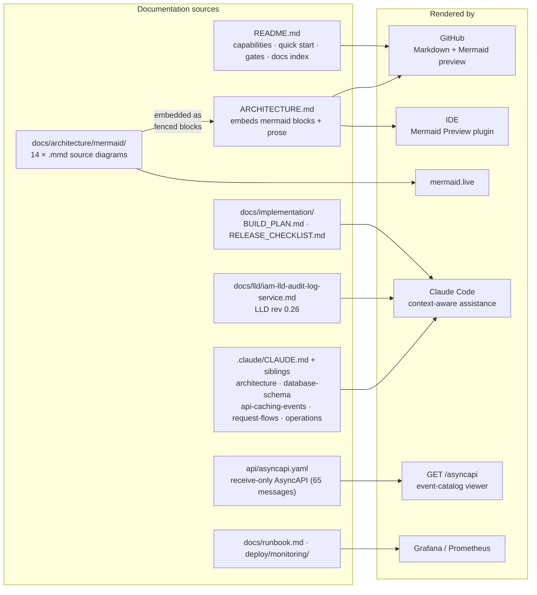

| Document | Description |
|----------|-------------|
| [`.claude/CLAUDE.md`](.claude/CLAUDE.md) | Project guide: status, invariants, platform-library rules, commands, conventions, how-tos |
| [`.claude/architecture.md`](.claude/architecture.md) | Components, composition roots, background workers, dependency rules |
| [`.claude/database-schema.md`](.claude/database-schema.md) | Tables, RLS, roles and grants, definer functions, migrations |
| [`.claude/api-caching-events.md`](.claude/api-caching-events.md) | AL-1..AL-7, no-cache posture, consumed topics, taxonomy, dedup |
| [`.claude/request-flows.md`](.claude/request-flows.md) | Ingest, query routing, export, archival/re-open, redaction |
| [`.claude/operations.md`](.claude/operations.md) | Configuration, CronJobs, metrics and alerts, local dev, troubleshooting |
| [`docs/architecture/README.md`](docs/architecture/README.md) | Standalone Mermaid diagram index (the 14 `.mmd` files embedded above) |
| [`docs/lld/iam-lld-audit-log-service.md`](docs/lld/iam-lld-audit-log-service.md) | Full LLD (rev 0.26): §16 open questions, §17 error taxonomy, §22 decision register, §25 name inventory |
| [`docs/implementation/BUILD_PLAN.md`](docs/implementation/BUILD_PLAN.md) | Phase plan, invariant → enforcement → test map, decisions D-1..D-21, gaps 1–46 |
| [`docs/implementation/RELEASE_CHECKLIST.md`](docs/implementation/RELEASE_CHECKLIST.md) | Deployment prerequisites outside this repo (Terraform role grant, bucket, namespace, CronJob alerting) |
| [`docs/runbook.md`](docs/runbook.md) | RB-1..RB-10 operational runbooks |
| [`deploy/monitoring/`](deploy/monitoring/) | Metric registry + lint config, alerts, recording rules, SLOs, dashboard, prometheus-adapter rule |

Render a diagram locally: open any `.mmd` file in a Mermaid-aware IDE (VS Code + Mermaid Preview, IntelliJ + Mermaid plugin) or paste it into [mermaid.live](https://mermaid.live).
