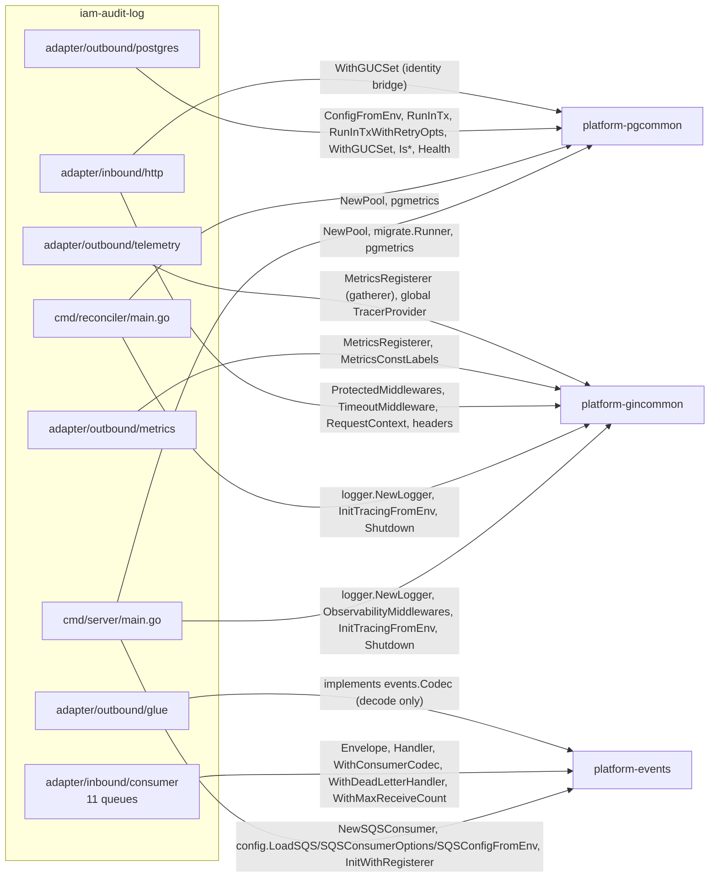
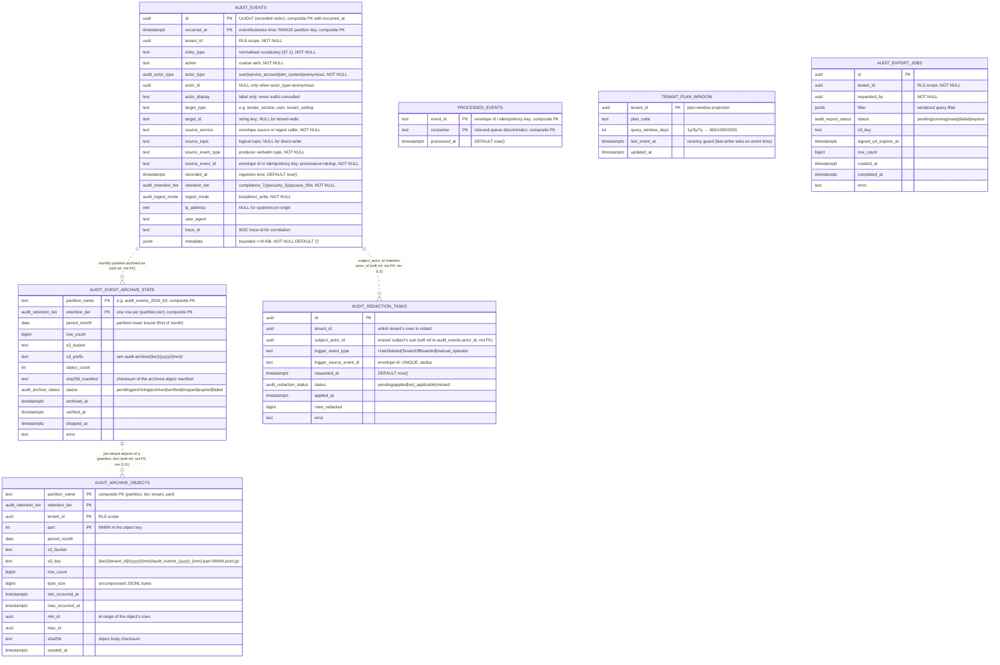
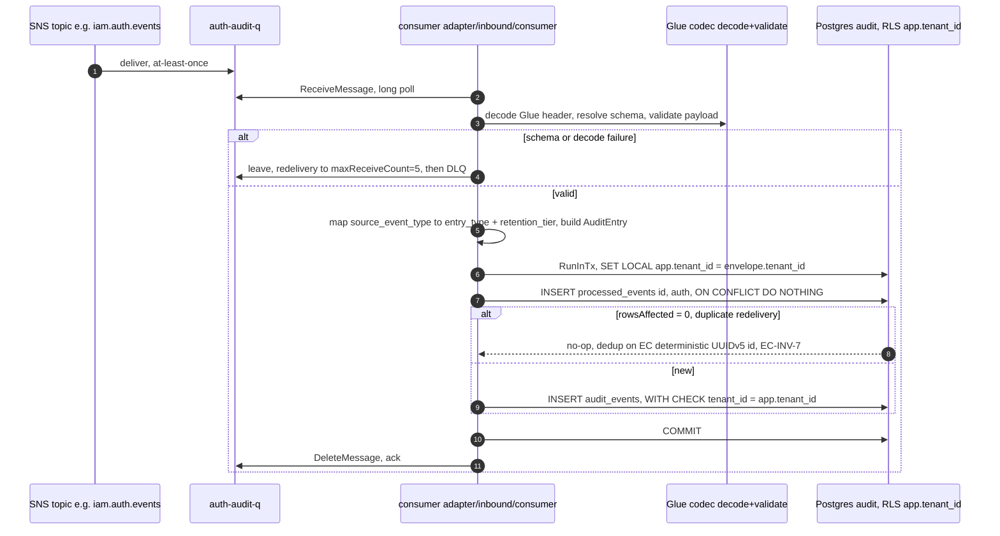
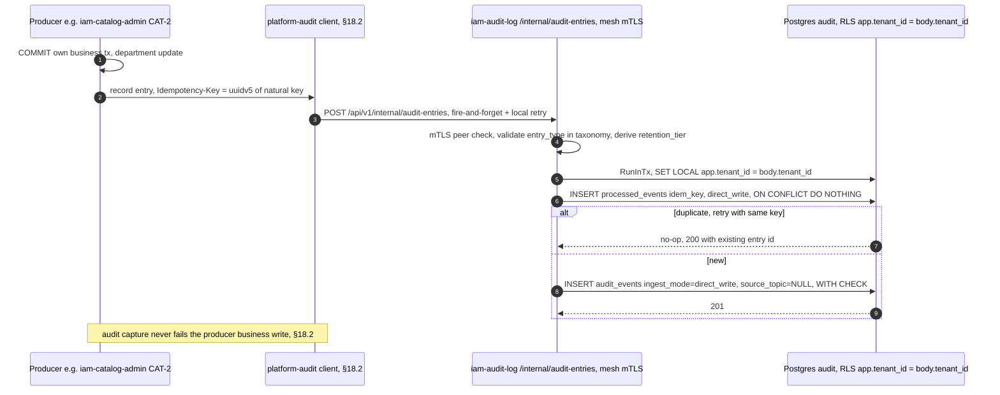
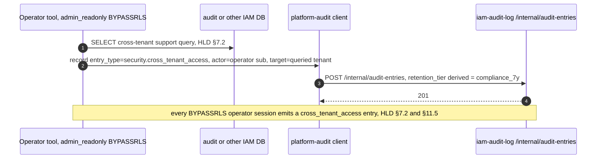
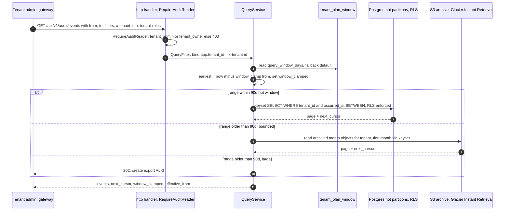
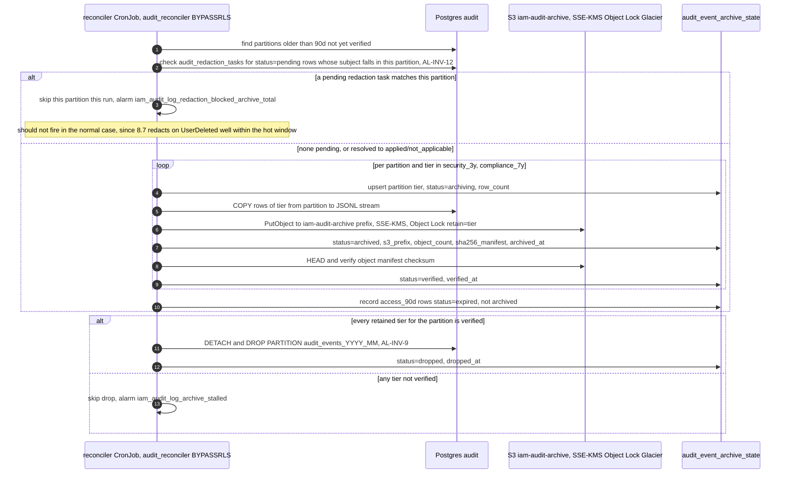

# Audit Log Service — Low-Level Design

## Tender Management SaaS Platform — IAM Subsystem

| Field | Value |
|---|---|
| Document Type | Low-Level Design (LLD) |
| Service | Audit Log Service (`iam-audit-log`) |
| Go module | `github.com/BCBP-SOLUTIONS-FZC-LLC/iam-audit-log` (Go 1.26) |
| Parent design | IAM High-Level Design v1.47 — file `iam-hld-tender-saas-v1.41.md`, header **Version 1.47**, "Approved for LLD" (see Revision 0.1 note on the version/filename discrepancy) |
| Subsystem | Identity & Access Management |
| Version | 0.26 (Draft — header version tracks the revision log; as-built through implementation Phase 8 and gaps 43–46) |
| Date | September 2026 |
| Status | Draft for review |
| Base HLD | IAM HLD §5.7 (charter), §6.6 (plan-gated query window), §7.1–§7.2 (`audit` DB topology, RLS), §9.1/§9.1.1 (SNS/SQS topology), §9.4 (event catalogue + direct-audit-write note), §13.1–§13.3 (DR, retention, GDPR) |
| Companion specs | `api/asyncapi.yaml` (inbound channel contract), `docs/swagger/` (query + ingest OpenAPI), `deploy/monitoring/` (alert rules), IAM Platform Observability Standard |
| Sibling LLDs | User Profile (`iam-user-profile`), Org & Membership (`iam-org-membership`), Event Consumer (`iam-event-consumer`), Realm Provisioner (`iam-realm-provisioner`), Delegation (`iam-delegation`), Token Service (`iam-token-service`), AuthZ Enrichment (`iam-authz-enrichment`), Catalog/Admin Config (`iam-catalog-admin`), Group Mapping (`iam-group-mapping`), Tender ACL (`iam-tender-acl`) |
| Owner database | RDS PostgreSQL `audit` |
| Deployment stage | MVP (HLD §16 roadmap, Week 7) — 3 replicas (`Deployment`) + `cmd/reconciler` (`CronJob`) |
| Audience | Platform engineering, security, SRE, compliance |
| Owner | Indhu (indhu@bcbpsolutions.com) |
| Revision | 0.1 (2026-09-22): **First specification of the Audit Log Service — the platform compliance system-of-record.** Establishes the canonical `audit_events` model and unified `entry_type` taxonomy (closing Event Consumer **EC-Q3**); resolves the platform-wide direct-write ingest gap (**AL-D1**, closing Catalog **CAT-Q7**, Group Mapping's and Tender ACL's local-audit deferrals, and the Org & Membership `TenantSettingChanged` transport question); defines monthly partitioning, RLS isolation, the 7 y / 3 y / 90 d retention tiers, S3 + Glacier archival with `audit_event_archive_state` bookkeeping, immutability posture, and the admin-only query/export API. Records the HLD amendments these decisions prompt (§18.4). Registers **AL-INV-\***, **AL-D\***, **AL-Q\***, **AL-EVT-\*** open from this revision. |
| Revision | 0.2 (2026-09-24): **Realignment pass against all ten sibling LLDs, which were revised 2026-09-23/24 (after this document's rev 0.1).** Re-verified every cross-service claim this document makes against each sibling's current text (not just its file mtime, which several siblings' own revision tables lag behind). Net result: the event-consumer, user-profile, org-membership, realm-provisioner, delegation, token-service, and authz-enrichment contracts this LLD depends on are **all still accurate as specified** — no producer added, removed, or renamed an event type this document relies on. Four real corrections and one dependency-version fix follow. (1) **New taxonomy row — `TenantReactivated{source=operator}` was missing.** Realm Provisioner §7.1/§10 and Org & Membership both now confirm an operator-sourced `TenantReactivated` rides `iam.tenant.events` → `tenant-audit-q` (distinct from Billing's own `source=billing` `TenantReactivated` on `billing.events`, already in the taxonomy) — added to §7.1 (mirrors the existing `MFAReset` dual-source pattern). Without this row the event would still be captured and never lost (AL-EVT-4's `<domain>.unknown` fail-safe), but misclassified instead of landing as `tenant.reactivated`. (2) **Citation fix** — §18.1 cited Token Service's "no secret in payload" invariant as **TS-INV-5**; Token Service's own document assigns that guarantee to **TS-INV-2** (paired with its EVT-2); corrected. (3) **CAT-Q7 "resolved" claim walked back.** Catalog's own LLD, re-read directly, still lists **CAT-Q7 as open** and has not integrated against this endpoint; its actual produced SNS event (where one exists at all — its own document is internally inconsistent about whether it publishes via `platform-events`) is a single `DepartmentCatalogChanged`, not the separate `DepartmentCreated`/`DepartmentUpdated` this document assumed, and its CAT-5 (plan update) path produces **no event of any kind**, only a cache invalidation — so `config.plan.updated` currently has no confirmed source. `plans.audit_query_window_days` (relied on by §4.2's `tenant_plan_window` design and cited to HLD §6.6) does not appear anywhere in Catalog's own document either. §7.1, §18.2, and §16 (new **AL-Q13**) are corrected to present these as this LLD's proposal for Catalog to adopt — not yet claimed, confirmed, or integrated on Catalog's side. Group Mapping's and Tender ACL's GM-2/4/5 and TAC-2/3/cascade names remain in the same state (their own documents still carry only the generic "Audit Log service" deferral, unaware of this document's specific mapping) — already correctly flagged as proposed in §7.1's note, reconfirmed unchanged. (4) **AL-D8/AL-Q3 dual-subscribe rationale downgraded.** Delegation's own LLD (ADR-0008/DLG-D1) shows Core dropped the legacy `delegations` table and cut over to Delegation-as-sole-producer **from inception**, with no evidence anywhere of Org & Membership ever producing `DelegationStarted`/`DelegationEnded` on `iam.membership.events` — i.e., no live transition exists to dual-subscribe against. The `membership-audit-q` delegation subscription is retained as harmless defense-in-depth (dedup makes it free), but §22 AL-D8 and §16 AL-Q3 are reworded from "removed once the HLD amendment lands" to "no evidence of an in-flight transition; retained as a no-cost safety net pending independent confirmation from the HLD owner." (5) **Dependency version note.** §3.1's `platform-pgcommon` pin is bumped **v1.2.1 → v1.3.0**: five of ten siblings (Org & Membership, Realm Provisioner, Catalog, Group Mapping, Tender ACL) have moved to v1.3.0, while User Profile, Event Consumer, Token Service, and Delegation remain on v1.2.1 — a platform-wide split, not a single sibling's drift. As a not-yet-built service, Audit Log adopts the newer version (also used by Org & Membership's error-mapper for `IsConnectionException`/`IsInsufficientResources`/`IsPgError`) and flags the split rather than silently picking a side. Two informational notes, no document change required: AuthZ Enrichment's EVT-4 (§16 AE-35, v1.28) fixed a real silent-DLQ bug (a `NoopCodec` had been swallowing Glue-encoded events) — its "degrade to stale" posture is unchanged, now on firmer footing; and User Profile's own document (rev 0.53) is internally inconsistent about whether tenant offboarding fans out per-user `UserDeleted` events, which bears on `user-audit-q` ingest volume during an offboarding — tracked as new **AL-Q14** rather than resolved here, since User Profile has not resolved it in its own text. §16 also reconfirms **AL-Q2** still open (no sibling attests an HLD §9.1 amendment has landed) and strengthens **AL-Q9** with cross-sibling evidence: the ten siblings cite Base HLD versions v1.39, v1.41 (×5), v1.42, v1.44, and v1.45 among them — **none cite v1.47**, the parent file's own header version — confirming the version tension is platform-wide, not specific to this document. No schema, API, retention-tier, or invariant changed; all edits are corrections/additions to existing sections. |
| Revision | 0.3 (2026-09-24): **Closes the cold-storage GDPR-redaction gap: redaction is moved from "a reconciler task that rewrites metadata" (unspecified timing) to a named, ordered guarantee that runs while a row is still hot — before it is ever archived under S3 Object Lock, where rewriting becomes both undiscoverable (no per-subject index over archived objects) and legally impossible (compliance-mode lock).** New **AL-INV-12**: redaction for a given subject completes, or is confirmed not applicable, before any row of theirs is archived — enforced primarily by redacting **immediately** on consuming the triggering `UserDeleted` (`iam.user.events`) event, using the existing `idx_audit_events_tenant_actor` index (the row is always hot at that point — an erasure request that arrives while the account still exists cannot postdate the account's own audit history), with the reconciler's archival step (§8.5) additionally refusing to archive a `security_3y` partition containing a still-pending redaction task as a second, independent line of defense. New table `audit_redaction_tasks` (§4.2) and enum `audit_redaction_status` (§4.1) give this its own append-only ledger, mirroring `audit_event_archive_state`'s bookkeeping pattern; new §8.7 sequence diagram; two new Tier-3 metrics and **RB-7** (§11, §24). **Scope, precisely, and why "who approved this tender" is unaffected:** (1) `compliance_7y`-tier rows (tender approvals among them) are untouched by any of this — AL-INV-7 already exempts them from redaction entirely, at any point in their lifecycle; this revision changes nothing about that tier. (2) Even on `security_3y` rows where redaction does apply, it only ever rewrites free-text strings inside the `metadata` jsonb — `actor_id`/`actor_display`/`target_id`, the columns an admin query actually resolves "who did what to what" from, are untouched by design (§15.5, unchanged). §15.5 is rewritten to state the ordering precisely and to name this example directly. **Residual risk, not fully closed:** an erasure request that arrives more than `AUDIT_WRITABLE_TRAILING_MONTHS`+hot-window late relative to a subject's own audit history — implying the account persisted un-erased well past its own deletion signal, an anomalous sequence — would find its target rows already archived and un-redactable; this residual is named, not hidden, as new **AL-Q15** (§16). AL-Q11 is narrowed accordingly: the *mechanism* question it raised is now answered; only the jurisdiction-specific *scope* question (which free-text fields count as PII) remains open. **Same-day addendum:** the §4 data-model ERD had not been updated to include `AUDIT_REDACTION_TASKS` alongside its own `CREATE TABLE` in §4.2 — added, with a soft-ref relationship to `AUDIT_EVENTS` matching the existing `AUDIT_EVENT_ARCHIVE_STATE` style. |
| Revision | 0.4 (2026-09-24): **AL-Q2 and AL-Q3 resolved — the proposed HLD amendment (§18.4) has landed as HLD v1.48.** The HLD owner shipped the amendment this LLD proposed: §9.1 topology now carries `iam.delegation.events` (Delegation Service → `delegation-workflow-q`/`delegation-notification-q`/`delegation-audit-q`) and `iam.serviceaccount.events` (Token Service → `serviceaccount-audit-q`), and §9.1.1/§9.4 now correctly show Delegation Service — not Org & Membership — as the producer of `DelegationStarted`/`DelegationEnded` on its own topic, matching the Delegation LLD's own text (ADR-0008/DLG-D1: sole producer since inception, no live O&M production ever existed). **AL-Q2 closed** (§16): the HLD lag this LLD raised is gone; `delegation-audit-q`/`serviceaccount-audit-q` are now first-class HLD subscriptions, not merely queues this document created and consumed ahead of the HLD catching up. **AL-Q3 closed** (§16): the HLD's own §9.4 text no longer disagrees with the Delegation LLD, so there is nothing left to reconcile — HLD v1.48 confirms directly what AL-D8's rev 0.2 narrowing already inferred from Delegation's side (no in-flight transition ever existed). **AL-D8 (§22) is reconsidered, not reversed:** the `membership-audit-q` dual-subscribe for delegation events was kept as a free, lossless safety net pending exactly this confirmation; now that HLD v1.48 removes `DelegationStarted`/`DelegationEnded` from `iam.membership.events` entirely, that subscription's filter can never match a real event again — it costs nothing to leave wired (dedup on envelope id makes a nonexistent case harmless), but it is no longer a safety net for anything and is a candidate for removal in a future cleanup pass, not urgent. HLD's own §17.1/§18.3 record the amendment as v1.48, aligning with `iam-lld-delegation-service.md` and `iam-lld-token-service.md` per this LLD's original §18.4 proposal. No schema, API, retention-tier, or invariant changed — this revision only closes two open questions against the sibling document that resolved them. |
| Revision | 0.5 (2026-09-24): **AL-Q1 and AL-Q4 formally deferred (post-MVP), per platform direction.** Both had carried a "recommend defer" posture since rev 0.1 without ever being made an actual decision; this revision converts the recommendation into a decision. **AL-Q1 (hash-chain tamper-evidence for the compliance tier):** deferred — MVP ships on AL-D7's posture (append-only grants + mutation triggers + S3 Object Lock, compliance mode) with no cryptographic hash-chain; the additive `prev_row_hash` design stays specified and ready to add without a row-shape change if a customer's jurisdiction ever requires log-level non-repudiation beyond the per-approval `signature_hash` Tender Service already carries in `metadata`. **AL-Q4 (optional `audit-directwrite-q` durable buffer):** deferred — MVP ships AL-D1's direct-write endpoint only, with the fire-and-forget-plus-local-retry caller pattern (§5.4/§18.2) as the sole durability story for producers that cannot retry locally; the buffer is added only if a specific producer proves it needs one. Neither deferral changes any schema, API, or invariant — both were already specified defensively (additive-only) for exactly this outcome. §16 register entries updated to **Deferred**, not left as an open recommendation. |
| Revision | 0.6 (2026-09-24): **AL-Q5 formally deferred (post-MVP), per platform direction.** The query path remains uncached for MVP (AL-D5 unchanged: ~5,000 events/day and ad-hoc admin queries give no sustained hot read path, and a cache adds staleness to a store where correctness outranks latency). If an in-product "recent activity" dashboard or similar surface later introduces sustained high-QPS hot-window reads, the resolution is a **tenant-scoped read-through cache with a short TTL (15–60 s)**, scoped to the hot window only, following AuthZ Enrichment's read-through discipline (cache miss/timeout never blocks correctness) — deliberately **avoiding cache-invalidation complexity** until a demonstrated workload actually requires it, rather than building invalidation machinery speculatively. §6, §16, and AL-D5 updated to record the specific trigger and shape of the deferred design, not just that it is deferred. |
| Revision | 0.7 (2026-09-24): **AL-Q6 confirmed as specified, per platform direction — formal `anonymous` actor semantics.** Pre-authentication events that cannot be attributed to an existing principal **SHALL** be recorded as `actor_type='anonymous'` and `actor_id=NULL`; any claimed identity (username, email, login identifier, or other caller-supplied credential label) **SHALL** be recorded only in `metadata`, never promoted into `actor_id`. This is a deliberate non-attribution: `anonymous` is **not** a principal, not a Token Service service-account record, and not represented anywhere in IAM's identity model outside this service's own `actor_type` vocabulary (§4.1) — it exists solely so Audit Log can record a pre-auth event (e.g. `LoginFailure` against an unresolvable username) without inventing or borrowing an identity for the attempt. New decision **AL-D11** records this; §16 AL-Q6 moves from "recommend as specified" to **Confirmed**; §10.3 and the `actor_type` DDL comment (§4.1) are updated to state the SHALL-level rule explicitly rather than only describing the net-new rationale. No schema change — `actor_type='anonymous'`/`actor_id NULL` were already the specified shape; this revision makes the semantics a confirmed decision, not a recommendation awaiting sign-off. |
| Revision | 0.8 (2026-09-24): **AL-Q7 confirmed, per platform direction — AL-D2's tier assignment stands; the §3.1/§13.3 tension is an HLD-wording matter, not a design gap.** Four points confirmed together: (1) **AL-D2 is approved as written** — no change to the `entry_type`→tier mapping. (2) **Successful-login events (`auth.login.success`) stay `access_90d`** — 90-day retention, dropped with the hot partition, never archived; failure/credential/MFA events (`auth.login.failure`, `auth.password.reset`, `auth.mfa.*`) remain `compliance_7y`, as already specified (§7.1, §15.2). (3) **The HLD §3.1 ("audit every authentication event … with 7-year retention") vs §13.3 (3 y security / 90 d access) discrepancy is confirmed as an HLD wording issue**, not a signal to reclassify — it is referred to Product/Legal for resolution on the HLD side (§18.4 item 7 stands as the open HLD-amendment pointer). (4) **This LLD's own classification does not move** unless Product/Legal explicitly mandate 7-year retention for *all* authentication events, including successful logins — a mandate this narrow and consequential is treated as requiring their explicit sign-off, not inferred from the HLD's ambiguous wording alone. §16 AL-Q7 moves from "recommend §13.3 durations" to **Confirmed**; no schema, `entry_type`, or tier assignment changed. |
| Revision | 0.9 (2026-09-24): **AL-Q8 confirmed for MVP, per platform direction — financial/billing lifecycle events stay `security_3y`, flagged for Product/Legal review, promotable later without a schema change.** Four points confirmed together: (1) **`tenant.plan_changed`/`tenant.payment_past_due`/`tenant.subscription_cancelled` stay `security_3y` (3-year retention) for MVP** — no change to §7.1's taxonomy. (2) **Flagged for Product/Legal review** — a jurisdiction's financial/accounting retention rules may ultimately require longer, and that determination sits with Compliance/Legal + Billing, not this LLD. (3) **AL-INV-6's monotonic-up rule is the intended promotion path**: if Product/Legal later require 7-year retention for these events, reclassifying them to `compliance_7y` is an additive taxonomy remap (§4.1/§15.2) — no DB migration, no schema change, and no row already stored ever has its retention *shortened* by any future change in the other direction. (4) **No promotion happens today** — `security_3y` remains the assigned tier absent an explicit legal or accounting retention requirement from Product/Legal; ambiguity or caution alone is not grounds to move it preemptively. §16 AL-Q8 moves from "Open" to **Confirmed (MVP posture)** — still flagged for Product/Legal, not fully closed, since the underlying jurisdictional question is theirs to answer, not this document's. |
| Revision | 0.10 (2026-09-24): **AL-Q10 confirmed, per platform direction — every consumed topic is Glue-framed; no per-topic codec; the probe-and-fallback mechanism keys on `dataschema` rather than sniffing wire bytes.** (1) **Confirmed with the Tender, Billing, Usage & Metering, and Workflow teams: `tender.events`/`billing.events`/`usage.events`/`wf.*.events` are Glue-framed**, the same wire format as the `iam.*` topics (§7.2) — there is no mixed-framing landscape across domains. (2) **No per-topic codec is needed** — a single `events.GlueCodec` (wrapped in `events.ValidatingCodec`, §7.3.1) handles every consumed topic uniformly; a topic-specific codec configuration is not required. (3) **Audit Log keeps its defensive probe-and-fallback design** — a producer misconfiguration or a future non-Glue producer is still handled gracefully rather than assumed away by this confirmation — **but the detection mechanism changes**: the consumer keys on whether the decoded envelope's `dataschema` attribute is populated (the shared CloudEvents-style envelope's own field, §7.4) to confirm Glue-validated framing, rather than sniffing the raw wire-format magic byte ahead of parsing. Keying on `dataschema` is the semantically correct signal — it reads a defined envelope attribute rather than pattern-matching on a byte value that happens not to collide with `{` (JSON's own first byte) only by convention, not by contract. §7.2 and §7.3.1 updated to state this explicitly; new decision **AL-D12** records it; §16 AL-Q10 moves from "Open — probe-and-fallback for MVP" to **Confirmed**. No schema or taxonomy change. |
| Revision | 0.11 (2026-09-24): **AL-Q11 narrowed further and its default confirmed, per platform direction.** Four points confirmed together: (1) **AL-INV-12 (§8.7, §15.5) is accepted as closing the archival/Object-Lock feasibility question** — redaction has exactly one window in which it is possible, and the redact-on-`UserDeleted` mechanism guarantees it is taken; this is settled, not still open. (2) **The current default stands: retain all, redact only non-compliance free-text PII** — no change to §15.5's behavior or to AL-D10's mechanism. (3) **Legal/Privacy is asked to publish an explicit field-level definition of redactable PII metadata** — the remaining open half of AL-Q11 is exactly this scope judgment (which `metadata` free-text fields count as PII in which jurisdiction), not the mechanism, which AL-INV-12 already answers. (4) **Redaction does not expand into compliance-tier records without an explicit regulatory requirement** — `compliance_7y` rows stay wholly out of scope for redaction (AL-INV-7, unchanged), and this revision records that boundary as a standing constraint on any future answer to AL-Q11's scope question, not merely today's default. §16 AL-Q11 updated to record the mechanism/timing question as closed and the remaining ask as a specific deliverable owed by Legal/Privacy, rather than an open-ended scope question. No schema, taxonomy, or invariant changed. |
| Revision | 0.12 (2026-09-24): **AL-Q15 accepted as a residual risk, per platform direction — no archive-redaction machinery is being built for it.** Five points confirmed together: (1) **Keep `missed` + alerting exactly as specified** — `audit_redaction_status='missed'` and `iam_audit_log_redaction_tasks_total{status="missed"}` (Critical) stand unchanged (§4.1, §12, RB-7). (2) **Treat a `missed` task as a documented compliance exception**, not a defect in this service's mechanism — AL-INV-12's design assumption (the triggering event arrives while rows are still hot) holds in the overwhelming normal case; a `missed` task is the named exception to that assumption, not evidence the mechanism is wrong. (3) **Do not modify Object-Locked archives** — this service has no path to rewrite a compliance-mode-locked S3 object and none is being built; a `missed` task stays exactly that, escalated, never silently worked around. (4) **Compliance/Legal owns the disposition policy** for a `missed` task (document the exception, wait out the lock, accept the residual exposure, or something else) — this LLD specifies detection and alerting, not the legal response. (5) **This is accepted as a residual risk, not a design gap to close** — building archive-redaction machinery (e.g., re-encrypting/replacing locked objects, a per-subject archived-object index solely to support this rare path) is explicitly rejected as disproportionate to a rare edge case (a redaction request arriving after its own target's archival, itself only possible via an anomalous multi-year-late replay or an out-of-band request). §16 AL-Q15 moves from "Open — named, not solved" to **Accepted residual risk**; new decision **AL-D13** records the rejection of archive-redaction machinery explicitly. No schema, mechanism, or invariant changed — this revision confirms the existing detection/alerting/escalation design as final, not provisional. |
| Revision | 0.13 (2026-09-24): **AL-Q12 confirmed, per platform direction — `TenantIdpConfigChanged` (`config.idp.changed`) flows via AL-5 direct-write, not a bus event; confirmed jointly with Realm Provisioner.** Confirmed: Realm Provisioner emits `config.idp.changed` via the existing AL-5 direct-write endpoint (`POST /api/v1/internal/audit-entries`, AL-D1), on **both RP-6 (`ConfigureIdp`) and RP-7 (`RemoveIdp`)**, after each operation's own local commit — following the same fire-and-forget-with-bounded-local-retry caller pattern (§5.4/§18.2/AUDIT-CALLER-1) as every other direct-write producer, and never blocking or failing Realm Provisioner's own already-returned response. This was this document's original assumption (rev 0.1) and remains its design — no schema, endpoint, or `entry_type` change on this side. **Realm Provisioner's own document is updated to match**, closing the gap this LLD had flagged (its §10.6 previously named `TenantIdpConfigChanged` as "a dedicated audit event" without specifying a transport): its §8.4 sequence diagram now shows the `POST .../audit-entries` call explicitly after RP-6's/RP-7's commit, its §10.6 "Audit and non-repudiation" section names the AL-5 transport directly, a new §16 register entry **RP-13** records the resolution, and a new §18.10 cross-service-dependency row documents the AL-5 call as a Realm Provisioner → Audit Log dependency. §16 AL-Q12 moves from "Open — assumed direct-write" to **Resolved (confirmed both sides)**; §18.2's Realm Provisioner producer-integration bullet is updated to state the confirmed transport rather than point at an open question. No decision-register change — this confirms AL-D1's existing direct-write contract applies to this producer exactly as originally assumed; it does not introduce a new decision. |
| Revision | 0.14 (2026-09-25): **AL-Q13 narrowed and mostly resolved, per Catalog team confirmation — two of its three items close; the third (`plans.audit_query_window_days`) stays open.** (1) **Item #1 (direct-write event mapping) confirmed for CAT-5**: Catalog's CAT-5 (`PlanUpdated`/plan-update write) now calls this service's AL-5 direct-write endpoint on every write, sending `entry_type='config.plan.updated'` — exactly this document's original proposed mapping. A prior instruction to Catalog to have this row **removed** from §7.1 is retracted as mistaken: the row was already specified here as a direct-write entry, not an SNS event, and it is exactly what Catalog now sends; it stays, and is marked **adopted** rather than proposed. **CAT-1/CAT-2** (`config.department.created`/`config.department.updated`) are marked adopted alongside it, per the same Catalog-side integration confirmation — Catalog's document-internal ambiguity about a unified `DepartmentCatalogChanged` SNS event (rev 0.2) concerned a separate bus-event question, not this endpoint's direct-write mapping. (2) **Item #2 (whether a separate bus/SNS "plan changed" event is needed for other consumers) is closed: no.** Core/Org & Membership refreshes its `om:plans` projection from Catalog's own CAT-I2 read endpoint on a cache timer, not from an event — no SNS plan event is needed for Core, and by extension no other consumer has surfaced a need for one either. This does not change anything in this document (this LLD never depended on or specified such a bus event); recorded here only for AL-Q13 traceability. (3) **Item #3 (`plans.audit_query_window_days` field existence) remains undecided** — still open, tracked as the narrowed remainder of AL-Q13. (4) **New AL-Q16**: CAT-5's `config.plan.updated` entries are **platform-level, not tenant-scoped** — a plan definition change applies platform-wide, but `audit_events.tenant_id` is `NOT NULL` and RLS-scoped (§4.1), so every row, including this one, must carry a concrete `tenant_id`. No sentinel exists for this today; the closest precedent is the reserved `iam_system` **actor** sentinel (`00000000-0000-0000-0000-0000000000a1`, §10.3), which addresses `actor_id`/`actor_type`, not `tenant_id`. This needs a decision with Catalog/platform: a reserved **platform-tenant** `tenant_id` sentinel (mirroring the `iam_system` pattern) for genuinely platform-wide direct-write entries, and — since RLS is tenant-scoped by design (AL-INV-3) — how or whether such rows become visible to a tenant admin's own query (they should not appear as "their" tenant's row) versus only to the platform operator view. §7.1's footnote, §16, §18.2, §6, and the §7.4/§18.4 cross-references are updated to reflect adoption of the three Catalog rows and to register AL-Q16; no schema or `entry_type` change from this revision — the taxonomy, tiers, and endpoint contract are unchanged. |
| Revision | 0.15 (2026-09-25): **AL-Q16 resolved — reserved `platform_tenant` tenant_id sentinel, per Catalog team confirmation; scope corrected to all three Catalog rows, not CAT-5 alone.** (1) **Scope correction:** rev 0.14 framed AL-Q16 around CAT-5 (`config.plan.updated`) alone; Catalog confirms the same gap applies to CAT-1/CAT-2 (`config.department.created`/`config.department.updated`) as well — departments, like plans, are a platform-wide Catalog table with no `tenant_id` column, and Catalog v1.40 already sends the sentinel on all three. (2) **New decision AL-D14**: reserve `tenant_id = '00000000-0000-0000-0000-0000000000b1'` (**`platform_tenant`**), published in §10.3 alongside the `iam_system` actor sentinel. Such rows are treated as platform-owned: structurally excluded from tenant-facing AL-1/AL-2 (RLS binds to the caller's own `x-tenant-id`, which never equals the sentinel — no code change), accepted at AL-5 ingest with no special-casing (the endpoint never validated `tenant_id` against a tenant registry to begin with — §5.4, §4.3), and reachable by operator tooling only through the existing `admin_readonly` BYPASSRLS path, which already emits `security.cross_tenant_access` on every session (§7.1, HLD §7.2) — no new operator route introduced. (3) **AL-Q16 moves from Open to Resolved**, and its "blocks sign-off" answer drops from Possibly to **No**: Catalog does not deliver until `AUDIT_PLATFORM_TENANT_ID` is configured on its side, queuing undelivered entries in its own `pending_audit_entries` table in the meantime — no row is, or was, ever written with a placeholder or incorrect `tenant_id`. §10.3, §4.3, §16, §18.2, §22, and §7.1's footnote are updated to reflect the sentinel value and mechanism. **Housekeeping:** the document header's `Version` field, which had drifted to `0.3` since rev 0.3 while the revision log advanced independently, is corrected to track the current revision. No schema, `entry_type`, or retention-tier change — `tenant_id` remains a plain `uuid` column; only a reserved value within it is newly defined. |
| Revision | 0.16 (2026-09-25): **Two new gaps raised by Catalog: this document's own mesh service address is unspecified (new AL-Q17), and `tenant_plan_window`'s sourcing/staleness design has two real holes (new AL-Q18).** (1) **`AUDIT_PLATFORM_TENANT_ID` is already satisfied** — rev 0.15 published the `platform_tenant` sentinel (`00000000-0000-0000-0000-0000000000b1`, §10.3); no further action needed on that half of Catalog's "blocks enabling delivery" note. (2) **New AL-Q17 — this document never states its own mesh-internal base URL/service address.** §5.4/§18.2 specify AL-5's route path and mesh-only/mTLS transport but not the DNS name or port a producer's `platform-audit` client (`AUDIT_LOG_BASE_URL`) should point at — a real gap, not previously noticed because every producer discussed so far was described only in terms of *what* it sends, never *where* it sends it. (3) **New AL-Q18 — `tenant_plan_window`'s plan→days sourcing and staleness.** Two compounding issues Catalog correctly identifies: **(a)** §4.2's DDL comment (`Starter 365 / Pro 1095 / Enterprise 2555`) implies these day-counts are compiled constants inside this service, but the map is supposed to be owned by Catalog (`plans.audit_query_window_days`, HLD §6.6, AL-D6) — no client, sync job, or mechanism is ever specified for how Catalog's authoritative values actually reach this service; **(b)** even granting a correct value at write time, `tenant_plan_window` bakes the resolved `query_window_days` into each tenant's row, updated only by tenant-lifecycle events (`TenantCreated`/`TenantPlanChanged`/etc.) — a later Catalog-side edit to a plan's window (via CAT-5/`config.plan.updated`) has no path to reach already-provisioned tenants on that plan, so the projection silently goes stale for everyone already assigned to it. Both are recorded as one open item since they share a fix; a recommended direction is written into AL-Q18 (§16), not yet adopted as a decision. No schema, API, or invariant changed by this revision — both items are newly registered open questions, not resolutions. |
| Revision | 0.17 (2026-09-25): **AL-Q17 resolved (base URL confirmed) and AL-Q18 adopted as new decision AL-D15 (CAT-I2 plans poller), per Catalog team confirmation.** (1) **AL-Q17 resolved:** this service's mesh-internal base URL is `http://iam-audit-log.iam.svc.cluster.local:8080` — deploys in the `iam` namespace like every sibling, `APP_PORT` default `8080` matching the platform-wide `http://<service>.iam.svc.cluster.local[:port]` convention (confirmed against Realm Provisioner's own LLD, which documents the identical pattern and port). This also unblocks Realm Provisioner, whose `platform-audit` client ships with `AUDIT_LOG_BASE_URL` empty today; its own LLD's §12 configuration block is updated to add the `auditLog` entry. (2) **New AL-D15, adopting AL-Q18's recommended direction as a decision:** `tenant_plan_window`'s plan→days map is sourced by a periodic poller against Catalog's `GET /api/v1/internal/plans` (CAT-I2, mesh-only, `iam-system` role), on a `CATALOG_PLANS_POLL_INTERVAL` timer (default `600s`, matching Core's own `om:plans` cadence against the same endpoint — Catalog confirms no SNS plan event is planned, so polling, not subscribing, is the only fit) and keyed by Catalog's own `record_versions` map for a cheap staleness check. `query_window_days` is now resolved **at query time** from the tenant's stored `plan_code` against this live map (§5.4) rather than trusted from the value stored on the `tenant_plan_window` row, which fixes the staleness bug outright — a later Catalog-side plan-window edit now reaches every tenant on that plan without any reconciliation step. Failure posture is **stale-if-error**, per Catalog's own recommendation: a poll failure keeps serving the last successfully polled map rather than collapsing to `AUDIT_DEFAULT_QUERY_WINDOW_DAYS` (which would otherwise silently shrink an Enterprise tenant's window to one year during a Catalog outage); that fallback is reserved for a true cold start (no map ever successfully polled) or an unrecognised `plan_code`. Network: Catalog's NetworkPolicy admits same-namespace callers only, so no ingress rule is needed once this service is confirmed in `iam` (item 1). (3) **New outbound dependency, first of its kind for this service:** §3.1's "no other dependency" framing is updated — the poller is this service's first synchronous call to another IAM service, though it remains a periodic background poll, not a per-request call, and does not introduce a Valkey/distributed-cache dependency (the polled map is held in-process). New config: `APP_PORT` (`8080`), `METRICS_PORT` (`9090`, split metrics listener, platform convention), `CATALOG_BASE_URL`, `CATALOG_PLANS_POLL_INTERVAL` (`600s`), `CATALOG_PLANS_POLL_TIMEOUT` (`3s`) — §12. New metrics `iam_audit_log_catalog_plans_poll_total{result}` and `iam_audit_log_catalog_plans_stale_seconds`, and new runbook **RB-8** for a sustained poll failure — §11, §24. §4.2, §5.4, §16 (AL-Q17/AL-Q18), and §22 (AL-D15) updated throughout. No schema change on either service's side. |
| Revision | 0.18 (2026-09-25): **AL-Q14 resolved — User Profile confirms the fan-out reading (rev 0.54, §8.7a); `user-audit-q` volume sizing is updated accordingly.** User Profile's internal contradiction (rev 0.2's finding) is settled: `TenantOffboarded` **does** make User Profile emit one `UserDeleted` per scrubbed user, plus up to one `UserAvailabilityChanged` per delegator whose pointer is cleared by the scrub — at most **2N** events on `iam.user.events` for an N-user tenant, sent as fast as User Profile's own outbox drains. `user-audit-q` is unfiltered and receives all of them, exactly as this document already assumed defensively. §6 and §13's sizing prose are updated: the platform's ~5,000 events/day baseline (HLD §14.1) should be read as a steady-state figure, not a hard ceiling — a large tenant's offboarding is a legitimate burst of up to 2× its user count landing in a short window, on top of that baseline. This changes no design: the ledger/redelivery/dedup mechanism and SQS-driven replica scaling already absorb a burst of this shape regardless of its cause (§16's original AL-Q14 framing — "No, a volume spike is absorbed by the ledger/redelivery design regardless" — was already correct); this revision only replaces an open sizing question with a confirmed, larger number to design against. §16 AL-Q14 moves from Open to **Resolved**. No schema, API, retention-tier, or invariant changed. |
| Revision | 0.19 (2026-09-25): **Pod labels published for Catalog's NetworkPolicy `podSelector` (closes their first ask); the per-environment rollout-notification ask is recorded as a coordination item, not a document fact this LLD can assert.** (1) **Pod labels:** this service's Helm chart (`helm/templates/deployment.yaml`) labels its pods `app.kubernetes.io/name: iam-audit-log` and `app.kubernetes.io/instance: iam-audit-log` — the standard Helm-chart convention, published here so Catalog (and any future caller) can scope an egress/ingress `podSelector` to this service specifically rather than the whole `iam` namespace. As a not-yet-built service, this LLD is normative for the chart, not a description of one already written. (2) **Environment rollout:** which environments currently have this service deployed and reachable is live rollout status, not a design fact — this document cannot assert it. Recorded instead as a standing coordination obligation: whoever operates this service's rollout notifies Catalog per environment as it goes live, since Catalog's `IAMCatalogAdminAuditDeliveryStalled` alert fires in any environment where delivery is enabled but this service isn't yet reachable — an expected, not a real, incident until that notification happens. §13 and §18.2 updated. No schema, API, or invariant changed. |
| Revision | 0.20 (2026-09-25): **Full re-audit of every open register item against the current text of all ten sibling LLDs and the parent HLD, as requested.** **AL-Q13 fully resolved (closed outright):** Catalog's own LLD (v1.41, **CAT-D15**) has shipped `plans.audit_query_window_days` — a typed `int NOT NULL CHECK (audit_query_window_days > 0)` column, seeded exactly **Starter 365 / Pro 1095 / Enterprise 2555**, served on CAT-I2 alongside `code` — precisely the field-shape this document's §4.2 `tenant_plan_window` design and HLD §6.6 required, and precisely what AL-D15's CAT-I2 poller (rev 0.17) already reads. Catalog's own changelog states this "clos[es] the last open item of Audit LLD AL-Q13" — confirmed from this side too; the narrowed remainder tracked since rev 0.14 is answered, not merely re-confirmed, and AL-Q13's "Blocks" answer drops from Possibly to **No**. No design change: §4.2/§5.4/AL-D15 already specified consuming this exact field. **AL-Q9 updated, stays Open:** the parent HLD file's own header has advanced to **v1.48**, and its changelog's terminal entry (also **v1.48**, dated September 2026 — the same entry that lands AL-Q2/AL-Q3, rev 0.4) now matches the header, so the header/changelog internal contradiction this question originally flagged (header 1.47 vs. terminal entries 1.44/1.43) has resolved itself. The underlying platform-wide gap has not: a fresh check of all ten sibling LLDs' own Base-HLD citations finds the same spread as before (v1.39, v1.41 ×5, v1.42, v1.44, v1.45) — **none cite v1.48** either, so no sibling has caught up to the header regardless of which number the header carries. This document continues grounding itself on the v1.47 content read at rev 0.1 (§5.7, §9.4, §13.3 confirmed stable through 1.48); AL-Q9 remains Open, owned by the HLD maintainer. **AL-Q14 independently re-verified:** read User Profile's own LLD (rev 0.54, §8.7a) directly rather than relying solely on the relayed summary — the text matches exactly what rev 0.18 recorded (up to 2N events on `iam.user.events` per N-user tenant offboarding); no correction needed, resolution stands as-is. **AL-Q1/AL-Q4/AL-Q5 reconfirmed Deferred:** swept all ten sibling LLDs for any of the three stated revisit triggers — a customer jurisdiction demanding log-level non-repudiation (AL-Q1), a producer unable to retry locally (AL-Q4), or a high-QPS "recent activity" read path (AL-Q5) — none found; all three stay Deferred exactly as specified, no revisit condition met. **No other stray cross-references found:** Delegation, Group Mapping, Tender ACL, and AuthZ Enrichment's own current LLD text were checked directly for any Audit-Log-relevant change beyond what prior revisions already captured; AuthZ Enrichment's own AE-32 (v1.23) independently confirms the HLD's three-type `tender.events` catalog this document's §18.1 `tender-audit-q` design already matches exactly, with no discrepancy on either side. §7.1 (intro paragraph), §7.4 (AL-D1 rationale), the sibling cross-reference table (§1), §16 (AL-Q9, AL-Q13), and the closing "resolved-by-this-document" / "End of document" paragraphs updated to reflect AL-Q13's closure and AL-Q9's refreshed numbers. **Housekeeping:** the header `Version` field, stale at `0.15` since rev 0.16 advanced the revision log independently, is corrected to `0.20`. No schema, API, retention-tier, or invariant changed. |
| Revision | 0.21 (2026-09-26): **Per-object archive manifest `audit_archive_objects` added (implementation Phase 4; BUILD_PLAN gap 29, decisions D-10/D-12).** `audit_event_archive_state` is per partition × tier. It cannot estimate one tenant's archived-read size, locate that tenant's objects, or find the object that holds a given entry id. The new tenant-scoped, RLS-protected table (§4.2) has one row per archived S3 object: tier, tenant, month, part, row/byte counts, `occurred_at` and id ranges, and SHA-256. The archive key scheme becomes per tier **and tenant** (§15.4, §25), so an archived read touches only the caller's own objects. The hot/archived boundary is partition existence, not a fixed 90-day cut. The reconciler writes the manifest during archival (§8.5); the query path only reads it (AL-1 size estimate and 202 deferral, AL-2 archived lookup by id range, AL-3 export). |
| Revision | 0.22 (2026-09-26): **GDPR redaction, as implemented (implementation Phase 6, BUILD_PLAN D-15..D-18).** (1) **The `missed` premise is corrected, and AL-Q15 is restated as Option A.** The claim that every row a `UserDeleted` could touch "is still within the 90-day hot window" holds only for the subject's latest rows. Anyone active longer than the hot window already has archived `security_3y` rows. For a mature tenant, a redaction task that finds archived rows is the **expected** outcome, not an anomaly. `missed` is therefore a routine status: the hot rows are redacted, and the archived rows are retained under Object Lock. It is not an alarm; only a task stuck `pending` needs action (RB-7). (2) **Scope (D-15).** On `security_3y` rows where the subject is the actor **or the user target**, `metadata` is replaced whole by a marker (`_redacted`, `_redaction_task_id`, `_redacted_at`), and the subject's own `actor_display` is cleared. No field-level PII list is needed (AL-Q11). (3) **`TenantOffboarded` raises no task (D-16).** Per-user `UserDeleted` fan-out covers it (AL-Q14). (4) **Detecting `missed` (D-17).** A per-object `audit_archive_objects.subject_ids` set, written by the archiver, gives an exact and cheap check. (5) **Late arrivals (D-18).** Every finished task records the subject in the new RLS-scoped `redacted_subjects` table. The ingest path, the single `Append` for bus and direct-write, checks it and redacts a late `security_3y` row **before insert**. A daily `redaction-sweep` re-checks subjects erased within the last 90 days as defense in depth. |
| Revision | 0.23 (2026-09-27): **Reconciler acceptance notes (implementation Phase 7, BUILD_PLAN gaps 16 and 40).** (1) **Test strategy, §14:** local integration tests validate Object Lock enforcement, but the emulator does not fully reproduce AWS's versioned-overwrite behavior. A re-archive that rewrites a locked key relies on the S3 versioned-bucket contract, where a PUT to an existing locked key creates a new version and leaves the protected version unchanged. It is not exercised under lock locally; a pinned regression test detects any emulator change. (2) **Observability, §11:** until metrics publishing is introduced (implementation Phase 8), reconciler health is monitored through CronJob success/failure state, Job history and Job logs. Archive metrics are emitted internally but are not externally scrapeable, so they do not take part in automated alerting. A blocked or stalled run exits non-zero. |
| Revision | 0.24 (2026-09-27): **Observability as implemented (implementation Phase 8, decision D-21).** (1) **DB-derived gauges from `cmd/server`:** the Deployment is always scraped, so it publishes the alerting gauges every `OPS_STATS_INTERVAL`. They come from `audit_ops_stats()` (a SECURITY DEFINER function returning aggregate numbers only, no tenant data) and from SQS DLQ depth: `archive_stalled`, `archive_lag_seconds`, `default_partition_rows_total`, `dlq_messages_total{queue}`, and the new `iam_audit_log_redaction_pending_tasks`. The last is added to the Tier-3 table: RB-7 needs a level, not the `pending` outcome counter. The Critical archival, redaction and DLQ alerts therefore no longer depend on scraping the reconciler CronJob. Its own counters (`archive_partitions_total`, `retention_pruned_total`, `redaction_blocked_archive_total`) stay internal, and CronJob failure alerts cover them. (2) The rev 0.23 'until Phase 8' reconciler-visibility note is updated to match. (3) The full runbooks are in `docs/runbook.md` (RB-1..RB-10). |
| Revision | 0.25 (2026-09-27): **As-built alignment after implementation phases 0–8 and the platform-library confinement (BUILD_PLAN gaps 43–45).** (1) **§3** now shows the implemented package layout (`cmd/reconciler/jobs`, `outbound/{catalog,metrics,telemetry}`, `internal/config`, the docs tree) and a confinement table: logs/metrics/traces only through platform-gincommon, with `outbound/telemetry` as the single OTel/promhttp seam (no span API, `/metrics` handler or context trace-id helper in gincommon v1.3.0); DB connection/configuration/operations only through platform-pgcommon; event consumption, SQS config, outbox and dedup only through platform-events. Each is CI-enforced. **§3.3.3** is corrected: consumers are built by `events.NewSQSConsumer` with `config.LoadSQS` / `SQSConsumerOptions`, and the dead-letter handler observes at `SQS_MAX_RECEIVE_COUNT − 1`. The local Glue decode-only codec replaces the non-existent `GlueCodec`/`ValidatingCodec`, and dedup follows the library contract (idempotent on `Envelope.ID` via `processed_events`) instead of the non-existent `skipDuplicate`/`ackUnknown`. `core/port` imports no vendor. (2) **§4**: migrations `000001`…`000009` as implemented; `redacted_subjects` (D-18); a database-function table (every SECURITY DEFINER / invoker function, owner and grantee); `audit_archive_objects.subject_ids` / `sealed` (D-17, D-20); the as-implemented grant matrix; the `audit_migrator` → `audit_reconciler` membership release prerequisite. (3) **§12**: every env var the code reads, with default and reader binary, plus the library-owned `PG_*` / `SQS_*` / `OTEL_*` and the four CronJob schedules. (4) **§11**: Tier-1 attribution corrected; one registry; the telemetry seam; log hygiene. (5) **§25**: new tables, functions, jobs, metrics and operational documents. (6) **§16**: new **AL-Q19** for the upstream library asks. |
| Revision | 0.26 (2026-09-27): **Metrics aligned with the Enterprise Platform Observability Standard (implementation gap 46).** (1) §11 rewritten: the tier decision tree; central label injection with `service="audit-log"`; the full Canonical Tier-1 set (adds `platform_retry_total`, `platform_duplicate_messages_total`, `platform_event_propagation_seconds`, `platform_queue_depth`, `platform_dlq_depth`) with the ratified label sets (`queue`, `event_type`, `reason`, `dependency`, `operation`, `outcome`); `platform_dependency_request_seconds` relabelled from `{target_service,endpoint}` to `{dependency,operation,outcome}` and extended to S3. (2) Tier 2 `iam_rls_violations_total` is now actually fed (migration `000010`, `audit_rls_violation_counts()`, watermark, exactly-once fleet-wide). (3) Tier-3 gauge renames with a compatibility period: `iam_audit_log_default_partition_rows_total` → `iam_audit_log_default_partition_rows`, `iam_audit_log_archive_stalled` → `iam_audit_log_archive_stalled_partitions`, `iam_audit_log_dlq_messages_total` → the Canonical `platform_dlq_depth`. (4) Registry (`deploy/monitoring/metric-registry.yaml`, `metrics/registry.go`), lint config, label vocabulary and CI checks; recording rules, SLOs with burn-rate alerts, a Grafana dashboard and HPA references, all on non-deprecated names. |

> **Revision 0.1 note — parent HLD version.** The staged parent file is named `iam-hld-tender-saas-v1.41.md` but its header declares **Version 1.47** ("Approved for LLD"), and its changelog's terminal substantive entries are **v1.44** (Event Consumer realm→tenant map; queue count) and **v1.43** (credential/MFA events promoted to bus events). This LLD grounds every claim in the **content as read (v1.47)** and cites HLD section numbers as they appear in that file. Where a reader's copy is labelled v1.44, the sections this LLD relies on (§5.7, §6.6, §9.1, §9.4, §13.3) are stable across 1.43→1.47. This discrepancy is recorded, not resolved here (see **AL-Q9**).

---

## Table of Contents

1. Document Overview
2. Service Responsibilities and Boundaries
3. Architecture and Package Layout
4. Data Model
5. API Contract
6. Caching Design
7. Event Architecture (Inbound, Serialization, AsyncAPI, Glue Schema Registry, Idempotency, Invariants)
8. Key Request Flows
9. Concurrency, Consistency, and Failure Handling
10. Security
11. Observability
12. Configuration
13. Deployment and Scaling
14. Testing Strategy
15. GDPR, Data Lifecycle, and Compliance
16. Open Questions and Sign-off Register
17. Appendix — Error Taxonomy
18. Integration Details
19. Migration Strategy
20. Operational Considerations
21. Performance Considerations
22. Decision Register
23. Appendix — Glossary
24. Appendix — Operational Runbooks
25. Appendix — Name Inventory (proposed freeze)

---

## 1. Document Overview

The Audit Log Service (`iam-audit-log`) is the Tender Management SaaS platform's **compliance system-of-record**. It is the single append-only store that answers questions of the form *"who did what, to what, when, and from where"* across every IAM and domain service — most consequentially *"who approved section 4.2 of tender T on March 14, and were they MFA-verified when they did"* (HLD §5.7, §8.8). Tender approvals and signatures create legal and financial obligations, so for this service **correctness and immutability outrank latency**: an audit write that is lost, mutable, or attributed to the wrong tenant is a compliance failure, whereas an audit write that is 50 ms slow is not (HLD §3.4 SLO: *"Audit Log write latency p99 | 50 ms async"*).

The service is predominantly a **consumer**: it subscribes to every audit-bearing SNS topic on the platform and persists each event as a tenant-scoped, immutable `audit_events` row (HLD §4.3: *"Audit Log is always a subscriber"*; §9.1). It additionally exposes an **admin-only query/export API** so a tenant administrator can search their own audit trail within their plan-gated window (HLD §6.6), and — new in this LLD — a **mesh-only direct-write ingest endpoint** that gives the platform's non-bus "direct audit write" entry types (`TenantSettingChanged` and its siblings; Catalog/Group-Mapping/Tender-ACL configuration writes) a durable, specified path for the first time (**AL-D1**, §5.4; HLD §9.4, §17.2). A `cmd/reconciler` `CronJob` archives aged partitions to S3 (Glacier), records archival state in `audit_event_archive_state`, and prunes each retention tier on schedule.

This is the one IAM service the platform has been building *around* but has never specified. Event Consumer routed its six auth/credential events onto the bus specifically because no Audit Log ingest contract existed to call (EC-D3, EC-Q3); Catalog built and then removed a local `audit_log` table for the same reason (CAT-D10, CAT-Q7); Group Mapping and Tender ACL defer their configuration-change audit trail to *"the platform general-configuration-change retention tier … Audit Log service"* that this document defines; and Org & Membership references `TenantSettingChanged` audit entries throughout with no transport specified. This LLD gives each of these a real contract to close against; Event Consumer's and Org & Membership's items close outright (§16), and Catalog's CAT-Q7 is likewise closed as of rev 0.14 — Catalog's own side has confirmed integration against the contract specified here, and the remaining plan-window-field question closed outright at rev 0.20 (§16 AL-Q13, fully resolved).

### 1.1 Relationship to the HLD

This LLD refines the HLD sections below. Where this LLD and the HLD disagree, **the HLD wins** and the disagreement is raised in the Open Questions register (§16) rather than silently diverged; the two substantive disagreements originally found (delegation/service-account audit queues absent from HLD §9.1; delegation-event ownership) were recorded as **AL-Q2** and **AL-Q3** with HLD amendments proposed in §18.4 — both **resolved as of HLD v1.48** (rev 0.4).

| HLD section | Subject | Where refined in this LLD |
|---|---|---|
| §5.7 Audit Log Service | Charter: Go · Gin · pgx/v5; 3 replicas; append-only; RDS `audit` (90 d hot) + S3 (7 y, Glacier after 90 d); tables `audit_events` (monthly partitioned) + `audit_event_archive_state`; consumes every service; admin-only tenant queries | Whole document; §2 (boundaries), §4 (model), §5 (API), §7 (ingestion), §15 (retention/archival) |
| §6.6 Plan Entitlements | Plan-gated *audit log query window (UI)*: Starter 1 y / Pro 3 y / Enterprise 7 y; `plans.audit_query_window_days`; compliance records retained 7 y for all plans regardless | §5.4 (query-window enforcement), §15.3 (storage-vs-window distinction) |
| §7.1 Database topology | `audit` DB → `audit_events (partitioned monthly)`, `audit_event_archive_state`; Audit pool 20 conns via PgBouncer | §4.2 (DDL — undefined in HLD, owned here), §13 (pooling) |
| §7.2 Tenant isolation | Every `audit` row has `tenant_id`, RLS-enforced; `admin_readonly` (`BYPASSRLS`) writes a `cross_tenant_access` audit event per query | §4.3 (RLS), §10 (isolation), §7 (`cross_tenant_access` ingestion) |
| §9.1 / §9.1.1 SNS/SQS topology | Every `*-audit-q` subscription; queue naming `<topic-short>-<consumer>-q`; DLQ `<queue>-dlq`, `maxReceiveCount=5`; tenant-event producer/consumer map | §7.1 (consumer fleet), §18 (per-topic integration), **AL-Q2** (missing delegation/serviceaccount rows) |
| §9.4 Event catalogue + notes | Bus event types per topic; the "direct audit write" (non-bus) entry note (`TenantSettingChanged`, `TenantIdpConfigChanged`, `TenantOwnerSignedUp`, `cross_tenant_access`); v1.43 credential/MFA-to-bus amendment | §4.4 (`entry_type` taxonomy), §5.4 (ingest endpoint), §7.6 (event invariants) |
| §13.1–§13.3 DR / retention / GDPR | S3 audit archive cross-region replicated to a compliance-isolated account; 7 y / 3 y / 90 d tiers; GDPR erasure retains audit entries ("security records override GDPR; verify with legal per jurisdiction") | §15 (retention, archival, GDPR), §13.1 (DR posture) |
| §16 Roadmap / §17.2 Inputs required | MVP Week 7 scope; open platform item "Audit Log Service — direct-write ingest contract" | Resolved by **AL-D1** (§5.4, §22); §18.4 |

Sibling LLDs referenced (contracts treated as **frozen input**; this LLD consumes them and does not redefine them):

| Sibling LLD | What this LLD consumes / reconciles |
|---|---|
| `iam-event-consumer` | 6 auth event types on `iam.auth.events` → `auth-audit-q`; deterministic UUIDv5 envelope `id` (EC-INV-7) as the dedup key; EC-Q3 (entry-type vocabulary deferred here); EC-D3 (bus routing); `NAMESPACE_AUTH_EVENT` |
| `iam-org-membership` | `iam.membership.events` (catch-all, no filter) → `membership-audit-q`; `iam.tenant.events` (`TenantCreated`, `TrialStarted`) → `tenant-audit-q`; `TenantSettingChanged`-family audit-only entries (transport unspecified — resolved by AL-D1); `iam-system` sentinel `…00a1`; RLS/GUC/`processed_events` patterns |
| `iam-realm-provisioner` | `iam.tenant.events` (9 tenant-lifecycle types) → `tenant-audit-q`; `TenantIdpConfigChanged` audit entry; the S3-export + SSE-KMS archival template |
| `iam-delegation` | `iam.delegation.events` (4 types) → `delegation-audit-q` (in HLD §9.1 as of v1.48 — AL-Q2 resolved) |
| `iam-token-service` | `iam.serviceaccount.events` (5 types) → `serviceaccount-audit-q` (in HLD §9.1 as of v1.48 — AL-Q2 resolved); the service-principal actor model + `platform-automation` client identity |
| `iam-authz-enrichment` | The pure-consumer / DLQ-discipline template; the "cache is not correctness" posture (inverted here — see §6, §9) |
| `iam-catalog-admin` | CAT-1/CAT-2/CAT-5 configuration writes (direct-write category, **adopted**, rev 0.14); CAT-D10/CAT-Q7 (the gap this LLD gave Catalog a contract to close against — **confirmed integrated as of rev 0.14**; `plans.audit_query_window_days` shipped as CAT-D15, closing §16 AL-Q13 outright, rev 0.20) |
| `iam-group-mapping` | GM-2/GM-4/GM-5 configuration writes (direct-write category); "general-configuration-change retention tier" |
| `iam-tender-acl` | `tender.events` semantics; TAC-2/TAC-3 + cascade local-audit entries; "general-configuration-change retention tier"; approval/signature 7-year framing |
| `iam-user-profile` | `iam.user.events` (4 types) → `user-audit-q`; the canonical LLD template (structure, RLS, `processed_events`, error taxonomy) |

---

## 2. Service Responsibilities and Boundaries

### 2.1 In scope

1. **Consume every audit-bearing SNS topic** and persist each event as one immutable `audit_events` row, tenant-scoped, deduplicated on the envelope `id` (HLD §5.7, §9.1; §7.1 here). The eleven-plus inbound audit queues are catalogued in §7.1.
2. **Own the canonical audit-entry model** (`audit_events`) and the **unified `entry_type` taxonomy** that maps every consumed event type and every direct-write entry to a stable audit vocabulary and a retention tier (§4.2, §4.4). This taxonomy is the deliverable Event Consumer EC-Q3 defers to this document for the six auth entries.
3. **Expose a mesh-only direct-write ingest endpoint** (`POST /api/v1/internal/audit-entries` and its `:batch` form) for the platform's non-bus "direct audit write" entries — `TenantSettingChanged`, `TenantIdpConfigChanged`, `TenantOwnerSignedUp`, `cross_tenant_access`, and the Catalog/Group-Mapping/Tender-ACL configuration writes (**AL-D1**; HLD §9.4, §17.2).
4. **Expose an admin-only tenant-facing query API** (`GET /api/v1/audit/events`, single-entry read, and an asynchronous export) with filtering, keyset pagination, and **plan-gated query-window enforcement** in the service layer on top of RLS (HLD §6.6; §5.4 here).
5. **Enforce strict tenant isolation** on every read via PostgreSQL Row-Level Security bound to the `app.tenant_id` GUC — cross-tenant reads are impossible for the application role (HLD §7.2; §4.3, §10 here).
6. **Enforce append-only immutability**: the application role holds `INSERT` + `SELECT` only — no `UPDATE`, no `DELETE`, no tenant-facing delete. Mutation of a persisted audit row is not a supported operation for any principal except the archival/pruning role's tier-driven partition lifecycle (§4.3, §10.4).
7. **Archive aged partitions to S3** (encrypted SSE-KMS, Glacier storage class), record archival state in `audit_event_archive_state`, and **prune each retention tier** on schedule — 90 days (access logs), 3 years (security/configuration), 7 years (compliance/approval) — dropping a hot partition only after it is provably archived (`cmd/reconciler`; §15.4, §24).
8. **Manage monthly range partitions** of `audit_events` ahead of need (partition pre-creation) and interact correctly with the 90-day hot boundary (§4.2, §19).

### 2.2 Out of scope (owned elsewhere)

| Concern | Owner | Note |
|---|---|---|
| Producing domain events | Each producing service | Audit Log publishes **no** SNS events (AL-EVT-1). It is a sink, mirroring `iam-authz-enrichment`'s pure-consumer posture, plus the ingest/query API. |
| Deciding *what is auditable* | Each producing service | Producers decide which actions emit events / direct-writes; Audit Log records what it is sent. It never infers or synthesises audit entries. |
| Human login / JWT issuance | Keycloak + Event Consumer | Audit Log receives the resulting `LoginSuccess`/`LoginFailure` events; it never sits on a login path (cf. Token Service §3.2). |
| The auth event **vocabulary's production** | Event Consumer | EC owns emitting the six `iam.auth.events` types; this LLD owns only the **audit `entry_type` mapping** of them (EC-Q3). |
| Realm export / offboarding export | Realm Provisioner | RP owns `iam-realm-exports` + `TenantOffboarded.export_s3_key`; Audit Log's S3 archive (`iam-audit-archive`) is a separate bucket for a separate purpose (§15.4). |
| Keycloak Admin API / any IdP writes | Realm Provisioner, Token Service | Audit Log never calls Keycloak. |
| Risk scoring / anomaly detection | Risk Engine (Phase 2) | Risk consumes `iam.auth.events` via `auth-risk-q` independently; not Audit Log's concern. |
| Structured request logging | `platform-gincommon` middleware, each service | Distinct from the durable audit trail; the direct-write endpoint (AL-D1) is what upgrades config writes *from* log-only *to* durable audit. |

### 2.3 Design note — consumer-and-query service, not a webhook terminator

Audit Log is architecturally two things sharing one database: a **consumer fleet** (one SQS consumer goroutine group per inbound queue, in `cmd/server`) writing the append-only store, and a **thin query/ingest API** (Gin) reading it and accepting direct-writes. It is deliberately *not* a webhook terminator (that is Event Consumer's role for Keycloak), *not* a Keycloak writer, and *not* an event producer. The direct-write endpoint (AL-D1) is the one place it accepts a synchronous write, and even there the durable record is the same `audit_events` row a consumer would write — the endpoint is an alternative *transport into the same sink*, not a second data model. This keeps a single immutability and RLS story for every entry regardless of how it arrived (AL-INV-2).

### 2.4 Core invariants (AL-INV-\*)

| ID | Invariant |
|---|---|
| **AL-INV-1** | **Append-only.** Once committed, an `audit_events` row is never updated or deleted by any application code path. The only deletions are retention-tier pruning and post-archival partition drop, performed by the dedicated `audit_reconciler` role (§4.3, §10.4). The `audit_app` role is granted `INSERT` + `SELECT` only; CI verifies the grant set (§14). |
| **AL-INV-2** | **One sink, one shape.** Every audit entry — whether it arrived via an SQS consumer or the direct-write endpoint — is persisted as the same `audit_events` row shape, under the same RLS policy and the same immutability grants. Transport never changes the record (§2.3, §4.2). |
| **AL-INV-3** | **Tenant isolation is fail-closed.** Every `audit_events` row carries a non-NULL `tenant_id`; every read runs under `app.tenant_id` with `FORCE ROW LEVEL SECURITY`; a missing/malformed GUC yields zero rows, never all rows (§4.3, mirrors User Profile §10.1 / O&M RLS-1). |
| **AL-INV-4** | **At-least-once, dedup on envelope id.** Consumption is at-least-once; every inbound event is deduplicated on `source_event_id` via `processed_events` keyed `(event_id, consumer)`, where `consumer` discriminates the inbound queue. A redelivery is a no-op (§7.5). |
| **AL-INV-5** | **Provenance is preserved.** Every row records `source_service`, `source_event_type` (the producer's verbatim `type`), and `source_event_id` (the envelope `id`), in addition to the normalised `entry_type`. The audit trail can always be traced back to the exact producing event (§4.2). |
| **AL-INV-6** | **Retention tier is assigned at write time and is monotonic-up.** Every row is stamped with exactly one `retention_tier` at ingestion from the `entry_type`→tier mapping (§4.4). A row's tier is never shortened after the fact; a reclassification may only lengthen retention (§15.2). |
| **AL-INV-7** | **Compliance records override erasure.** Rows in the `compliance_7y` tier (tender approval/signature and security-critical records) are retained for their full duration regardless of plan and regardless of a GDPR erasure request for the data subject; erasure redacts free-text PII in `metadata` but never deletes the row (HLD §13.3; §15.5). |
| **AL-INV-8** | **Storage retention ≠ query window.** How long a row is *stored* (`retention_tier`: 7 y / 3 y / 90 d) is independent of how far back a tenant admin may *query* through the UI (plan-gated: 1 y / 3 y / 7 y). The query window is enforced in the service layer; it never shortens storage (HLD §6.6; AL-INV-6, §5.4). |
| **AL-INV-9** | **A partition is dropped only after it is provably archived.** The reconciler drops a hot monthly partition only when `audit_event_archive_state` records every retained-tier row in it as archived to S3 and checksum-verified (§15.4, §19). |
| **AL-INV-10** | **The service produces no bus events.** There is no outbox, no SNS publisher, and no `send` operation anywhere in `api/asyncapi.yaml` (mirrors AuthZ Enrichment EVT-2 / Tender ACL TAC-EVT-1). |
| **AL-INV-11** | **Classification, not the producer's label, drives lifecycle.** `source_event_type` records what the producer *called* the event; `entry_type` — and its derived `retention_tier` — records how Audit Log *classifies* it. Retention, querying, compliance rules, and archival/pruning are driven exclusively by `entry_type`/`retention_tier`, never by the producer-selected `source_event_type`. The direct-write endpoint derives the tier server-side and ignores any tier a caller might supply (§4.4, §7.1, §5.4; AL-D3). |
| **AL-INV-12** (added rev 0.3) | **Redaction precedes cold storage.** For every subject named in an `audit_redaction_tasks` row, every `security_3y`-tier row of theirs is redacted (or the task is confirmed not applicable) while still hot, before that partition is archived. A partition is never archived while it contains a row matching a still-`pending` redaction task (§8.5, §8.7, §15.5). This exists because S3 Object Lock (compliance mode, AL-INV-1/§10.4/§15.4) makes an archived object as un-rewritable as it is un-deletable — redaction has exactly one window in which it is even possible, and this invariant guarantees it is taken. |

---

## 3. Architecture and Package Layout

Audit Log follows the platform Clean-Architecture / ports-and-adapters convention (HLD §15.3), enforced by `go-arch-lint` in CI. There are **two composition roots**:
- `cmd/server` wires the Gin query + ingest API, the SQS consumer fleet, the export worker (D-2), the CAT-I2 plans poller (AL-D15) and the ops-gauge monitor (D-21).
- `cmd/reconciler` wires the archival / retention / partition / redaction CronJobs (one `--job` per run).

Both share `internal/core` and `internal/adapter/outbound/postgres`. **Rev 0.25:** the tree below is the implemented layout.

```
iam-audit-log/
├── cmd/
│   ├── server/                            # API + consumer fleet + export worker + plans poller + ops monitor
│   │   ├── main.go
│   │   └── swagger_info.go                # swaggo @info metadata for the generated OpenAPI spec
│   └── reconciler/                        # CronJob composition root: --job=reconcile|processed-events-prune|redaction-retry|redaction-sweep
│       ├── main.go
│       └── jobs/                          # job registry + bodies (context.go, reconcile.go, redaction_retry.go)
├── internal/
│   ├── core/
│   │   ├── domain/                        # stdlib only: AuditEntry, actor model, taxonomy, tiers, query/cursor/window, export, archive keys/lifecycle, redaction, ops, §17 errors
│   │   ├── port/                          # interfaces the core needs (no vendor import): AuditWriter/Reader, RedactionStore, ArchiveRepository/Store, ExportJobs, PlanCatalog, metrics ports, Tracer, Logger
│   │   └── service/                       # IngestService (+bus), QueryService, ExportService, ArchiveService, PartitionService, PlanPoller, OpsMonitor
│   ├── adapter/
│   │   ├── inbound/
│   │   │   ├── http/                      # Gin router, handlers (AL-1..AL-7), DTOs, middleware, rate limiters, Swagger/AsyncAPI UI
│   │   │   └── consumer/                  # platform-events consumer fleet: one consumer per inbound queue → IngestBus
│   │   └── outbound/
│   │       ├── postgres/                  # the only raw SQL: repositories (audit, query, export, archive, redaction, plan window, partition, ops), db.go, migrate.go, role.go
│   │       │   └── migrations/            # 000001…000010 (§4.4)
│   │       ├── s3/                        # archive + export object store (aws-sdk-go-v2): SSE-KMS, Object Lock, presign, read-back verify
│   │       ├── glue/                      # Glue Schema Registry decode-only codec (events.Codec), sanitized validation errors
│   │       ├── catalog/                   # CAT-I2 plans client (AL-D15)
│   │       ├── metrics/                   # Tier-1/2/3 collectors, registered on gincommon.MetricsRegisterer() only
│   │       └── telemetry/                 # the single OTel/promhttp seam onto gincommon's tracer provider and registry (rev 0.25)
│   ├── config/                            # per-root config loaders (LoadServer / LoadReconciler) + validation
│   └── eventschema/                       # per-source inbound JSON-schema package (doc)
├── pkg/
│   └── requestctx/                        # request-scoped tenant/actor/role context (exported package)
├── api/
│   ├── asyncapi.yaml                      # AsyncAPI 3.0 — inbound-only channel contract (§7.3); zero `send` ops
│   └── embed.go                           # go:embed of asyncapi.yaml
├── docs/
│   ├── swagger/                           # OpenAPI spec — GENERATED by `make swag` (swaggo), checked in
│   ├── lld/iam-lld-audit-log-service.md   # this document
│   ├── implementation/                    # BUILD_PLAN.md (decisions D-1..D-21, gaps), RELEASE_CHECKLIST.md
│   ├── runbook.md                         # RB-1..RB-10 (§24)
│   └── architecture/                      # README.md
├── deploy/
│   ├── helm/                              # Deployment, 4 CronJobs, PrometheusRule, ServiceMonitor, HPA, PDB, NetworkPolicy, per-root Secrets
│   ├── iam/                               # IAM policy (S3 + KMS + SQS + Glue)
│   └── monitoring/                        # app-alerts.yml (static mirror of the PrometheusRule) + README
├── test/                                  # unit/, postgres/ (testcontainers), integration/ (floci SQS/S3/Glue), e2e/, fixtures/, dbseed/
├── scripts/                               # init-floci.sh (SQS queues + DLQs, SNS topics, S3 bucket with Object Lock, Glue registries), merge_coverage.py
├── .github/                               # workflows (ci, validate-*, release, changelog) + scripts (§3.2)
├── ARCHITECTURE.md  README.md  CHANGELOG.md  CONTRIBUTING.md  VERSIONING.md
└── Dockerfile  docker-compose.yml  Makefile  go.mod  go.sum  .golangci.yml  .go-arch-lint.yml
```

### 3.1 Shared library dependencies (HLD §15.4)

```
require (
    github.com/BCBP-SOLUTIONS-FZC-LLC/platform-gincommon           v1.3.0
    github.com/BCBP-SOLUTIONS-FZC-LLC/platform-events              v1.4.0
    github.com/BCBP-SOLUTIONS-FZC-LLC/platform-pgcommon            v1.3.0
    github.com/aws/aws-sdk-go-v2/service/s3                        v1.x.x  // archive + export object store
    github.com/aws/aws-sdk-go-v2/service/glue                      v1.x.x  // Glue Schema Registry client (decode)
    github.com/aws/aws-sdk-go-v2/service/sqs                       v1.x.x  // DLQ depth gauge only (GetQueueAttributes); consumption is platform-events'
    github.com/santhosh-tekuri/jsonschema/v6                       v6.x.x  // payload validation against the producer's registered schema
)
```

Module prefix `github.com/BCBP-SOLUTIONS-FZC-LLC/`, Go 1.26. `platform-gincommon` and `platform-events` pins match every sibling LLD verified against as of this revision (all ten agree on v1.3.0 / v1.4.0). **`platform-pgcommon` is pinned to v1.3.0 (revised from v1.2.1 in rev 0.1) — the platform is currently split**: Org & Membership, Realm Provisioner, Catalog, Group Mapping, and Tender ACL have all moved to v1.3.0 (it supplies `IsConnectionException`/`IsInsufficientResources`/`IsPgError`, used by Org & Membership's own error-mapper), while User Profile, Event Consumer, Token Service, and Delegation remain on v1.2.1. As a not-yet-built (greenfield) service, Audit Log targets the newer version rather than the version its rev-0.1 draft happened to be written against; this is noted, not treated as resolved, since it reflects a platform-wide inconsistency this document did not create and cannot settle unilaterally (§25 lists it for traceability).

**Platform-library confinement (rev 0.25; BUILD_PLAN gaps 43–45).** Each cross-cutting concern goes through its platform library and nowhere else. The rule is enforced in CI (§3.2):

| Concern | Library (only) | Enforced by |
|---|---|---|
| Logs, metrics, traces | `platform-gincommon` | `.github/scripts/check-observability-confinement.sh` |
| DB connection, configuration, operations | `platform-pgcommon` | `.github/scripts/arch-lint.sh` (database invariant) |
| Event consumption, SQS config, outbox, processed-message dedup | `platform-events` | `.github/scripts/check-forbidden-events-bypass.sh` (§1–§4) |

**Not** dependencies: `platform-events`' SNS-publisher and outbox subsystems are never wired. Audit Log calls `events.NewSQSConsumer` with its local Glue decode codec, and never `NewSNSPublisher`, `outbox.ApplySchema` or `outbox.NewRunner` (AL-INV-10; mirrors AuthZ Enrichment §3). There is **no Valkey / cache dependency** (§6; mirrors Token Service §3.2): the CAT-I2 plans poller's map (AL-D15, §4.2) is held in-process. The only external state is Postgres (`audit`) and S3 (`iam-audit-archive`). **Rev 0.17 added this service's first outbound synchronous dependency**: a periodic (not per-request) HTTP poll of Catalog's `iam-catalog-admin` (CAT-I2, §4.2, AL-D15) for the plan→query-window map.

### 3.2 Dependency rules (enforced in CI)

- `core/domain` imports nothing outside the standard library.
- `core/port` imports `core/domain` only. It imports **no vendor at all** (rev 0.25): the log trace-id helper is injected from the telemetry adapter as a `port.TraceIDFunc`.
- `core/service` imports `core/domain` + `core/port`.
- `adapter/*` implements ports; adapters never import each other. `cmd/*` (composition roots) are the only place adapters meet.
- Transport confinement:
  - The SQS consumer is built only by platform-events. `cmd/server/main.go` is the only place an SQS client exists, and only for the DLQ depth gauge.
  - Glue is confined to `outbound/glue` + `cmd/server`, S3 to `outbound/s3` + the composition roots, raw SQL to `outbound/postgres`, and OTel/promhttp to `outbound/telemetry`.
- Enforced by `go-arch-lint` (`.go-arch-lint.yml`) plus the `make arch-lint` / `make invariant-lint` scripts:

| Script | Asserts |
|---|---|
| `arch-lint.sh` | architecture guards; the **database invariant** (pgcommon only: no other driver, no `pgx.Connect`/`pgxpool.New*`/`ParseConfig`, no raw `Begin`/`Acquire`, no direct `pgconn.PgError` classification, no hand-built `pgcommon.Config{}` or `PG_*` reads); AWS SDK transport confinement; DB-role confinement per root |
| `check-grants.sh` | `audit_app` holds exactly INSERT + SELECT on `audit_events` (AL-INV-1) |
| `check-forbidden-events-bypass.sh` | no publisher / outbox / raw SNS (AL-INV-10). No raw SQS transport calls or hand-built envelopes. §4: consumers only via `events.NewSQSConsumer`; no `SQS_*` reads; no envelope decode outside the consumer; dedup keyed on `Envelope.ID` only, via the one `processed_events` writer |
| `check-asyncapi-receive-only.sh` | the AsyncAPI contract has zero `send` operations |
| `check-metric-naming.sh` | every collector's namespace, suffix and tier labels |
| `check-observability-confinement.sh` | logs only via the gincommon logger, collectors only on `gincommon.MetricsRegisterer()`, OTel/promhttp only in `outbound/telemetry`, no `log`/`log/slog`/zap/`fmt.Print*`, stderr only for a logger-init failure |

### 3.3 Shared library integration scope

The service touches three platform libraries. The map below shows which component consumes which library symbol (as implemented, rev 0.25); the per-library tables follow.



#### 3.3.1 `platform-gincommon` — HTTP middleware, logging, tracing, metrics registry

| Symbol | Where | Use in Audit Log |
|---|---|---|
| `logger.NewLogger(env)` | both `main.go` | The **only** log sink (Zap-backed `port.Logger`). It is built first, so configuration errors are logged through it; stderr is used only if it cannot be built. It is injected into the pool, middleware, consumer fleet, services and reconciler jobs |
| `gincommon.Config{Logger, ServiceName, BuildVersion}` / `ObservabilityMiddlewares` | router | RED metrics, request-id, tracing, correlation headers, panic recovery, request logging |
| `gincommon.ProtectedMiddlewares` / `TimeoutMiddleware(30s)` | router | Gateway-identity trust (`x-user-id` / `x-tenant-id` / `x-tenant-roles`; no JWT parsing, §5.1); per-request deadline |
| `gincommon.InitTracingFromEnv` / `Shutdown` | both `main.go` | Installs the TracerProvider + OTLP pipeline (`OTEL_*`); flushes spans and logs on shutdown |
| `gincommon.MetricsRegisterer()` / `MetricsConstLabels()` | `outbound/metrics`, libraries | The one registry: business collectors, `events.InitWithRegisterer`, `pgmetrics.InitWithRegisterer` |
| `gincommon.ErrorResponse` shape | error mapper | Superset body (§17, BUILD_PLAN gap 19) |

**The telemetry seam (rev 0.25, gap 43).** gincommon v1.3.0 exposes no span API, no `/metrics` handler, and no trace-id helper outside a `*gin.Context`. `internal/adapter/outbound/telemetry` is the single package allowed to touch the OpenTelemetry and promhttp APIs, always against gincommon's provider and registry:

| Function | Purpose |
|---|---|
| `NewTracer` | spans from gincommon's provider: pgcommon `db.query`, the reconciler root span |
| `TraceID` | the log `trace_id` |
| `MetricsHandler` | serves exactly gincommon's registry on `METRICS_PORT` |
| `HTTPErrorLog` | net/http's own errors into the gincommon logger |
| `QuietGin` | gin release mode, no console writers |

Proposed upstream (§16): `gincommon.StartSpan`, `gincommon.MetricsHandler`, and a context `TraceID`, which would let this seam be deleted.

Exact middleware order: Timeout → Observability (PanicRecovery → RequestID → Tracing → CorrelationHeaders → Metrics → Logging) → ProtectedMiddlewares (RequireAuth → Context) → IdentityBridge (binds `app.tenant_id` via `pgcommon.WithGUCSet`) → `RequireAuditReader` (`/api/v1/audit/*`) | `RequireSystemRole` (`/api/v1/internal/*`).

#### 3.3.2 `platform-pgcommon` — pool, configuration, RLS GUC injection, transactions, errors

| Symbol | Where | Use in Audit Log |
|---|---|---|
| `pgcommon.ConfigFromEnv()` | `postgres.AppPoolConfig` / `ReconcilerPoolConfig` only | Every `PG_*` pool setting. The service injects only the per-role DSN (`DATABASE_URL` / `RECONCILER_DATABASE_URL`), because `ConfigFromEnv` reads a single `DATABASE_URL` and rule 5 gives each root only its own role's secret. The app pool forces `PGBouncerMode=true` (transaction-local GUCs, AL-INV-3) |
| `pgcommon.NewPool` / `Health` / `DrainAndClose` | both `main.go` | The only pool constructor; readiness; shutdown |
| `pgcommon.RunInTx` / `RunInTxWithRetryOpts` | `postgres` (`withPool`, `TxRunner`) | Every read and write is a pgcommon transaction; pgx types appear only as pgcommon's callback types |
| `GUCSetFromContext` / `WithGUCSet` | http identity bridge, repositories | Binds `app.tenant_id` **transaction-locally** (`set_config(…, true)`) on every checkout, reads included (O&M RLS-6) |
| `pgcommon.Is*` / `ConstraintName` / `IsConnectionException` | error mapper, `wrapConnErr` | The only Postgres error classification (§17; 503 on connectivity classes) |
| `platform-pgcommon/pkg/migrate.Runner` | `cmd/server` | Migrations at startup via `MIGRATION_DATABASE_URL` (direct, not PgBouncer); tracked in `pgcommon_migrations` (gap 13) |
| `pgmetrics.InitWithRegisterer` | both `main.go` | Pool + query metrics on gincommon's registry |

The `audit_reconciler` role connects with a **separate pool** in `cmd/reconciler` that binds no `app.tenant_id` (`BYPASSRLS`). It is the *only* role with `DELETE` on `audit_events` or with the column-level `UPDATE (metadata, actor_display)` redaction uses; partition DDL still goes through the migrator-owned definer functions (§4.2, §4.3, §10.4). Enforced by the `arch-lint.sh` database invariant (rev 0.25, gap 44).

#### 3.3.3 `platform-events` — SQS consumer (consume-only), config, dedup contract

| Symbol | Where | Use in Audit Log |
|---|---|---|
| `events.NewSQSConsumer(cfg, handler, opts…)` | `cmd/server` (fleet builder) | One consumer per inbound queue. **The library builds the SQS client** (rev 0.25; no `NewSQSConsumerWithClient` in production), receives, decodes the envelope, deletes and extends visibility |
| `config.LoadSQS` / `SQSConfigFromEnv` / `SQSConsumerOptions` / `LogWarningsTo` | `cmd/server` | Every `SQS_*` setting (region, endpoint, batch, long-poll, visibility timeout, `SQS_CONCURRENCY`, `SQS_MAX_RECEIVE_COUNT`); the service injects only each queue's URL (`*_AUDIT_QUEUE_URL`) |
| `events.WithMaxReceiveCount` + `WithDeadLetterHandler` | `inbound/consumer` | The dead-letter handler fires at `DeadLetterObserveAt(SQS_MAX_RECEIVE_COUNT)` = redrive − 1, returning an error so **SQS** performs the move to `<queue>-dlq` on the redrive (`maxReceiveCount=5`, §7.1, AL-EVT-4) |
| `events.WithConsumerCodec(codec)` | `inbound/consumer` | Plugs in the **local** Glue decode-only codec (`outbound/glue`, implements `events.Codec`). v1.4.0 ships no `GlueCodec` / `ValidatingCodec` (BUILD_PLAN gap 14). It parses the 18-byte Glue header (zlib-safe, bomb-bounded) and validates the payload against the **producer's registered schema version** (`glue:GetSchemaVersion`, compiled once per version). It is invoked only when `dataschema` is set (AL-D12); a failure → redelivery → DLQ. `Encode` refuses (AL-INV-10). Validation errors carry paths and keywords only, never payload values (§11) |
| `events.Envelope` / `events.Handler` | `inbound/consumer` | The envelope handed to the handler (§7.4). `toBusEvent` maps `Envelope.ID` → `source_event_id`, the dedup key |
| `events.InitWithRegisterer` | `cmd/server` | Library metrics (`events_consumed_total{status}` …) on gincommon's registry |

**Dedup follows the library contract.** platform-events v1.4.0 has no processed-message store and no `skipDuplicate` / `ackUnknown` (gap 14). Its documented contract (`pkg/events/doc.go`) is "handlers must be idempotent; use `Envelope.ID` as the idempotency key". Audit Log implements it with the single `processed_events` ledger write in `AuditRepository.Append`, keyed on `Envelope.ID`, backed by `uq_audit_events_source_id` (AL-INV-4, §7.5). This is the same pattern every sibling uses. It never keys on an SQS `MessageId` / `ReceiptHandle`. Unknown types are **persisted** as `<domain>.unknown`, never acked-and-dropped (AL-EVT-4).

**Known library gap (D-3, gap 42).** v1.4.0 deletes a message whose body is not valid envelope JSON, logging its raw body, and never DLQs it. This is alerted via `events_consumed_total{status="malformed"}` (RB-10) and filed upstream (§16).

Audit Log **does not** call `NewSNSPublisher`, `outbox.ApplySchema`, or `outbox.NewRunner`. A set `SNS_TOPIC_ARN` or `OUTBOX_DATABASE_URL` is logged as a startup warning (AL-INV-10, mirrors AuthZ Enrichment §3). Enforced by `check-forbidden-events-bypass.sh` (rev 0.25, gap 45).

---

## 4. Data Model

The `audit` database (HLD §7.1) holds one hub table — `audit_events`, range-partitioned monthly on `occurred_at` — plus operational tables for archival bookkeeping, consumer idempotency, the plan-window projection, and asynchronous export jobs. The HLD names `audit_events` and `audit_event_archive_state` but defines **no DDL for either** (§7.1: the `audit` DB is the only one whose tables are named but not defined); this section owns their definition.



`audit_events` has **no foreign keys** — it references users, tenders, memberships and settings that live in other services' databases; those references are recorded as opaque `actor_id`/`target_id` values (soft refs, not FKs). This is deliberate: the audit trail must survive the deletion of the thing it describes (a GDPR-erased user's `sub` still appears in immutable security records — HLD §13.3, AL-INV-7).

### 4.1 Extensions and enums

```sql
CREATE EXTENSION IF NOT EXISTS pgcrypto;   -- gen_random_uuid() fallback; UUIDv7 minted in-app

-- Storage-retention tier. Assigned once at write time from the entry_type→tier map (§7.1).
CREATE TYPE audit_retention_tier AS ENUM (
    'compliance_7y',   -- tender approval/signature + security-critical; 7 y; all plans; overrides GDPR erasure (AL-INV-7)
    'security_3y',     -- general security records + configuration changes; 3 y
    'access_90d'       -- access logs (successful login, email verification, availability); 90 d
);

-- Who performed the action. Covers the four platform actor kinds (§10.3).
CREATE TYPE audit_actor_type AS ENUM (
    'user',            -- human end user (Keycloak sub carried as actor_id)
    'service_account', -- a Token Service platform-automation principal (§ Token Service model)
    'iam_system',      -- the reserved iam-system sentinel 00000000-0000-0000-0000-0000000000a1
    'anonymous'        -- pre-auth / unauthenticated origin (e.g. LOGIN_ERROR with no resolvable user); actor_id always NULL, claimed identity in metadata only, no IAM principal introduced (AL-Q6/AL-D11, confirmed rev 0.7)
);

-- How the entry reached the sink. Never changes the record shape (AL-INV-2).
CREATE TYPE audit_ingest_mode AS ENUM ('bus', 'direct_write');

-- Archival lifecycle of a (partition, tier) pair (§15.4).
CREATE TYPE audit_archive_status AS ENUM (
    'pending', 'archiving', 'archived', 'verified', 'dropped', 'expired', 'failed'
);

-- Async export job lifecycle (§5.4).
CREATE TYPE audit_export_status AS ENUM ('pending', 'running', 'ready', 'failed', 'expired');

-- GDPR redaction task lifecycle (§4.2, §8.7, §15.5, AL-INV-12). 'pending' rows block
-- archival of any partition they can still reach (§8.5).
CREATE TYPE audit_redaction_status AS ENUM ('pending', 'applied', 'not_applicable', 'missed');
```

**`entry_type` is a controlled string vocabulary, not a PostgreSQL enum.** The taxonomy grows every time a producer adds an event type, and a DB enum would force a migration (and a partitioned-table rewrite risk) on every producer change; a `text` column validated in the service layer against the compiled taxonomy map (`internal/core/domain/taxonomy.go`) is the house-consistent choice (cf. the string `type` in every sibling envelope). The full vocabulary and its `retention_tier` mapping are in §7.1 (**AL-D3**). A CI check asserts every taxonomy value matches the `^[a-z][a-z0-9_]*(\.[a-z][a-z0-9_]*)+$` shape.

### 4.2 Tables

#### `audit_events` (partitioned monthly on `occurred_at`)

```sql
CREATE TABLE audit_events (
    id                uuid        NOT NULL,                          -- UUIDv7 minted at ingestion (recorded order within a partition)
    occurred_at       timestamptz NOT NULL,                         -- event/business time (envelope `time`); RANGE partition key
    tenant_id         uuid        NOT NULL,                         -- RLS scope
    entry_type        text        NOT NULL,                         -- normalised controlled vocabulary (§7.1)
    action            text        NOT NULL,                         -- coarse verb: create|update|delete|grant|revoke|approve|login|read|override|provision|suspend|...
    actor_type        audit_actor_type NOT NULL,
    actor_id          uuid,                                         -- NULL iff actor_type = 'anonymous' (CHECK below)
    actor_display     text,                                         -- best-effort label (username / keycloak_client_id / 'iam-system'); never consulted for authz
    target_type       text,                                         -- what was acted on
    target_id         text,                                         -- opaque string key (uuid or composite); NULL for tenant-wide actions
    source_service    text        NOT NULL,                         -- e.g. 'iam-event-consumer', 'iam-org-membership', 'iam-catalog-admin'
    source_topic      text,                                         -- logical topic e.g. 'iam.auth.events'; NULL for direct_write
    source_event_type text        NOT NULL,                         -- producer's verbatim envelope `type` (or direct-write entry name)
    source_event_id   text        NOT NULL,                         -- envelope `id` (UUIDv7/UUIDv5) or direct-write idempotency key — provenance + dedup (AL-INV-5)
    recorded_at       timestamptz NOT NULL DEFAULT now(),           -- ingestion time
    retention_tier    audit_retention_tier NOT NULL,
    ingest_mode       audit_ingest_mode NOT NULL,
    ip_address        inet,                                         -- from envelope; NULL for the "system" cron-origin sentinel
    user_agent        text,
    trace_id          text,
    metadata          jsonb       NOT NULL DEFAULT '{}',            -- bounded projection of the source payload (≤ 8 KiB, service-enforced)
    CONSTRAINT audit_events_pkey PRIMARY KEY (id, occurred_at),      -- partition key must be in the PK
    CONSTRAINT chk_anonymous_actor CHECK (
        (actor_type = 'anonymous' AND actor_id IS NULL)
        OR (actor_type <> 'anonymous' AND actor_id IS NOT NULL)
    ),
    CONSTRAINT chk_metadata_object CHECK (jsonb_typeof(metadata) = 'object')
) PARTITION BY RANGE (occurred_at);

-- Hard dedup backstop to the processed_events ledger (AL-INV-4). Unique index on a
-- partitioned table must include the partition key; the envelope id is globally unique
-- (UUIDv7 from most producers, deterministic UUIDv5 from Event Consumer — EC-INV-7),
-- so (source_event_id, occurred_at) is a safe backstop that also survives a ledger prune.
CREATE UNIQUE INDEX uq_audit_events_source_id ON audit_events (source_event_id, occurred_at);

-- Query-path indexes (all LOCAL / per-partition). The tenant_id leads every one because
-- every query is RLS-scoped to a single tenant (§5.4).
CREATE INDEX idx_audit_events_tenant_time     ON audit_events (tenant_id, occurred_at DESC);
CREATE INDEX idx_audit_events_tenant_type     ON audit_events (tenant_id, entry_type, occurred_at DESC);
CREATE INDEX idx_audit_events_tenant_actor    ON audit_events (tenant_id, actor_id, occurred_at DESC);
CREATE INDEX idx_audit_events_tenant_target   ON audit_events (tenant_id, target_type, target_id, occurred_at DESC);
CREATE INDEX idx_audit_events_tenant_tier     ON audit_events (tenant_id, retention_tier, occurred_at DESC);
```

Partitions are monthly, named `audit_events_YYYY_MM`, created ahead of need by `PartitionService` (§4.4, §19). A `DEFAULT` partition (`audit_events_default`) catches any row whose `occurred_at` falls outside every explicit partition (a badly-clocked producer, or a very-late redelivery); rows landing there raise `iam_audit_log_default_partition_rows_total` (Tier-3) and page SRE — the invariant is that the default partition is *always empty* in steady state (§11 metric `iam_audit_log_default_partition_rows_total`; runbook RB-3).

**Why partition on `occurred_at`, not `recorded_at`.** Retention tiers are defined relative to *when the audited action happened* (a tender approved on 2026-03-14 must survive 7 years from that date), and the plan-gated query window filters on event time. Partitioning on `occurred_at` therefore aligns partition boundaries with both retention pruning and query pruning: a whole partition ages out of a tier together, and a windowed query prunes to a contiguous partition range. The cost is late-arriving events (SQS redelivery, a DLQ replay days later) landing in an already-archived month; this is handled by keeping the trailing **N** months writable (`AUDIT_WRITABLE_TRAILING_MONTHS`, default 3) and re-opening/re-archiving a month if a verified partition receives a late write (rare; alarmed). This trade-off is recorded as **AL-D4**.

#### `audit_event_archive_state`

```sql
CREATE TABLE audit_event_archive_state (
    partition_name  text NOT NULL,                                 -- 'audit_events_2026_03'
    retention_tier  audit_retention_tier NOT NULL,                 -- one bookkeeping row per (partition, tier)
    period_month    date NOT NULL,                                 -- first day of the partitioned month
    row_count       bigint NOT NULL DEFAULT 0,
    s3_bucket       text,
    s3_prefix       text,                                          -- iam-audit-archive/{tier}/{yyyy}/{mm}/
    object_count    int NOT NULL DEFAULT 0,
    sha256_manifest text,                                          -- SHA-256 over the sorted manifest of archived object keys+etags
    status          audit_archive_status NOT NULL DEFAULT 'pending',
    archived_at     timestamptz,
    verified_at     timestamptz,
    dropped_at      timestamptz,
    error           text,
    CONSTRAINT audit_event_archive_state_pkey PRIMARY KEY (partition_name, retention_tier)
);
CREATE INDEX idx_archive_state_status ON audit_event_archive_state (status, period_month);
```

Not partitioned, not tenant-scoped (archival is per-partition across all tenants — a compliance operation), **RLS-exempt**, and reachable only by the `audit_reconciler` role. `access_90d` rows are recorded here with `status='expired'` at partition-drop time (they are dropped with the hot partition and never written to S3 — §15.4); `security_3y` and `compliance_7y` rows progress `pending → archiving → archived → verified`, and the partition is dropped (`dropped`) only once **every** retained-tier row for it is `verified` (AL-INV-9).

#### `audit_archive_objects` (per-object archive manifest — added rev 0.21)

```sql
CREATE TABLE audit_archive_objects (
    partition_name  text NOT NULL,                       -- audit_events_YYYY_MM
    retention_tier  audit_retention_tier NOT NULL,
    tenant_id       uuid NOT NULL,                       -- RLS scope
    part            int  NOT NULL,                       -- NNNN in the key
    period_month    date NOT NULL,                       -- first day of the month
    s3_bucket       text NOT NULL,
    s3_key          text NOT NULL,                       -- {tier}/{tenant_id}/{yyyy}/{mm}/audit_events_{yyyy}_{mm}-part-NNNN.jsonl.gz
    row_count       bigint NOT NULL,
    byte_size       bigint NOT NULL,                     -- uncompressed JSONL bytes (size-estimate basis)
    min_occurred_at timestamptz NOT NULL,
    max_occurred_at timestamptz NOT NULL,
    min_id          uuid NOT NULL,                       -- id range of the object's rows (UUIDv7 ≈ recorded order)
    max_id          uuid NOT NULL,
    sha256          text NOT NULL,                       -- checksum of the object body (verification, §15.4)
    created_at      timestamptz NOT NULL DEFAULT now(),
    CONSTRAINT audit_archive_objects_pkey PRIMARY KEY (partition_name, retention_tier, tenant_id, part),
    CONSTRAINT uq_archive_objects_key UNIQUE (s3_bucket, s3_key),
    CONSTRAINT chk_archive_objects_counts CHECK (row_count >= 0 AND byte_size >= 0 AND part >= 0),
    CONSTRAINT chk_archive_objects_ranges CHECK (min_occurred_at <= max_occurred_at AND min_id <= max_id)
);
CREATE INDEX idx_archive_objects_tenant_month ON audit_archive_objects (tenant_id, period_month);
CREATE INDEX idx_archive_objects_tenant_ids   ON audit_archive_objects (tenant_id, min_id, max_id);
```

This is the per-object complement to `audit_event_archive_state`, which tracks one row per (partition, tier). Archive objects are split by tenant as well as tier and month (§15.4), so each manifest row belongs to exactly one tenant. The table is therefore **tenant-scoped and RLS-protected** (`FORCE`, `tenant_isolation`, §4.3), just like `audit_events`.

- **Writer.** `cmd/reconciler`'s archival step (§8.5) runs as `audit_reconciler` and has `SELECT, INSERT`. It inserts one row per object it uploads, in the same transaction that moves the (partition, tier) row to `archived`. Verification (§15.4) re-reads each object and checks it against `sha256`.
- **Reader.** `audit_app` has `SELECT` only and reads under the caller's `app.tenant_id`.
- **Hot/archived boundary.** A row is only considered once its `partition_name` no longer exists, i.e. the partition was dropped after AL-INV-9. So every month is read from exactly one place, RDS or S3, and never counted twice.
- **Query-path uses:**
  1. **AL-1 size estimate.** The summed `row_count`/`byte_size` of the tenant's objects in range, compared against `ARCHIVE_SYNC_MAX_ROWS` / `ARCHIVE_SYNC_MAX_BYTES` (§12). Above either bound the read becomes an AL-3 export and returns `202` (§5.4). The estimate is an upper bound, because content filters can only be applied after reading.
  2. **Locating objects.** Finding the tenant's objects for the queried months and tiers, via `min_occurred_at`/`max_occurred_at`.
  3. **AL-2 lookup of an archived entry.** Only the objects whose `[min_id, max_id]` contains the id are read. Ids are UUIDv7, minted at ingest, so an object's range is tight around its month. Only late arrivals widen it.

**`audit_archive_objects` additions (as implemented).**
- `subject_ids uuid[] NOT NULL DEFAULT '{}'` (`000007`; GIN index): the distinct actor ids and user-target ids in the object, written by the archiver. Redaction uses it for an exact, cheap `missed` check (D-17).
- `sealed boolean NOT NULL DEFAULT false` (`000008`, D-20): set by the drop gate when the object's partition is dropped, because its rows then exist only in S3.
  - A sealed object is immutable.
  - A re-archive rewrites only unsealed parts, as new object versions under the same deterministic keys; a re-opened month appends parts after its sealed ones.
  - Archived reads, the AL-2 id lookup and the redaction `missed` check route on `sealed`, not on partition existence (D-12 refined). A re-opened month would otherwise hide its earlier, S3-only rows.

#### `redacted_subjects` (post-redaction late arrivals — added rev 0.22/0.25, D-18)

```sql
CREATE TABLE redacted_subjects (
    tenant_id              uuid NOT NULL,
    subject_id             uuid NOT NULL,
    task_id                uuid NOT NULL,                -- the task whose marker late rows carry
    redaction_completed_at timestamptz NOT NULL,
    CONSTRAINT redacted_subjects_pkey PRIMARY KEY (tenant_id, subject_id)
);
CREATE INDEX idx_redacted_subjects_completed ON redacted_subjects (redaction_completed_at);
-- ENABLE + FORCE RLS, tenant_isolation policy (§4.3)
```

One row per erased subject, upserted by `apply_redaction()` for every finished task (`applied` / `not_applicable` / `missed`). The single write path (`AuditRepository.Append`, AL-INV-2) reads it inside the insert transaction as `audit_app` under the entry tenant's RLS binding. A `security_3y` row whose actor or user target is an erased subject is stored **already redacted** (marker plus `_redacted_on_ingest`; `actor_display` cleared on the subject's own row). The daily `redaction-sweep` CronJob (`sweep_redactions`, `REDACTION_SWEEP_WINDOW`) re-checks subjects erased within the window, as defense in depth.

#### Database functions (SECURITY DEFINER unless noted)

Each is a narrow, bounded operation granted only to the role that needs it. This is the pattern that lets the runtime roles hold no DDL and no broad privilege (§4.3, gap 26):

| Function | Migration | Owner | EXECUTE | Does |
|---|---|---|---|---|
| `app_tenant_id()` / `rls_check_tenant()` / `log_rls_violation()` | `000002` | migrator | `audit_app` | Fail-closed GUC read and the RLS predicate (AL-INV-3) |
| `audit_ensure_partitions(ahead, trailing)` | `000005` | migrator | `audit_app`, `audit_reconciler` | Creates missing monthly partitions in a 0..24-month window; skips months blocked by DEFAULT rows (RB-3) |
| `claim_export_job(lease)` | `000006` | migrator | `audit_app` | Claims the oldest pending (or lease-expired running) export across tenants with `SKIP LOCKED` (D-2) |
| `apply_redaction(task_id)` | `000007`/`000008` | **`audit_reconciler`** | `audit_app` | Redacts the subject's hot `security_3y` rows (D-15). It invalidates the `security_3y` archive of each rewritten partition, decides `applied` / `not_applicable` / `missed` via **sealed** manifest `subject_ids` (D-17), and upserts `redacted_subjects` (D-18). Idempotent |
| `redaction_marker(task_id, on_ingest)` | `000007` | migrator | (invoker) | The one SQL definition of the redaction marker; Go `domain.RedactedMetadata` builds identical keys (unit-tested) |
| `sweep_redactions(window)` (invoker) | `000007`/`000008` | migrator | `audit_reconciler` | Re-redacts rows that bypassed the ingest check for subjects erased within the window (1 d..400 d) and invalidates their archive (D-18) |
| `invalidate_security_archive(partitions)` (invoker) | `000008` | migrator | `audit_reconciler` | Resets a partition's `security_3y` archive state to pending after a redaction rewrite, so stale PII is never sealed |
| `audit_drop_partition(name)` | `000008` | migrator | `audit_reconciler` | **The AL-INV-9 gate.** Under an ACCESS EXCLUSIVE lock on `audit_events` it requires both retained tiers `verified`, live per-tier counts equal to the unsealed manifest (`count_mismatch` → re-archive, AL-D4), and no pending redaction (AL-INV-12). It then seals the manifest, records `dropped` / `expired`, and runs DETACH + DROP |
| `audit_reopen_partition(name)` | `000008` | migrator | `audit_reconciler` | Re-opens a **dropped** month whose late rows landed in DEFAULT (D-19): swaps DEFAULT out, recreates the month and re-routes the rows through the parent (no row UPDATE/DELETE), then resets the retained tiers to pending |
| `audit_ops_stats(hot_days, trailing, grace, pending_age)` | `000009` | migrator | `audit_app` | Aggregate-only operational state (DEFAULT rows, stalled partitions, archive lag, stuck redactions) for the cmd/server gauges (D-21, §11). Eligibility is identical to `domain.ArchiveEligible` |
| `audit_rls_violation_counts()` | `000010` | migrator | `audit_app` | Per-type counts of `rls_violation_log` rows logged since the last call; advances `ops_export_watermark` so each row is counted once (rev 0.26) |

#### `processed_events` (consumer idempotency, HLD §9.3)

```sql
CREATE TABLE processed_events (
    event_id     text NOT NULL,                                    -- TEXT: also dedupes replayed SQS/SNS broker ids and direct-write keys
    consumer     text NOT NULL,                                    -- inbound-queue discriminator (§7.5)
    processed_at timestamptz NOT NULL DEFAULT now(),
    PRIMARY KEY (event_id, consumer)                               -- composite: same event may reach a different consumer
);
CREATE INDEX idx_processed_events_prune ON processed_events (processed_at);
```

Global (not tenant-scoped), RLS-exempt. Multi-consumer-shaped exactly as O&M (`(event_id, consumer)` PK); `consumer` takes one frozen value per inbound queue plus `direct_write` (§7.5). Retention **8 days** (`> 7 d` SQS main-queue lifetime), pruned by the `processed-events-prune` CronJob (mirrors O&M PE-1). DLQ redrives beyond 8 days are covered by the `uq_audit_events_source_id` backstop (AL-INV-4).

#### `tenant_plan_window` (plan-gated query-window projection)

```sql
CREATE TABLE tenant_plan_window (
    tenant_id         uuid PRIMARY KEY,
    plan_code         text NOT NULL,
    query_window_days int  NOT NULL,                               -- Starter 365 / Pro 1095 / Enterprise 2555 (HLD §6.6)
    last_event_at     timestamptz NOT NULL,                        -- recency guard (last-writer-wins on the driving event's time)
    updated_at        timestamptz NOT NULL DEFAULT now()
);
```

A read-only-to-the-query-path projection maintained by the tenant/billing consumers from `TenantCreated`/`TrialStarted` (initial plan), `TenantConverted`/`TenantPlanChanged` (tier change), and `TenantSubscriptionCancelled`/`TenantReactivated` (status change), applying an O&M-style recency guard on `last_event_at` vs the envelope `time` so an out-of-order replay never regresses the window. Global, RLS-exempt (the query path reads exactly one row, keyed by the caller's own `tenant_id`, before opening the RLS-scoped query). If no row exists (a tenant seen only through non-plan events), the service falls back to `AUDIT_DEFAULT_QUERY_WINDOW_DAYS` (default 365 = Starter, the most conservative). The plan→days map is owned by Catalog (`plans.audit_query_window_days`, HLD §6.6); this projection avoids a synchronous per-query Catalog call (**AL-D6**). **Resolved, rev 0.17 (AL-Q18/AL-D15):** the map itself is kept current by a background **CAT-I2 poller** (`GET /api/v1/internal/plans`, mesh-only, authenticating as the `iam-system` sentinel per §10.2), run on a `CATALOG_PLANS_POLL_INTERVAL` timer (default `600s`, matching Core's own `om:plans` cadence against the same endpoint) — never per-query, preserving AL-D6's intent. Each polled item carries `code` and `audit_query_window_days`; the top-level `record_versions` map lets the poller detect a real change cheaply without re-parsing every plan on every tick. The poller's result is held as a small in-process (or single-row-per-plan-table) `plan_code → query_window_days` map — not a Valkey/distributed-cache dependency (§3.1) — and is what the query path resolves against **at query time**, keyed by the tenant's own stored `plan_code` (§5.4), rather than trusting the `query_window_days` value stored on the `tenant_plan_window` row itself. That column is retained only as a **last-known-good fallback** for the (rare) case the poller's in-memory map is not yet populated (cold start) or is between successful polls — this is a **stale-if-error** posture, not fail-to-default: a Catalog outage keeps serving the last successfully polled map rather than collapsing every tenant to `AUDIT_DEFAULT_QUERY_WINDOW_DAYS`, which would otherwise silently shrink an Enterprise tenant's window to one year during an incident. `AUDIT_DEFAULT_QUERY_WINDOW_DAYS` is used only when the poller has **never yet** completed a successful poll (a true cold start) or a tenant's own `plan_code` is unrecognised by the current map (an unseeded/renamed plan) — not as the answer to a transient Catalog outage. No schema change: `plan_code` (already a column here) is the join key; `tenant_plan_window.query_window_days` shifts in meaning from "authoritative" to "cached fallback", and no column is added or removed.

#### `audit_export_jobs` (async export, §5.4)

```sql
CREATE TABLE audit_export_jobs (
    id                    uuid PRIMARY KEY DEFAULT gen_random_uuid(),
    tenant_id             uuid NOT NULL,                           -- RLS scope
    requested_by          uuid NOT NULL,                          -- the tenant_admin/owner sub
    filter                jsonb NOT NULL,                         -- serialized QueryFilter (§5.4)
    status                audit_export_status NOT NULL DEFAULT 'pending',
    s3_key                text,                                   -- iam-audit-archive/exports/{tenant}/{id}.jsonl.gz (SSE-KMS)
    signed_url_expires_at timestamptz,                            -- signed URL valid 7 days (HLD §13.3 export convention)
    row_count             bigint,
    created_at            timestamptz NOT NULL DEFAULT now(),
    completed_at          timestamptz,
    error                 text
);
CREATE INDEX idx_export_jobs_tenant ON audit_export_jobs (tenant_id, created_at DESC);
CREATE INDEX idx_export_jobs_status ON audit_export_jobs (status) WHERE status IN ('pending','running');
```

Tenant-scoped and **RLS-enforced** (a tenant admin sees only their own export jobs). Processed by an `ExportService` worker in `cmd/reconciler` (or a dedicated worker), which streams matching rows (hot + archived) to an SSE-KMS S3 object and returns a signed URL — the same export mechanism the HLD prescribes for tenant data export (§13.3).

#### `audit_redaction_tasks` (GDPR erasure ledger, §8.7, §15.5, AL-INV-12 — added rev 0.3)

```sql
CREATE TABLE audit_redaction_tasks (
    id                    uuid PRIMARY KEY DEFAULT gen_random_uuid(),
    tenant_id             uuid NOT NULL,                           -- which tenant's rows to redact
    subject_actor_id      uuid NOT NULL,                          -- the erased subject's sub (matches audit_events.actor_id)
    trigger_event_type    text NOT NULL,                          -- 'UserDeleted' | 'TenantOffboarded' | 'manual_operator'
    trigger_source_event_id text NOT NULL,                        -- envelope id of the event that raised this task — provenance + dedup
    requested_at          timestamptz NOT NULL DEFAULT now(),
    status                audit_redaction_status NOT NULL DEFAULT 'pending',
    applied_at            timestamptz,
    rows_redacted         bigint,
    error                 text,
    CONSTRAINT uq_redaction_trigger UNIQUE (trigger_source_event_id)  -- a redelivered UserDeleted is a no-op, not a second task
);
CREATE INDEX idx_redaction_tasks_pending ON audit_redaction_tasks (tenant_id, subject_actor_id) WHERE status = 'pending';
```

Not partitioned, not RLS-scoped (like `audit_event_archive_state`, this is a cross-cutting compliance-operator table: `audit_app` may only `INSERT` a task in the `UserDeleted` ingest transaction (D-1), and every read/update is by `audit_reconciler` or its `apply_redaction()` definer), and deliberately small — it holds one row per erasure trigger, not per audited row. **Created (or the request is a no-op) the moment Audit Log consumes the triggering event**: the existing `user-audit-q`/`tenant-audit-q` consumer, on `UserDeleted`/`TenantOffboarded`, inserts a `pending` task in the *same transaction* as its own `audit_events` insert (so the deletion is itself audited **and** its redaction is scheduled atomically — no separate coordination step, no new queue). A dedicated step immediately following that same transaction runs `UPDATE audit_events SET metadata = redact(metadata) WHERE tenant_id = … AND actor_id = … AND retention_tier = 'security_3y'` against the **hot** table (using `idx_audit_events_tenant_actor`, already indexed for exactly this lookup shape) and marks the task `applied`. Because the triggering event is, by construction, generated at or after the account's own last activity, every row it could possibly touch is still well within the 90-day hot window — this is what makes "redact before archive" achievable without coordinating with the archival cron at all in the normal case. `not_applicable` marks a task where the subject has no `security_3y` rows to redact (e.g., a service account with no free-text metadata anywhere). `missed` (see AL-Q15; rev 0.22) is set when the subject also has rows in an archived `security_3y` object (`audit_archive_objects.subject_ids`). The hot rows are still redacted, and the archived rows are retained under Object Lock. For a long-lived subject this is the **expected** outcome, a routine status rather than an alarm. A finished task of any status also records the subject in `redacted_subjects`, so a row about them that arrives later is redacted on ingest (rev 0.22).

### 4.3 Row-Level Security

`audit_events`, `audit_export_jobs`, `audit_archive_objects` (rev 0.21), `redacted_subjects` (rev 0.25, D-18) — each with the same `ENABLE`+`FORCE` RLS and `tenant_isolation` policy — and the `tenant_plan_window` read on the query path are tenant-scoped; the platform RLS pattern (User Profile §4.3, O&M RLS-1/RLS-6) is reused verbatim. RLS is enforced on the **partitioned parent**; PostgreSQL applies the parent policy to every partition, so new monthly partitions inherit isolation automatically (verified by CI — MIG-4 analogue, §14).

```sql
ALTER TABLE audit_events      ENABLE ROW LEVEL SECURITY;
ALTER TABLE audit_export_jobs ENABLE ROW LEVEL SECURITY;
ALTER TABLE audit_events      FORCE  ROW LEVEL SECURITY;   -- applies even to the table owner
ALTER TABLE audit_export_jobs FORCE  ROW LEVEL SECURITY;
REVOKE ALL ON audit_events      FROM PUBLIC;
REVOKE ALL ON audit_export_jobs FROM PUBLIC;

-- Fail-closed GUC reader (identical contract to User Profile app_tenant_id()).
CREATE OR REPLACE FUNCTION app_tenant_id() RETURNS uuid
LANGUAGE plpgsql STABLE SECURITY DEFINER AS $$
DECLARE v text;
BEGIN
  v := current_setting('app.tenant_id', true);
  IF v IS NULL OR v = '' THEN RETURN NULL; END IF;
  RETURN v::uuid;
EXCEPTION WHEN OTHERS THEN RETURN NULL;   -- malformed GUC → NULL → zero rows
END;
$$;

CREATE OR REPLACE FUNCTION rls_check_tenant(p_tenant_id uuid, p_table_name text)
RETURNS boolean LANGUAGE plpgsql STABLE STRICT SECURITY DEFINER SET search_path = public AS $$
DECLARE v_app uuid;
BEGIN
  v_app := app_tenant_id();
  IF v_app IS NULL THEN
    PERFORM log_rls_violation(p_table_name, p_tenant_id, 'missing_or_invalid_guc');
    RETURN false;                          -- fail-closed
  END IF;
  IF p_tenant_id <> v_app THEN
    PERFORM log_rls_violation(p_table_name, p_tenant_id, 'cross_tenant_access');
    RETURN false;
  END IF;
  RETURN true;
END;
$$;

CREATE POLICY tenant_isolation ON audit_events
  USING      (rls_check_tenant(tenant_id, 'audit_events'))
  WITH CHECK (rls_check_tenant(tenant_id, 'audit_events'));

CREATE POLICY tenant_isolation ON audit_export_jobs
  USING      (rls_check_tenant(tenant_id, 'audit_export_jobs'))
  WITH CHECK (rls_check_tenant(tenant_id, 'audit_export_jobs'));
```

**`WITH CHECK` on the ingest path.** The direct-write endpoint (AL-D1) runs its `INSERT` under `app.tenant_id = <target tenant>` bound from the request body's `tenant_id`, so the `WITH CHECK` clause structurally forbids a caller writing an audit row for a tenant other than the one it declared — a compromised or buggy producer cannot forge cross-tenant audit history (§5.4, §10.2). The **bus** consumers set `app.tenant_id` from the envelope `tenant_id` before insert, so the same `WITH CHECK` guards consumed writes too (AL-INV-3). The reserved `platform_tenant` sentinel (§10.3, AL-D14) is not special-cased here — it is simply a `tenant_id` value like any other, bound and checked the same way; the only thing reserved about it is that no real tenant is ever assigned it.

**Roles** (least privilege; §10.4):

| Role | Grants (as implemented, `000003` + later migrations) | `BYPASSRLS` | Used by |
|---|---|---|---|
| `audit_app` | `audit_events`: `INSERT`, `SELECT` only, **no `UPDATE`, no `DELETE`** (AL-INV-1, CI-asserted). `processed_events` `SELECT, INSERT`; `tenant_plan_window` `SELECT, INSERT, UPDATE`; `audit_export_jobs` `SELECT, INSERT, UPDATE` (D-2); `audit_redaction_tasks` `INSERT` only (D-1); `audit_archive_objects` and `redacted_subjects` `SELECT`. `EXECUTE` on `rls_check_tenant`, `app_tenant_id`, `log_rls_violation`, `audit_ensure_partitions`, `claim_export_job`, `apply_redaction`, `audit_ops_stats` | no | `cmd/server` (consumers, query, ingest, export worker, ops gauges) |
| `audit_reconciler` | `audit_events`: `SELECT`, `DELETE`, and a **column-level** `UPDATE (metadata, actor_display)` for redaction. `audit_event_archive_state` `SELECT, INSERT, UPDATE`; `audit_archive_objects` `SELECT, INSERT, UPDATE, DELETE` (re-archive upsert / stale unsealed parts); `processed_events` `SELECT, DELETE` (prune); `audit_redaction_tasks` `SELECT, UPDATE`; `redacted_subjects` `SELECT, INSERT, UPDATE`. `EXECUTE` on `audit_ensure_partitions`, `audit_drop_partition`, `audit_reopen_partition`, `sweep_redactions`, `invalidate_security_archive`. Owns `apply_redaction` (D-1). Partition DDL goes only through the migrator-owned definer functions | **yes** | `cmd/reconciler` only: archival, drop, re-open, prune, redaction retry/sweep |
| `audit_migrator` | owns the schema and every non-redaction definer function | yes | migrations (`platform-pgcommon/pkg/migrate`). Must be a member of `audit_reconciler` so `000007` can hand it `apply_redaction` (**release prerequisite**, `RELEASE_CHECKLIST.md`, gap 34) |
| `admin_readonly` | `SELECT` (incl. `audit_archive_objects`, `redacted_subjects`) | yes | operator support tooling; **every session emits a `security.cross_tenant_access` audit entry** (HLD §7.2; §7.1, §10.4) |

A dedicated `rls_violation_log` table (RLS permanently disabled on itself to avoid recursion) receives 1%-sampled `log_rls_violation()` inserts, feeding `iam_rls_violations_total` (§11, mirrors User Profile / O&M).

### 4.4 Migrations

Migrations live in `internal/adapter/outbound/postgres/migrations/`. They run at `cmd/server` startup via `platform-pgcommon/pkg/migrate.Runner` over `MIGRATION_DATABASE_URL` (direct to Postgres, not PgBouncer: the runner's advisory lock is session-scoped), tracked in `pgcommon_migrations` (gap 13). They use `NNNNNN_name.up.sql`/`.down.sql` naming, forward-only and additive (destructive changes are split expand/contract), matching O&M MIG-1..MIG-9. Every step has a tested down (`TestMigrations_FullDownUpRoundTrip`). **As implemented (rev 0.25):**

1. `000001_schema` — extensions, enums, the `audit_events` parent (partitioned) + `DEFAULT` partition, `audit_event_archive_state`, `processed_events`, `tenant_plan_window`, `audit_export_jobs` (+ `updated_at`, gap 9), `audit_redaction_tasks`, all indexes. No outbox schema (AL-INV-10).
2. `000002_rls` — `ENABLE`/`FORCE`/`REVOKE`, `app_tenant_id()`, `rls_check_tenant()`, `log_rls_violation()`, `rls_violation_log`, `tenant_isolation` policies.
3. `000003_roles` — the four roles (created `NOLOGIN` when missing; Terraform provisions them in AWS) and their least-privilege grants (§4.3).
4. `000004_triggers` — `forbid_audit_mutation()` on `audit_events` UPDATE/DELETE (AL-INV-1, §4.5); `touch_row()` on `audit_export_jobs`.
5. `000005_partition_bootstrap` — `audit_ensure_partitions()` (SECURITY DEFINER, gap 26) and the bootstrap call (current month ± 3).
6. `000006_archive_manifest_export_claim` — `audit_archive_objects` (per-object manifest, rev 0.21, D-10) and `claim_export_job()` (D-2).
7. `000007_redaction` — `audit_archive_objects.subject_ids`; `UPDATE (metadata, actor_display)` for `audit_reconciler`. Also `redacted_subjects`, `redaction_marker()`, `apply_redaction()` (owned by `audit_reconciler`, D-1) and `sweep_redactions()` (D-15..D-18).
8. `000008_reconciler` — `audit_archive_objects.sealed`; seal-aware `apply_redaction()` / `sweep_redactions()` with archive invalidation; `audit_drop_partition()` (AL-INV-9 gate) and `audit_reopen_partition()` (D-19, D-20).
9. `000009_ops_stats` — `audit_ops_stats()` for the DB-derived gauges (D-21).
10. `000010_rls_violation_export` — `ops_export_watermark` + `audit_rls_violation_counts()`, feeding `iam_rls_violations_total` exactly once fleet-wide (rev 0.26).

**Partition management is not a migration** — monthly partitions are created at runtime by `PartitionService` through `audit_ensure_partitions()`, invoked both by the reconciler `reconcile` CronJob (ahead-of-need pre-creation) and defensively at server startup, so a missed CronJob run never blocks ingestion. There is **no `outbox.ApplySchema` step** (AL-INV-10). A `test/postgres/rls_test.go` re-runs the canonical fail-closed RLS cases after every migration (§14): missing GUC → 0 rows; cross-tenant write → `ERROR`; malformed GUC → 0 rows.

The `audit` database is classified for **manual-approval migrations** via the stricter `production-data-migrations` GitHub Environment (HLD §15.6).

### 4.5 Triggers

Because `audit_events` is append-only there is **no `updated_at`/`record_version` touch trigger** (contrast User Profile §4.5 — audit rows are never updated, so there is nothing to touch). Two defensive triggers back up the grant-based immutability guarantee (AL-INV-1) as defense-in-depth:

```sql
-- Reject any UPDATE or DELETE on audit_events except from the reconciler role.
CREATE OR REPLACE FUNCTION forbid_audit_mutation() RETURNS trigger AS $$
BEGIN
  IF current_user <> 'audit_reconciler' THEN
    RAISE EXCEPTION 'audit_events is append-only (AL-INV-1): % denied for %', TG_OP, current_user
      USING ERRCODE = 'insufficient_privilege';
  END IF;
  RETURN CASE TG_OP WHEN 'DELETE' THEN OLD ELSE NEW END;
END;
$$ LANGUAGE plpgsql;

CREATE TRIGGER audit_events_no_update BEFORE UPDATE ON audit_events
  FOR EACH ROW EXECUTE FUNCTION forbid_audit_mutation();
CREATE TRIGGER audit_events_no_delete BEFORE DELETE ON audit_events
  FOR EACH ROW EXECUTE FUNCTION forbid_audit_mutation();
```

The grant model already prevents `audit_app` from issuing `UPDATE`/`DELETE`; the trigger is a second, in-database line of defense that also covers an accidental privileged session, and it names the invariant in the error so an operator sees why the statement was refused. `audit_export_jobs` does carry a conventional `updated_at`/`touch_row()` trigger (it is a mutable job-status table, not audit content).

### 4.6 Data ownership summary

| Object | Owner | Tenant-scoped | RLS | Mutability |
|---|---|---|---|---|
| `audit_events` (+ monthly partitions) | Audit Log | yes | `FORCE`, `tenant_isolation` | append-only (INSERT+SELECT); DELETE only via reconciler partition lifecycle |
| `audit_event_archive_state` | Audit Log | no (cross-tenant ops) | exempt | reconciler-only read/write |
| `audit_archive_objects` (rev 0.21; `subject_ids`, `sealed` rev 0.25) | Audit Log | yes | `FORCE`, `tenant_isolation` | reconciler insert/upsert/delete of **unsealed** rows; sealed rows immutable; `audit_app` `SELECT` (query path) |
| `redacted_subjects` (rev 0.25, D-18) | Audit Log | yes | `FORCE`, `tenant_isolation` | upserted by `apply_redaction()`; `audit_app` `SELECT` (ingest-time check) |
| `processed_events` | Audit Log | no | exempt | insert + prune |
| `tenant_plan_window` | Audit Log (projection of Catalog `plans` + tenant/billing events) | keyed by tenant | exempt (single-row keyed read) | upsert from events |
| `audit_export_jobs` | Audit Log | yes | `FORCE`, `tenant_isolation` | mutable job status |
| `audit_redaction_tasks` (rev 0.3) | Audit Log | no (cross-tenant ops) | exempt | `audit_app` `INSERT` only, in the `UserDeleted` ingest tx (D-1); status progression via `apply_redaction()` / reconciler `UPDATE` |
| `rls_violation_log` | Audit Log | no | disabled (anti-recursion) | insert (sampled) |
| the audited *entities* (users, tenders, memberships, settings) | their owning services | — | — | Audit Log holds only opaque soft-ref ids (no FK) |

---

## 5. API Contract

Audit Log exposes two route classes: a **public, admin-only query/export API** under `/api/v1/audit/*` (gateway-authenticated tenant admins), and a **mesh-only internal ingest + read API** under `/api/v1/internal/*` (service-to-service, mTLS, no gateway). There is no unauthenticated route except health/observability.

### 5.1 Conventions

- Path versioning `/api/v1`; full-path spelling in the catalogue.
- Identity is gateway-trusted on public routes: `x-user-id`, `x-tenant-id`, `x-tenant-roles` headers (Envoy `jwt_authn` + `ext_authz`), never parsed from a JWT in-service and never taken from the body or path (mirrors User Profile §5.1). Internal routes trust mesh-mTLS peer identity and the `iam-system` sentinel header set (§10.2).
- `application/json`; all timestamps RFC 3339 UTC; all filters and cursors URL-safe.
- Errors use `gincommon.ErrorResponse` (§17).
- The query API is **read-only** over an append-only store; it never mutates `audit_events`. The only writes any API accepts are (a) direct-write ingest (`/internal/audit-entries`) and (b) export-job creation.
- Reads are **RLS-scoped**: the handler binds `app.tenant_id` from `x-tenant-id` before every query; the plan-gated window is enforced in the service layer *on top of* RLS (§5.4, AL-INV-8).
- Pagination is **keyset** on `(occurred_at DESC, id DESC)` — offset pagination is never used (audit ranges are large and append-only; keyset is stable under concurrent ingestion).

### 5.2 Authorization rules per route

| Route class | Principal | Rule |
|---|---|---|
| `GET /api/v1/audit/*` (query, single-read, export) | human end user with role `tenant_admin` or `tenant_owner` (HLD §6.4 "View audit log" ✓ for owner/admin only) | Caller may read only their own tenant's trail; enforced by RLS (`app.tenant_id = x-tenant-id`) **and** a service-layer role check `RequireAuditReader` (`tenant_admin`∨`tenant_owner`). A plain `member` receives `403 insufficient_permissions`. |
| `POST /api/v1/audit/exports` | `tenant_admin` / `tenant_owner` | As above; the export is RLS-scoped to the caller's tenant and clamped to the plan window. |
| `POST /api/v1/internal/audit-entries[:batch]` | service principal or `iam-system` (mesh-only) | The caller must present a recognised mesh peer identity; the entry's `tenant_id` is bound to `app.tenant_id` so `WITH CHECK` forbids cross-tenant forgery (§10.2). No human principal may reach this route (gateway does not route `/internal/*`). |
| `GET /api/v1/internal/audit/events` | service principal or `iam-system` (mesh-only) | Cross-service provenance lookups (e.g. a compliance verifier). The caller must pass an explicit `tenant_id`, bound to `app.tenant_id`; RLS still applies (no cross-tenant read). |
| `GET /healthz`, `/readyz`, `/metrics`, `/asyncapi`, `/asyncapi.yaml` | none | Liveness/readiness/observability; registered before auth. |

### 5.3 Endpoint catalogue

| # | Method & path | Purpose | AuthZ | Cached |
|---|---|---|---|---|
| AL-1 | `GET /api/v1/audit/events` | Search the tenant's audit trail (filter + keyset page) within the plan window | `tenant_admin`/`owner` | no (§6) |
| AL-2 | `GET /api/v1/audit/events/:id` | Read one audit entry by id (within tenant, within window) | `tenant_admin`/`owner` | no |
| AL-3 | `POST /api/v1/audit/exports` | Request an asynchronous export (bounded to plan window); returns a job id | `tenant_admin`/`owner` | no |
| AL-4 | `GET /api/v1/audit/exports/:id` | Poll an export job; returns status and, when ready, a 7-day signed S3 URL | `tenant_admin`/`owner` | no |
| AL-5 | `POST /api/v1/internal/audit-entries` | **Direct-write ingest** of one non-bus audit entry (AL-D1) | service / `iam-system` | invalidates nothing |
| AL-6 | `POST /api/v1/internal/audit-entries:batch` | Direct-write ingest of up to `MAX_INGEST_BATCH` (default 500) entries in one call | service / `iam-system` | — |
| AL-7 | `GET /api/v1/internal/audit/events` | Mesh-only provenance read (explicit `tenant_id`) for compliance/verification callers | service / `iam-system` | no |

### 5.4 Key endpoint specifications

#### (AL-5) `POST /api/v1/internal/audit-entries` — the direct-write ingest contract (AL-D1)

This endpoint is the platform's audit ingest contract for the **non-bus "direct audit write" category** the HLD §9.4 names but never specifies: `TenantSettingChanged`, `TenantIdpConfigChanged`, `TenantOwnerSignedUp`, `cross_tenant_access`, plus the Catalog (CAT-1/CAT-2/CAT-5), Group Mapping (GM-2/GM-4/GM-5) and Tender ACL (TAC-2/TAC-3 + cascades) configuration writes. It closes Catalog **CAT-Q7**, the Group-Mapping / Tender-ACL local-audit deferrals, and the Org & Membership `TenantSettingChanged` transport question (see §7 for the full decision and the alternative considered).

**Transport & auth.** Mesh-only (Envoy does not route `/internal/*` from the gateway); mTLS peer identity required; the caller authenticates as its own service principal or the `iam-system` sentinel (§10.2). No JWT parsing.

**Request body** (`application/json`):

```jsonc
// POST /api/v1/internal/audit-entries
// Header: Idempotency-Key: <caller-generated stable key>   (required)
{
  "tenant_id":       "…uuid…",              // REQUIRED — bound to app.tenant_id; WITH CHECK forbids cross-tenant (AL-INV-3)
  "entry_type":      "config.tenant_setting.changed",  // REQUIRED — must be a known taxonomy value (§7.1); 422 if unknown
  "action":          "update",              // REQUIRED — coarse verb
  "actor": {                                 // REQUIRED
    "type":    "user",                       // user|service_account|iam_system|anonymous
    "id":      "…uuid…",                     // REQUIRED unless type=anonymous
    "display": "asha@acme.example"           // optional label; never authz-consulted
  },
  "target": {                                // optional (null for tenant-wide)
    "type": "tenant_setting",
    "id":   "mfa_freshness_seconds"
  },
  "occurred_at":     "2026-03-14T09:12:04Z", // REQUIRED — event/business time (partition + retention basis)
  "source_service":  "iam-catalog-admin",    // REQUIRED — the producing service
  "source_event_type":"TenantSettingChanged",// REQUIRED — the producer's own entry name (provenance, AL-INV-5)
  "ip_address":      "203.0.113.7",          // optional
  "user_agent":      "…",                    // optional
  "trace_id":        "…",                    // optional; taken from the current W3C traceparent if omitted
  "metadata": {                              // optional; bounded ≤ 8 KiB; object only
    "setting": "mfa_freshness_seconds", "from": 900, "to": 1800
  }
}
```

**Idempotency.** The `Idempotency-Key` header is **required** and becomes the row's `source_event_id` (and the `processed_events.event_id`, `consumer='direct_write'`). A retried POST with the same key is a no-op that returns `200` with the already-persisted entry's id (at-least-once safe, exactly like a redelivered bus event — AL-INV-4). The key must be stable across the caller's own retries (the recommendation for producers is `uuidv5(service_namespace, natural_key_of_the_change)`; §18.2).

**Server-side processing** (inside one `RunInTx`, `app.tenant_id = body.tenant_id`):
1. Validate `entry_type` against the taxonomy; unknown → `422 unknown_entry_type`.
2. Derive `retention_tier` from the `entry_type`→tier map (§7.1) — the caller does **not** choose the tier (AL-INV-6, AL-INV-11). Set `ingest_mode='direct_write'`, `source_topic=NULL`, `recorded_at=now()`.
3. `INSERT … ON CONFLICT (source_event_id, occurred_at) DO NOTHING`, guarded by the `processed_events` insert. `rowsAffected == 0` → duplicate → return the existing row.
4. Mint `id` as UUIDv7.

**Responses:** `201` (created, body = persisted entry), `200` (idempotent replay), `400 invalid_request` (missing required field / malformed), `422 unknown_entry_type` / `422 metadata_too_large`, `403 forbidden_peer` (unrecognised mesh identity), `409` never (idempotency is a `200`, not a conflict), `503 dependency_unavailable` (Postgres down).

**Delivery semantics for callers.** The endpoint is synchronous but the recommended caller pattern is **fire-and-forget with a bounded local retry buffer**: the producer commits its own business transaction first, then POSTs the audit entry; on a `5x`/timeout it retries with the same `Idempotency-Key` from a small local queue. Because the key makes the write idempotent, at-least-once retry never double-records. A producer that wants stronger coupling may instead enqueue the audit entry in its *own* outbox and relay it to this endpoint — the shared `platform-audit` client (§18.2) offers both modes. Audit capture must never fail the producer's primary business write; this is stated as a caller-side invariant in §18.2. **AL-Q4** tracks whether a small ingest-side durable buffer (SQS `audit-directwrite-q`) should be offered as a third mode for producers that cannot retry locally.

#### (AL-6) `POST /api/v1/internal/audit-entries:batch`

Same schema wrapped in `{ "entries": [ … ] }`, up to `MAX_INGEST_BATCH` (500). Each entry carries its own idempotency key (or the batch carries one and entries are indexed). Partial success is reported per-entry (`207`-style body with per-index status); a malformed entry never rejects the whole batch. Used by producers that batch config changes (e.g. a reconcile `PUT` that changes several mappings — GM-2/GM-4/GM-5).

#### (AL-1) `GET /api/v1/audit/events` — tenant admin query

```
GET /api/v1/audit/events
  ?from=2026-01-01T00:00:00Z        // occurred_at lower bound (optional; clamped to plan window)
  &to=2026-03-31T23:59:59Z          // occurred_at upper bound (optional; default now)
  &entry_type=membership.department.granted   // optional; repeatable
  &actor_id=…uuid…                  // optional
  &actor_type=user                  // optional
  &target_type=tender_section&target_id=…     // optional pair
  &source_service=iam-org-membership // optional
  &retention_tier=compliance_7y     // optional
  &limit=100                        // default 100, max 1000
  &cursor=<opaque>                  // keyset cursor from the previous page
```

**Plan-window enforcement (service layer, on top of RLS — AL-INV-8).** Before querying, the handler reads `tenant_plan_window` for `x-tenant-id` (fallback default) and resolves `query_window_days` from the CAT-I2 poller's live `plan_code → days` map (AL-D15, §4.2) by the row's `plan_code` — falling back to the row's own stored `query_window_days` if the map has no entry for that plan code (map not yet warm, or an unrecognised code), and to `AUDIT_DEFAULT_QUERY_WINDOW_DAYS` only when no `tenant_plan_window` row exists at all — then computes `earliest = now() - query_window_days`. If `from` is absent or older than `earliest`, it is **clamped** to `earliest` and the response sets `"window_clamped": true` with the effective `from`; if the caller explicitly requests a range entirely older than `earliest`, the response is `200` with an empty page and `"window_clamped": true` (not an error — the UX is "you can't see that far back on your plan," HLD §6.6). Compliance records older than the window are **stored** but not **queryable through this endpoint** for a lower-tier plan; they remain retrievable by the tenant via a support-ticket export and by compliance/legal via the internal read (AL-7). This preserves the storage-vs-window distinction exactly (AL-INV-8).

**Hot vs archived reads.** `occurred_at ≥ now() - 90 d` is served from the RDS hot partitions (fast, interactive). A window reaching older than 90 days is served from the S3 archive via the archived-partition reader (§15.4): for bounded interactive ranges the reference implementation reads the per-month archived objects directly (Glacier Instant Retrieval class keeps them millisecond-retrievable within the 7-year tail — §15.4); for large ranges the endpoint returns `202` with a pointer to create an export (AL-3) instead of streaming synchronously. The `limit`/`cursor` keyset contract is identical across hot and archived reads.

**Response:**
```jsonc
{
  "events": [ { "id": "…", "occurred_at": "…", "entry_type": "…", "action": "…",
                "actor": {"type":"user","id":"…","display":"…"},
                "target": {"type":"…","id":"…"}, "source_service":"…",
                "source_event_type":"…", "ip_address":"…", "trace_id":"…",
                "retention_tier":"…", "metadata": { … } } ],
  "next_cursor": "…",          // null when exhausted
  "window_clamped": false,
  "effective_from": "2026-01-01T00:00:00Z"
}
```

#### (AL-3) `POST /api/v1/audit/exports` — async export

Body is the same filter object as AL-1 (clamped to the plan window). Creates an `audit_export_jobs` row (`status='pending'`), returns `202` with `{ "export_id": "…" }`. A worker streams matching hot + archived rows to an SSE-KMS S3 object and, on completion, sets `status='ready'`, `s3_key`, and a signed URL valid 7 days (HLD §13.3 export convention). AL-4 polls status. This is the mechanism for a tenant to obtain their full trail beyond what the interactive endpoint returns, and it is what a `tenant_owner`'s "full data export" support flow (HLD §13.3) calls for the audit portion.

### 5.5 Status codes

| Code | When |
|---|---|
| 200 | Successful read; idempotent ingest replay |
| 201 | Direct-write entry created |
| 202 | Export accepted; large archived query deferred to export |
| 400 | `invalid_request` — malformed body/filter/cursor, bad UUID, bad time range |
| 401 | missing/invalid gateway identity (public routes) |
| 403 | `insufficient_permissions` (non-admin on query) / `forbidden_peer` (unrecognised mesh identity on `/internal/*`) |
| 404 | `audit_entry_not_found` / `export_not_found` (within tenant, RLS-scoped) |
| 422 | `unknown_entry_type`, `metadata_too_large`, `invalid_actor` (anonymous with id, or non-anonymous without id) |
| 429 | `rate_limited` — export-creation abuse; batch-ingest flooding (§10.5) |
| 503 | `dependency_unavailable` — Postgres or S3 (archived read) unavailable |

The full machine-readable error taxonomy is in §17.

---

## 6. Caching Design

**No Valkey / no request-path cache.** Audit Log holds no read cache; §6 has no cache path. This is a deliberate decision (**AL-D5**), justified the way Token Service justifies its own "no Valkey" posture (§3.2 there) and the inverse of AuthZ Enrichment (whose entire design *is* a cache):

1. **Volume is tiny — on the read/query side.** The HLD sizes audit generation at ~5,000 events/day platform-wide (§14.1, steady-state; **a large tenant's offboarding is a confirmed burst of up to 2× its user count on `iam.user.events`, AL-Q14/rev 0.18**, absorbed on the *ingest* side and irrelevant here) and the query API at ad-hoc admin use (a handful of QPS at most). There is no hot read path to protect; a cache would serve almost entirely cold keys.
2. **The data is append-only and strongly consistent by nature.** A cache adds a staleness window to a compliance store whose whole value is that it reflects exactly what happened. A tenant admin investigating "who approved section 4.2" must not see a cached, possibly stale view.
3. **The authoritative store is already fast for the hot window.** Interactive queries hit RDS partitions indexed `(tenant_id, occurred_at DESC)` etc. (§4.2); the 90-day hot window is small per tenant. Archived reads are latency-bound by S3, where a Valkey layer in front of Glacier-class objects would be a correctness hazard (serving a cached slice of an object that may since have been tier-pruned).
4. **Correctness outranks latency for this service** (§1). The one place a bounded cache could help — repeated identical export polls — is served by the cheap `audit_export_jobs` status read, not worth a cache dependency.

**Deferred, rev 0.6 (AL-Q5).** The query path remains uncached for MVP. If a future high-QPS read path emerges (e.g. an in-product "recent activity" widget backed by Audit Log), the resolution is a **tenant-scoped read-through cache with a short TTL (15–60 s), on the *hot* window only**, following AuthZ Enrichment's read-through discipline (cache miss/timeout never blocks correctness) — cache-invalidation complexity is deliberately avoided until a demonstrated workload requires it.

The only in-process caching is the `tenant_plan_window` projection lookup, which is a single-row Postgres read on the query path (not a distributed cache) and may be memoised per-request.

---

## 7. Event Architecture

Audit Log is an inbound-only event participant: it consumes every audit-bearing topic and publishes nothing (AL-INV-10, AL-EVT-1). This section defines the consumer fleet and the **unified `entry_type` taxonomy** that maps every consumed event type and every direct-write entry to a stable audit vocabulary and a retention tier — the deliverable Event Consumer EC-Q3 defers to this document.

### 7.1 Inbound — SQS consumers

Each inbound topic has its own SQS queue, **created and owned by Audit Log** as the subscribing service (HLD §9.1: "for IAM's subscriptions to externally-owned topics the queue is created and owned by the subscribing IAM service"), each with a dead-letter queue `<queue>-dlq` and `maxReceiveCount=5`. Queue naming follows the platform convention `<topic-short>-<consumer>-q` — here the consumer short-name is `audit`. Audit's subscription is, on every topic, the **catch-all** (no SNS filter policy): audit is the sink that records everything (O&M §7.3.2: "no filter — audit is the catch-all sink").

| Topic (logical / SNS) | Producer(s) | Audit queue (+ `-dlq`) | `processed_events.consumer` | HLD status |
|---|---|---|---|---|
| `iam.auth.events` / `iam-auth-events` | Event Consumer | `auth-audit-q` | `auth` | §9.1 ✓ |
| `iam.user.events` / `iam-user-events` | User Profile | `user-audit-q` | `user` | §9.1 ✓ |
| `iam.membership.events` / `iam-membership-events` | Org & Membership | `membership-audit-q` | `membership` | §9.1 ✓ |
| `iam.tenant.events` / `iam-tenant-events` | Realm Provisioner, Org & Membership | `tenant-audit-q` | `tenant` | §9.1 ✓ |
| `iam.delegation.events` / `iam-delegation-events` | Delegation | `delegation-audit-q` | `delegation` | in HLD §9.1 (v1.48) — AL-Q2 resolved |
| `iam.serviceaccount.events` / `iam-serviceaccount-events` | Token Service | `serviceaccount-audit-q` | `serviceaccount` | in HLD §9.1 (v1.48) — AL-Q2 resolved |
| `tender.events` | Tender Service | `tender-audit-q` | `tender` | §9.1 ✓ |
| `billing.events` | Billing Service | `billing-audit-q` | `billing` | §9.1 ✓ |
| `usage.events` | Usage & Metering | `usage-audit-q` | `usage` | §9.1 ✓ |
| `wf.workflow.events` | Workflow Engine | `wf-workflow-audit-q` | `wf_workflow` | §9.1 ✓ |
| `wf.template.events` | Workflow Engine | `wf-template-audit-q` | `wf_template` | §9.1 ✓ |
| *(direct-write ingest, no topic)* | Catalog, Group Mapping, Tender ACL, Org & Membership, Realm Provisioner, operator tooling | `POST /internal/audit-entries` (+ optional `audit-directwrite-q`, AL-Q4) | `direct_write` | resolved by **AL-D1** |

**AL-Q2 note (HLD divergence — resolved rev 0.4).** The HLD §9.1 topology previously did *not* list `iam.delegation.events`/`delegation-audit-q` or `iam.serviceaccount.events`/`serviceaccount-audit-q`; it showed delegation events (`DelegationStarted`/`DelegationEnded`) riding `iam.membership.events` (produced by O&M), and the Service Account & Token Service with no bus/audit queue at all. The **Delegation LLD** (post-ADR-0008 extraction) and the **Token Service LLD** both publish their own topics and name `delegation-audit-q` / `serviceaccount-audit-q` as Audit's queues, and this LLD **honoured the frozen sibling contracts** (created and consumed both queues) while raising the HLD §9.1/§9.4 lag as **AL-Q2**/**AL-Q3** with the amendment proposed in §18.4, rather than silently dropping the queues or silently contradicting the HLD. **HLD v1.48 now lands that amendment**: §9.1/§9.1.1/§9.4 carry both topics and their correct producer, so this document's own topology and the HLD's are aligned with no remaining lag.

Each consumer decodes the envelope (§7.2), validates the payload against the embedded per-source JSON Schema, deduplicates on `source_event_id` via `processed_events` (§7.5), maps `(source_event_type → entry_type, retention_tier)` via the taxonomy, and inserts one `audit_events` row. A payload that fails schema validation goes straight to the DLQ (decode failure = permanent); a transient DB failure is left to SQS redelivery up to `maxReceiveCount=5` (§9).

#### The unified `entry_type` taxonomy (AL-D3; closes EC-Q3)

Every consumed event type and every direct-write entry maps to exactly one `entry_type` (controlled vocabulary `<domain>.<object>.<action>`) and exactly one `retention_tier`. `source_event_type` always preserves the producer's verbatim `type` (AL-INV-5), so this mapping normalises without losing provenance. Tier assignment follows **AL-D2** (§22): tender approval/authentication/privilege/credential records are `compliance_7y`; configuration/lifecycle/delegation records are `security_3y`; successful-access/operational records are `access_90d`.

| Source topic / mode | `source_event_type` (verbatim) | `entry_type` | `retention_tier` |
|---|---|---|---|
| `iam.auth.events` | `LoginSuccess` | `auth.login.success` | `access_90d` |
| `iam.auth.events` | `LoginFailure` | `auth.login.failure` | `compliance_7y` |
| `iam.auth.events` | `PasswordReset` | `auth.password.reset` | `compliance_7y` |
| `iam.auth.events` | `MFAEnrolled` | `auth.mfa.enrolled` | `compliance_7y` |
| `iam.auth.events` | `MFAReset` | `auth.mfa.reset` | `compliance_7y` |
| `iam.auth.events` | `EmailVerified` | `auth.email.verified` | `access_90d` |
| `iam.user.events` | `UserProvisioned` | `user.provisioned` | `security_3y` |
| `iam.user.events` | `UserUpdated` | `user.updated` | `security_3y` |
| `iam.user.events` | `UserAvailabilityChanged` | `user.availability.changed` | `access_90d` |
| `iam.user.events` | `UserDeleted` | `user.deleted` | `security_3y` |
| `iam.membership.events` | `DepartmentMembershipGranted` | `membership.department.granted` | `compliance_7y` |
| `iam.membership.events` | `DepartmentMembershipRevoked` | `membership.department.revoked` | `compliance_7y` |
| `iam.membership.events` | `DepartmentMembershipLevelChanged` | `membership.department.level_changed` | `compliance_7y` |
| `iam.membership.events` | `TenantRoleGranted` | `membership.role.granted` | `compliance_7y` |
| `iam.membership.events` | `TenantRoleRevoked` | `membership.role.revoked` | `compliance_7y` |
| `iam.membership.events` | `MembershipRevoked` | `membership.revoked` | `compliance_7y` |
| `iam.membership.events` | `TenantMembershipsPurged` | `membership.purged` | `compliance_7y` |
| `iam.membership.events` | `TenderAssigneeOverridden` | `tender.assignee.overridden` | `compliance_7y` |
| `iam.membership.events` | `MFAReset` (O&M P-34 admin reset) | `auth.mfa.reset` | `compliance_7y` |
| `iam.membership.events` | `TenantStateChanged` (relay) | `tenant.state.changed` | `security_3y` |
| `iam.membership.events` | `TenantSeatOverageStarted` | `tenant.seat_overage.started` | `security_3y` |
| `iam.membership.events` | `TenantSeatOverageResolved` | `tenant.seat_overage.resolved` | `security_3y` |
| `iam.tenant.events` | `TenantCreated` | `tenant.created` | `security_3y` |
| `iam.tenant.events` | `TrialStarted` | `tenant.trial_started` | `security_3y` |
| `iam.tenant.events` | `TrialTenantProvisioned` | `tenant.trial_provisioned` | `security_3y` |
| `iam.tenant.events` | `TenantRealmReady` | `tenant.realm_ready` | `security_3y` |
| `iam.tenant.events` | `TenantConverted` | `tenant.converted` | `security_3y` |
| `iam.tenant.events` | `DirectPaidSignup` | `tenant.direct_paid_signup` | `security_3y` |
| `iam.tenant.events` | `TrialExpired` | `tenant.trial_expired` | `security_3y` |
| `iam.tenant.events` | `TrialReactivated` | `tenant.trial_reactivated` | `security_3y` |
| `iam.tenant.events` | `TenantSuspended` | `tenant.suspended` | `security_3y` |
| `iam.tenant.events` | `TenantOffboarded` | `tenant.offboarded` | `security_3y` |
| `iam.tenant.events` | `TenantReactivated` (`source=operator`, Realm Provisioner/O&M — added rev 0.2) | `tenant.reactivated` | `security_3y` |
| `iam.delegation.events` | `DelegationStarted` | `delegation.started` | `security_3y` |
| `iam.delegation.events` | `DelegationEnded` | `delegation.ended` | `security_3y` |
| `iam.delegation.events` | `DelegationReviewRequested` | `delegation.review_requested` | `security_3y` |
| `iam.delegation.events` | `DelegationEscalationRequested` | `delegation.escalation_requested` | `security_3y` |
| `iam.serviceaccount.events` | `ServiceAccountRegistered` | `serviceaccount.registered` | `compliance_7y` |
| `iam.serviceaccount.events` | `ServiceAccountCredentialIssued` | `serviceaccount.credential.issued` | `compliance_7y` |
| `iam.serviceaccount.events` | `ServiceAccountCredentialRotated` | `serviceaccount.credential.rotated` | `compliance_7y` |
| `iam.serviceaccount.events` | `ServiceAccountCredentialRevoked` | `serviceaccount.credential.revoked` | `compliance_7y` |
| `iam.serviceaccount.events` | `ServiceAccountRevoked` | `serviceaccount.revoked` | `compliance_7y` |
| `tender.events` | `TenderSectionApproved` | `tender.section.approved` | `compliance_7y` |
| `tender.events` | `TenderAccessGranted` | `tender.access.granted` | `compliance_7y` |
| `tender.events` | `TenderRestricted` | `tender.restricted` | `compliance_7y` |
| `billing.events` | `TenantPlanChanged` | `tenant.plan_changed` | `security_3y` |
| `billing.events` | `TenantPaymentPastDue` | `tenant.payment_past_due` | `security_3y` |
| `billing.events` | `TenantSubscriptionCancelled` | `tenant.subscription_cancelled` | `security_3y` |
| `billing.events` | `TenantReactivated` (`source=billing`) | `tenant.reactivated` | `security_3y` |
| `usage.events` | `TenantQuotaWarning` | `usage.quota.warning` | `access_90d` |
| `usage.events` | `TenantQuotaExceeded` | `usage.quota.exceeded` | `access_90d` |
| `wf.workflow.events` | `TaskCreated` | `workflow.task.created` | `access_90d` |
| `wf.workflow.events` | `TaskSLAWarning` | `workflow.task.sla_warning` | `access_90d` |
| `wf.workflow.events` | `TaskSLABreached` | `workflow.task.sla_breached` | `access_90d` |
| `wf.workflow.events` | `TaskDeferred` | `workflow.task.deferred` | `access_90d` |
| `wf.workflow.events` | `TaskReassigned` | `workflow.task.reassigned` | `security_3y` |
| `wf.workflow.events` | `WorkflowFinished` | `workflow.finished` | `access_90d` |
| `wf.template.events` | `TemplatePublished` (+ template version events) | `workflow.template.published` | `security_3y` |
| direct-write | `TenantSettingChanged` | `config.tenant_setting.changed` | `security_3y` |
| direct-write | `TenantIdpConfigChanged` | `config.idp.changed` | `security_3y` |
| direct-write | `TenantOwnerSignedUp` | `tenant.owner_signed_up` | `security_3y` |
| direct-write | `cross_tenant_access` | `security.cross_tenant_access` | `compliance_7y` |
| direct-write (Catalog CAT-1) | `DepartmentCreated` | `config.department.created` | `security_3y` |
| direct-write (Catalog CAT-2) | `DepartmentUpdated` | `config.department.updated` | `security_3y` |
| direct-write (Catalog CAT-5) | `PlanUpdated` | `config.plan.updated` | `security_3y` |
| direct-write (Group Mapping GM-2) | `GroupDeptRoleMappingChanged` | `config.group_mapping.department_roles.changed` | `security_3y` |
| direct-write (Group Mapping GM-4) | `GroupDeptMappingChanged` | `config.group_mapping.departments.changed` | `security_3y` |
| direct-write (Group Mapping GM-5) | `GroupTenantRoleMappingChanged` | `config.group_mapping.tenant_roles.changed` | `security_3y` |
| direct-write (Tender ACL TAC-2) | `TenderAclGranted` | `config.tender_acl.granted` | `security_3y` |
| direct-write (Tender ACL TAC-3) | `TenderAclRevoked` | `config.tender_acl.revoked` | `security_3y` |
| direct-write (Tender ACL cascade) | `TenderAclCascade` | `config.tender_acl.cascade` | `security_3y` |
| direct-write (O&M invitations) | `InvitationCreated` / `InvitationRevoked` / `InvitationExpired` | `invitation.created` / `invitation.revoked` / `invitation.expired` | `security_3y` |

> **Note on the direct-write `source_event_type` values.** For bus events and for the four HLD-named direct-write entries (`TenantSettingChanged`, `TenantIdpConfigChanged`, `TenantOwnerSignedUp`, `cross_tenant_access`), `source_event_type` is the producer's **verbatim** type. The nine Catalog / Group-Mapping / Tender-ACL config values (`DepartmentCreated`, `DepartmentUpdated`, `PlanUpdated`, `GroupDeptRoleMappingChanged`, `GroupDeptMappingChanged`, `GroupTenantRoleMappingChanged`, `TenderAclGranted`, `TenderAclRevoked`, `TenderAclCascade`) are **proposed by this LLD** — those services publish no named event today (they audit "locally") — and each producer confirms its own `source_event_type` string when it integrates the direct-write client (§18.2). The `entry_type` and tier for these are fixed regardless of the producer's chosen `source_event_type` string.
>
> **Rev 0.2 re-check (2026-09-24).** Group Mapping's and Tender ACL's own LLDs still carry only the generic "platform general-configuration-change retention tier … Audit Log service" deferral verbatim — neither has adopted, referenced, or contradicted the GM-2/4/5 or TAC-2/3/cascade names above; they remain this document's proposal, unclaimed. **Catalog is a real mismatch, not just an unclaimed proposal**: Catalog's own LLD (re-read 2026-09-24, one day after its file's mtime but whose newest actual revision entry predates this document) still lists **CAT-Q7 as open**, has no integration with this endpoint, and its own text is internally inconsistent about whether it emits any SNS event at all — where one is described, it is a single unified `DepartmentCatalogChanged` (not the separate `DepartmentCreated`/`DepartmentUpdated` assumed above), and its plan-update path (CAT-5) produces **no event of any kind**, only a cache invalidation, so `config.plan.updated` currently has no confirmed source event on Catalog's side. Treat the three Catalog rows above as this document's proposal pending Catalog's own confirmation (§16 **AL-Q13**), not an adopted contract.
>
> **Rev 0.14 update (2026-09-25).** Catalog has since confirmed integration: CAT-5 calls this endpoint on every plan-update write, sending `config.plan.updated` exactly as proposed above, and CAT-1/CAT-2 are adopted alongside it. The three Catalog rows above are no longer a pending proposal — they are the **adopted** contract (§16 AL-Q13). One open item surfaces from this confirmation, not resolved by it: CAT-5's writes describe a platform-wide change with no natural tenant owner, and `tenant_id` is `NOT NULL`/RLS-scoped here — tracked as new **AL-Q16** (resolved rev 0.15). **Rev 0.20 update.** Catalog's LLD v1.41 (CAT-D15) has since shipped `plans.audit_query_window_days`, the field-shape question AL-Q13 was narrowed to — it is now fully resolved, not merely narrowed.
>
> **Rev 0.15 update (2026-09-25).** Corrected scope: the platform-wide-change gap is not CAT-5-only — Catalog's department table (CAT-1/CAT-2) is equally global, with no `tenant_id` column on Catalog's own side. All three rows above carry the reserved `platform_tenant` sentinel `tenant_id` (`00000000-0000-0000-0000-0000000000b1`, §10.3, AL-D14); Catalog v1.40 sends it on all three. AL-Q16 is resolved, not merely narrowed — see §16 and §10.3 for the full mechanism.

The taxonomy is a compiled Go map in `internal/core/domain/taxonomy.go`; adding a producer event type is an additive change (one map row + one JSON Schema), never a DB migration (§4.1). Unknown `source_event_type` on a consumed topic is persisted as `<domain>.unknown` and acknowledged (counted `iam_audit_log_unknown_event_total{source_service}`, not DLQ'd; rev 0.25: platform-events has no `ackUnknown`) so a new producer type never blocks the queue — but it is **also** persisted with `entry_type = '<domain>.unknown'` and `retention_tier = security_3y` (fail-safe: an unrecognised event is still recorded, never silently dropped — **AL-EVT-4**), and alarms so the taxonomy is extended promptly.

### 7.2 Serialization format

Inbound events use the platform CloudEvents-style envelope shared by every sibling (§7.4 below). Payloads on the `iam.*` topics are **Glue-framed**: an 18-byte AWS Glue wire-format header (header version, compression flag, 16-byte schema-version UUID) precedes the JSON body (Event Consumer §7.2). Audit Log decodes the header via the Glue codec (§7.3.1) to resolve and validate the schema, then reads the JSON. **Confirmed, rev 0.10 (AL-Q10/AL-D12): non-`iam.*` topics (`tender.events`, `billing.events`, `usage.events`, `wf.*.events`) are Glue-framed too** — the Tender, Billing, Usage & Metering, and Workflow teams confirmed the same wire format as the `iam.*` topics, so there is no per-topic codec branching to configure; one local Glue decode-validate codec (`outbound/glue`, plugged in via `events.WithConsumerCodec`; §3.3.3) handles every consumed topic. Audit Log still keeps a defensive fallback for a payload that turns out not to be Glue-encoded, but the check is keyed on **whether the decoded envelope's `dataschema` attribute is populated**, not on sniffing the raw Glue magic byte ahead of parsing (§7.3.1). The direct-write endpoint takes plain JSON (§5.4); it is never Glue-framed.

### 7.3 AsyncAPI contract

`api/asyncapi.yaml` (AsyncAPI 3.0, hand-authored source of truth, `go:embed`-ed and served at `/asyncapi`) declares **only `receive` operations** — one channel per inbound bus topic, eleven channels total (the direct-write endpoint is REST, not an AsyncAPI channel), zero `send` operations (AL-INV-10, AL-EVT-1; mirrors AuthZ Enrichment's inbound-only spec and Tender ACL's two-`receive`/zero-`send` shape). Each channel references the per-source message schema in `internal/eventschema/`. The `published` tag exists for symmetry but is applied to no message.

#### 7.3.1 AWS Glue Schema Registry

Audit Log is a **decode-only** Glue client. For each `iam.*` topic it reads from the corresponding registry — `iam-auth-events`, `iam-user-events`, `iam-membership-events`, `iam-tenant-events`, `iam-delegation-events`, `iam-serviceaccount-events` (each registry name equals the SNS topic name, per the sibling convention) — resolving the 16-byte schema-version UUID in the wire header to the registered JSON Schema and validating the payload before persistence. **Confirmed, rev 0.10 (AL-Q10/AL-D12):** the same local Glue decode-validate codec (`outbound/glue`; platform-events v1.4.0 ships no `GlueCodec`/`ValidatingCodec`, rev 0.25) is used for every consumed topic, `iam.*` and non-`iam.*` alike — there is no per-topic codec, since Tender, Billing, Usage & Metering, and Workflow all confirmed Glue framing on their own topics too. The codec's defensive fallback path (for a payload that is not actually Glue-encoded) keys on **whether the decoded envelope's `dataschema` attribute is populated**, not on sniffing the raw wire-format magic byte before parsing — a populated `dataschema` confirms Glue-validated framing; an absent one falls back to a plain-JSON decode of the same payload. Integration tests run the real codec against floci, whose Glue registries and schemas are created by `scripts/init-floci.sh` (rev 0.25, gap 16). Audit Log **registers no schemas of its own** (it produces nothing) and needs only `glue:GetSchemaVersion`/`GetSchemaByDefinition` read permissions (§10, deploy/iam). A schema-version UUID that cannot be resolved is a decode failure → DLQ (§9), never a silent drop.

### 7.4 Outbound events — none; and the ingest-contract decision (AL-D1)

Audit Log publishes **no** SNS events: no outbox, no publisher, no `send` operation (AL-INV-10, AL-EVT-1). The only inbound *write* transport that is not an SQS consumer is the direct-write ingest endpoint (§5.4), whose existence is the platform's long-open decision. That decision is recorded here in full.

**Problem.** Services perform two kinds of auditable action. **Bus-event actions** already emit an event on a topic Audit Log subscribes to (the eleven topics in §7.1) — covered. **"Audit-only" / "direct audit write" entries** — `TenantSettingChanged`, `TenantIdpConfigChanged`, `TenantOwnerSignedUp`, `cross_tenant_access` (HLD §9.4), plus Catalog CAT-1/2/5, Group Mapping GM-2/4/5, Tender ACL TAC-2/3 + cascades, and O&M's invitation entries — are named across the platform as audit entries but are **not** bus events, and **no service specifies how the write actually happens**: the HLD §9.4 names a "direct audit write" category but no endpoint, client, or schema; Catalog built and removed a local table rather than integrate against nothing (CAT-D10) and is waiting (CAT-Q7); Event Consumer routed its six around the gap onto the bus (EC-D3) and deferred the vocabulary here (EC-Q3); O&M emits `TenantSettingChanged` "audit entries" with no transport at all. This LLD must decide and specify the contract.

**Option A — bus-only ingestion.** Promote every audit-only entry to a first-class SNS event (e.g. a new `iam.config.events` topic) that producers publish via their existing outbox; Audit Log grows one more consumer. *Pros:* one uniform at-least-once path; no new synchronous coupling; consistent with how the platform already works; this is exactly what Event Consumer did for its six (EC-D3). *Cons:* it forces every config producer to stand up outbox + SNS + Glue wiring **solely for audit** — and three of them (Catalog, Group Mapping, Tender ACL) are deliberately built with **no producer at all** (CAT §7.7 "publishes zero bus events, no outbox"; GM-EVT-1; TAC-EVT-1). It also creates a topic (`iam.config.events`) with exactly one subscriber (Audit), i.e. a point-to-point audit channel dressed as pub/sub, plus a topic-per-domain proliferation question.

**Option B — a direct-write ingest endpoint (recommended, AL-D1).** Expose the internal `POST /api/v1/internal/audit-entries` (+ `:batch`) endpoint specified in §5.4: mesh-only, service/`iam-system`-authorised, canonical entry schema, required idempotency key, RLS `WITH CHECK` on the target tenant, retention tier derived server-side. *Pros:* gives config/operator actions a durable audit path **today** without every producer building a bus producer; matches the HLD's own "direct audit write" wording (§5.7, §9.4); one contract that Catalog, Group Mapping, Tender ACL, O&M and Realm Provisioner integrate once via a thin shared `platform-audit` client (§18.2); keeps a single `audit_events` shape and immutability/RLS story regardless of transport (AL-INV-2). *Cons:* a second write path to keep consistent with the consumed one; synchronous coupling on the caller. The coupling is mitigated by the required idempotency key + fire-and-forget-with-local-retry caller pattern (§5.4), and the invariant that audit capture must never fail the producer's business write (§18.2); an optional ingest-side durable buffer (`audit-directwrite-q`) is held open as **AL-Q4** for producers that cannot retry locally.

**Decision (AL-D1): adopt Option B for the direct-write category; keep the bus for everything that already emits a domain event.** Rationale: the config producers that own the stranded entries are the very services designed without a bus producer, so Option A would impose the most wiring on the least-equipped services and pervert a topic into a point-to-point channel; Option B matches the HLD's stated mechanism, is integrable immediately, and — crucially — does not disturb the already-working bus path for the eleven domain topics or Event Consumer's EC-D3 routing of the six auth events (which stay on the bus; this LLD does **not** move them to the endpoint). The two modes coexist by design and converge on one sink (AL-INV-2). This gives **CAT-Q7**, the Group Mapping and Tender ACL local-audit deferrals, and the O&M `TenantSettingChanged` transport question a real contract to close against (**CAT-Q7 is confirmed closed as of rev 0.14** — Catalog's own side has confirmed integration, §16 AL-Q13 narrowed); §18.4 lists the HLD amendment (a §5.7 note that Audit Log exposes a direct-write endpoint, and resolution of the §17.2 open item). The precise producer→entry_type mapping is in §7.1; the per-producer integration is in §18.2.

### 7.5 Idempotency and ordering

**At-least-once, dedup on the envelope id (AL-INV-4).** SQS delivery is at-least-once; Audit Log deduplicates every inbound event on `source_event_id` via `processed_events` (`INSERT … ON CONFLICT DO NOTHING`, composite PK `(event_id, consumer)`), inside the same `RunInTx` as the `audit_events` insert. `rowsAffected == 0` on the ledger insert → duplicate → the transaction commits without writing a second audit row. The `consumer` discriminator takes one frozen value per inbound queue (`auth`, `user`, `membership`, `tenant`, `delegation`, `serviceaccount`, `tender`, `billing`, `usage`, `wf_workflow`, `wf_template`) plus `direct_write` for the ingest endpoint.

The dedup key is the envelope `id`: **UUIDv7** from most producers, and for `iam.auth.events` the **deterministic UUIDv5** `uuidv5(NAMESPACE_AUTH_EVENT, keycloak_event_id + ":" + type)` (Event Consumer EC-INV-7, `NAMESPACE_AUTH_EVENT = 6f1e0e8a-1c2b-5c7a-9a3d-0e5c7b2f4a10`). The determinism matters: an SQS redelivery of a Keycloak-derived event republishes a byte-identical `id`, so Audit's dedup collapses it correctly even across a producer restart. Audit Log relies on this property and does not attempt any content-hash dedup of its own.

**Mark-last.** The `processed_events` row and the `audit_events` row are committed together in one transaction, so there is no window where an event is marked processed but not persisted (the write is local, so mark-last and the atomic single-transaction form coincide — contrast Event Consumer, whose side effects are remote and so marks last explicitly). A crash before commit simply redelivers.

**Ordering is not required.** Audit is append-only and every row carries its own `occurred_at` (event time) and `recorded_at` (ingestion time); there is no cross-event state to keep consistent, so out-of-order or interleaved delivery across partitions or replicas is harmless (AL-EVT-3). The only ordering-sensitive consumer is the `tenant_plan_window` projection, which applies an O&M-style recency guard (`last_event_at` vs envelope `time`) so a late/replayed plan event never regresses the window (§4.2).

**Late arrivals & DLQ replay.** A redelivery or an operator DLQ replay days later is deduped by `processed_events` while the ledger row survives (8-day retention) and, beyond that, by the `uq_audit_events_source_id` backstop (which never expires). A very-late event whose `occurred_at` falls in an already-archived month is handled by the writable-trailing-months window and partition re-open logic (§4.2, AL-D4).

### 7.6 Event invariants (AL-EVT-\*)

| ID | Invariant |
|---|---|
| **AL-EVT-1** | **Zero outbound.** Audit Log publishes no SNS event; `api/asyncapi.yaml` declares only `receive` operations; no `NewSNSPublisher`/outbox wiring exists (CI-enforced). |
| **AL-EVT-2** | **Catch-all subscription.** On every inbound topic Audit's SQS subscription carries no SNS filter policy — it records every event on the topic (the audit sink, per O&M §7.3.2). |
| **AL-EVT-3** | **Order-independence.** Correctness never depends on inter-event ordering; each row is self-contained with `occurred_at`/`recorded_at`. The sole projection (`tenant_plan_window`) is recency-guarded. |
| **AL-EVT-4** | **No silent drop.** An unrecognised `source_event_type` on a consumed topic is still persisted (`entry_type='<domain>.unknown'`, `security_3y`), counted, and alarmed — never acked-and-forgotten. Only a schema-decode failure DLQs (for operator replay), and a DLQ'd audit message is a compliance incident, not a degrade-to-stale (contrast AuthZ Enrichment EVT-4). |
| **AL-EVT-5** | **Deterministic-id reliance.** Dedup of `iam.auth.events` relies on Event Consumer's deterministic UUIDv5 envelope id (EC-INV-7); Audit Log must not rewrite or normalise the id. |
| **AL-EVT-6** | **Provenance completeness.** Every persisted row records `source_service` + `source_topic` (or `direct_write`) + `source_event_type` + `source_event_id`, so any entry traces to its exact producing event or ingest call (AL-INV-5). |

---

## 8. Key Request Flows

Two ingestion paths write the sink (bus and direct-write), one read path serves the query API, and two reconciler paths (archive, prune) manage the lifecycle. Each is shown below.

### 8.1 Bus ingestion (generic, with auth-event dedup)



### 8.2 Direct-write ingestion (a configuration change; AL-D1)



### 8.3 `cross_tenant_access` ingestion (operator support read)



### 8.4 Admin query with plan-window enforcement (hot + archived)



### 8.5 Archival + provable partition drop (`cmd/reconciler`)



### 8.6 Retention pruning (tiered expiry)

Pruning is expressed at the granularity of the S3 lifecycle plus partition drop, not per-row `DELETE` (which would violate append-only from the app role and thrash the hot table). Access-tier rows expire by **partition drop** at 90 days (they are never archived). Security and compliance rows expire in **S3** by an Object-Lock-bounded lifecycle rule per tier prefix (3 y / 7 y), so no application code ever deletes a compliance row before its lock expires (§15.4). The reconciler only *drops provably-archived hot partitions* and *reconciles* `audit_event_archive_state`; it never issues a row-level `DELETE` against `audit_events` except the whole-partition `DROP`.

### 8.7 GDPR erasure redaction, triggered by `UserDeleted` (AL-INV-12 — added rev 0.3)

```mermaid
sequenceDiagram
    autonumber
    participant UP as User Profile, iam.user.events
    participant SQS as user-audit-q
    participant C as consumer adapter/inbound/consumer
    participant PG as Postgres audit, hot partitions
    participant CR as reconciler, archival step 8.5
    UP->>SQS: UserDeleted, subject sub, tenant_id
    SQS->>C: deliver
    C->>PG: RunInTx: INSERT audit_events, entry_type=user.deleted (unchanged, this event is itself audited)
    C->>PG: same tx: INSERT audit_redaction_tasks, status=pending, tenant_id, subject_actor_id=sub
    C->>PG: COMMIT
    C->>PG: UPDATE audit_events SET metadata = redact(metadata) WHERE tenant_id, actor_id=sub, retention_tier='security_3y'
    Note over C,PG: uses idx_audit_events_tenant_actor, already indexed; runs against hot rows only, AL-INV-12
    PG-->>C: rowsAffected = N redacted
    C->>PG: UPDATE audit_redaction_tasks SET status='applied', applied_at=now(), rows_redacted=N
    Note over CR: independently, before archiving any security_3y partition (§8.5), CR checks for a pending task touching it — refuses the archive and alarms if one is found (defense in depth, should never fire in the normal case)
```

`compliance_7y` rows are never included in the `WHERE retention_tier = …` clause above — they are out of scope for redaction at every step, not merely retained-but-redacted (AL-INV-7, unchanged by this revision). This is why, for example, a `tender.section.approved` row answering "who approved this tender" is never touched by this flow: it is `compliance_7y`, so the `UPDATE` never selects it, regardless of whether its `actor_id` also appears in a `pending` redaction task for an unrelated `security_3y` row.

---

## 9. Concurrency, Consistency, and Failure Handling

**Concurrency model.** `cmd/server` runs one consumer goroutine group per inbound queue (11 queues) plus the Gin API, across 3 replicas. SQS gives at-least-once delivery with per-message visibility timeout; multiple replicas draw from the same queue safely because the terminal consistency guarantee is the `processed_events` unique insert + the `uq_audit_events_source_id` backstop — two replicas that both receive a redelivered message race on the ledger `INSERT … ON CONFLICT DO NOTHING`, and exactly one wins; the loser's transaction is a no-op (AL-INV-4). No distributed lock is needed or attempted (contrast a leader-elected job).

**Transaction discipline.** Every ingestion (bus or direct-write) is a single `RunInTx`: bind `app.tenant_id`, insert the ledger row, insert the audit row (guarded by `WITH CHECK`), commit, then ack SQS (bus) or return (direct-write). The audit write and the dedup mark are therefore atomic (§7.5). Query transactions are read-only under the caller's `app.tenant_id`.

**Consistency.** The store is append-only and free of cross-row invariants, so there is no multi-row consistency to maintain and no read-modify-write. The only derived state is `tenant_plan_window`, updated idempotently with a recency guard (§4.2); a stale window only affects how far back a tenant *can query*, never what is stored (AL-INV-8).

**Dependency failure matrix.**

| Dependency | Failure | Effect | Handling |
|---|---|---|---|
| Postgres `audit` | down/slow | ingestion + query fail | consumer leaves the message un-acked → SQS redelivers (no data loss, at-least-once); query returns `503 dependency_unavailable`; direct-write returns `503` and the caller retries with the same idempotency key |
| SQS | unavailable | ingestion stalls | events accumulate on the topic/queue (SQS durable up to 14 d with DLQ); no loss; ingestion resumes on recovery |
| A single message | schema-decode failure | one event | → DLQ after `maxReceiveCount=5` (or immediately for a hard decode failure); **compliance incident** — alarmed for operator replay (AL-EVT-4), never dropped |
| A single message | unknown `source_event_type` | one event | persisted as `<domain>.unknown` (`security_3y`), counted, alarmed — not DLQ'd (AL-EVT-4) |
| S3 archive | unavailable | archival + archived-read fail | reconciler retries next run; partition **not** dropped (AL-INV-9); archived queries return `503`; **no hot data at risk** |
| KMS | unavailable | archival write fails | archival deferred; hot data retained (fail-safe: never drop unarchived) |
| Glue registry | schema unresolvable | affected topic decode fails | → DLQ; alarmed; other topics unaffected |
| `tenant_plan_window` miss | no projection row | query window unknown | fall back to `AUDIT_DEFAULT_QUERY_WINDOW_DAYS` (conservative 365) |

**The audit-specific failure posture** is the inverse of a cache-fronted service like AuthZ Enrichment: there, a DLQ'd message degrades to "cache stale until TTL." Here, a DLQ'd or lost audit event is a **correctness and compliance loss**, so every failure path is designed to *retain and retry*, never to drop or degrade: un-acked redelivery on DB failure, partition-drop gated on provable archival, Object-Lock preventing premature deletion, and DLQ contents treated as an incident requiring replay (§24 runbooks). This is the load-bearing consequence of §1's "correctness and immutability outrank latency."

---

## 10. Security

### 10.1 Tenant isolation (defense in depth, HLD §7.2)

Three independent layers, as the platform mandates: (1) the gateway authenticates the human caller and injects `x-tenant-id`; (2) the service binds `app.tenant_id` from it and every query runs under `FORCE ROW LEVEL SECURITY` with the fail-closed `rls_check_tenant` predicate (§4.3) — a missing or malformed GUC yields zero rows (AL-INV-3); (3) `admin_readonly` (the only `BYPASSRLS` read role) is confined to operator tooling and **emits a `security.cross_tenant_access` audit entry on every session** (HLD §7.2; §8.3). The `audit_app` role has no `BYPASSRLS`. Cross-tenant reads are therefore impossible on the application path.

### 10.2 Trust boundary

- **Public routes** (`/api/v1/audit/*`): reachable only through the API gateway, which performs `jwt_authn` + `ext_authz` and injects `x-user-id`/`x-tenant-id`/`x-tenant-roles`. The service parses no JWT and trusts these headers only because the gateway is the sole ingress (mirrors User Profile §10.2).
- **Internal routes** (`/api/v1/internal/*`): mesh-only; the gateway does not route `/internal/*`. mTLS peer identity is required; the caller presents its own service principal or the `iam-system` sentinel (`00000000-0000-0000-0000-0000000000a1`). An unrecognised peer is `403 forbidden_peer`.
- **Direct-write cross-tenant forgery is structurally prevented**: the ingest handler binds `app.tenant_id` to the request body's `tenant_id`, and the `WITH CHECK` clause of `tenant_isolation` rejects any row whose `tenant_id` differs — a compromised producer cannot write audit history into another tenant's trail (§4.3, §5.4).

### 10.3 Actor model

Every audit row attributes an actor via `actor_type` + `actor_id` (+ label `actor_display`, never authz-consulted). Four actor kinds, aligned with the platform's frozen conventions:

| `actor_type` | `actor_id` | Origin |
|---|---|---|
| `user` | Keycloak `sub` (from envelope `actor`/`subject` or `x-user-id`) | a human end user |
| `service_account` | the Token Service principal's `principal_sub` (a `platform-automation` client) | a non-human platform-automation principal |
| `iam_system` | `00000000-0000-0000-0000-0000000000a1` | reserved system/internal actor — crons, cascade consumers, internal provisioning (RP RLS-5, O&M AUTH-5, Token Service, Delegation crons) |
| `anonymous` | NULL | pre-auth origin with no resolvable user — e.g. a `LoginFailure` (`LOGIN_ERROR`) for an unknown username |

`anonymous` is defined **net-new** here: no sibling inventory carries an anonymous principal (Token Service explicitly rejects an "anonymous in-cluster shared secret"), but the audit model needs it for pre-authentication events. **Confirmed, rev 0.7 (AL-Q6/AL-D11):** a pre-authentication event that cannot be attributed to an existing principal **SHALL** be recorded as `actor_type='anonymous'` and `actor_id=NULL`; any claimed identity (username, email, login identifier, etc.) **SHALL** be recorded only in `metadata`, never promoted into `actor_id`. No anonymous principal or service-account record is introduced into IAM by this — `anonymous` is an Audit-Log-only `actor_type` value, not a Token Service principal or an identity any other IAM service resolves against. Cron-origin events carry the event-level sentinels `ip_address:"system"` and a job-named `user_agent` (e.g. `iam-delegation/delegation-expiry-cron`); the consumer maps `ip_address:"system"` → `ip_address = NULL` + `actor_type = iam_system` and preserves the `user_agent` verbatim.

**Reserved `tenant_id` sentinel — `platform_tenant`.** Confirmed, rev 0.15 (AL-Q16/AL-D14): direct-write entries describing a platform-wide, non-tenant-scoped change — today, Catalog's `config.department.created`, `config.department.updated`, and `config.plan.updated` (CAT-1/CAT-2/CAT-5; departments and plans are both platform-wide Catalog tables with no `tenant_id` column of their own) — carry the reserved sentinel `tenant_id = '00000000-0000-0000-0000-0000000000b1'` (**`platform_tenant`**), published here alongside the `iam_system` actor sentinel above so both reserved values are found in one place. This is a `tenant_id` sentinel, not an `actor_type` — a `platform_tenant` row still carries a real `actor_type`/`actor_id` (typically `service_account`, the producer's own principal) describing *who* made the change; only the tenant dimension is reserved. **Ingest (AL-5):** no code change is needed — the endpoint never validated `tenant_id` against a tenant registry (§5.4 lists its only validation as `entry_type` against the taxonomy), so the sentinel is accepted as any other well-formed UUID, bound to `app.tenant_id`, and checked by the same generic `WITH CHECK` clause of `tenant_isolation` (§4.3) as a real tenant's row. **Query (AL-1/AL-2):** structurally excluded — RLS binds the tenant-facing query path to the caller's own `x-tenant-id`, which never equals the sentinel, so no tenant admin can see a `platform_tenant` row by construction; no code change needed here either. **Operator access:** `platform_tenant` rows are reachable only through the existing `admin_readonly` BYPASSRLS path (§4.3, §10.2) already used for cross-tenant support queries — an operator filters `WHERE tenant_id = '00000000-0000-0000-0000-0000000000b1'` explicitly, and the session emits the standard `security.cross_tenant_access` audit entry like any other BYPASSRLS query (§7.1, HLD §7.2). No dedicated operator API route is introduced; the existing mechanism generalizes without change.

### 10.4 Immutability and append-only enforcement

Immutability is enforced at three levels (AL-INV-1): (1) the `audit_app` role is granted `INSERT` + `SELECT` only — no `UPDATE`, no `DELETE` — asserted in CI by `check-grants.sh`; (2) the `forbid_audit_mutation()` triggers reject any `UPDATE`/`DELETE` from any role except `audit_reconciler` (§4.5); (3) at rest, archived objects are written under **S3 Object Lock in compliance mode** with a per-tier retention duration, so not even an AWS account admin can delete a compliance object before its lock expires (§15.4). The only mutation path in the entire service is the `audit_reconciler`'s whole-partition `DROP` after provable archival (AL-INV-9), and the S3 lifecycle expiry bounded by Object Lock. There is **no tenant-facing delete** and no UPDATE path anywhere.

### 10.5 Rate limiting

The export-creation route (AL-3) and the batch-ingest route (AL-6) are rate-limited (per-tenant token bucket via `platform-gincommon`), returning `429 rate_limited` on abuse — an export is expensive (streams archived data) and batch-ingest could be used to flood the sink. Interactive queries (AL-1/AL-2) carry the standard per-caller limit. The single-entry ingest (AL-5) is not tightly limited (it is the common config-change path) but is size-bounded (`metadata ≤ 8 KiB`).

### 10.6 Tamper-evidence

The HLD mandates append-only (§5.7) but specifies **no** cryptographic tamper-evidence (no hash-chain, Merkle tree, or WORM) — the only integrity constructs it names are RLS + `cross_tenant_access` detection and the per-approval `signature_hash` on `TenderSectionApproved` (which is Tender Service's, carried here in `metadata`). This LLD's tamper-evidence posture (AL-D7) is: **append-only grants + in-DB mutation triggers + S3 Object Lock (compliance mode) on the 7-year archive** provide strong immutability at rest without new machinery. A per-row/per-partition **hash-chain** (each row carries `prev_row_hash`, chained per `(tenant_id, partition)`, with a periodically-published chain head) is evaluated and **deferred** as **AL-Q1**: it adds verifiable append-only proof for the compliance tier but also write-ordering coupling and operational complexity that Object Lock already largely covers. If a customer's jurisdiction requires cryptographic non-repudiation of the log itself (beyond the approval `signature_hash`), the hash-chain is added under AL-Q1 without changing the row shape (the columns are additive).

---

## 11. Observability

**Rev 0.26 — Enterprise Platform Observability Standard (gap 46).** Every series belongs to exactly one tier, chosen by the standard's decision tree: a concept emitted with identical semantics across domains is **Tier 1 `platform_*`**; one shared across IAM services only is **Tier 2 `iam_*`**; anything unique to this service is **Tier 3 `iam_audit_log_*`**. Shared names never encode the service. Differentiation is by labels, and the required labels are injected centrally (`platformLabels` / `serviceLabels` in `business.go`), never at a call site: Tier 1 carries `{domain="iam", service="audit-log", environment}`, Tiers 2–3 carry `{service="audit-log", environment}`, and every series also gets gincommon's `version`. `service="audit-log"` is the service's name within its domain (as `service="event-consumer"` is Event Consumer's), so shared metrics aggregate by one vocabulary across IAM.

**Registry and CI.** `deploy/monitoring/metric-registry.yaml` is the inventory: every series with its tier, type, labels, status, and for deprecated names the replacement and sunset. It also defines the label vocabulary (names, meanings, allowed values, cardinality) and the forbidden unbounded keys (`tenant_id`, `user_id`, `email`, `request_id`, `event_id`, `session_id`, `actor_id`, `target_id`, `trace_id`, …). `internal/adapter/outbound/metrics/registry.go` is the machine-checked ledger of the shared names with their ratification status. CI checks (`test/unit/metrics_registry_test.go`, gated by `deploy/monitoring/metric-lint.yaml`): namespace classification, no service name in shared names, `_total` counters, `_seconds` histograms, gauge quantity tokens, required and centrally injected labels, shared-registry compliance, label-vocabulary compliance, forbidden label keys, inventory completeness both ways, and deprecation metadata. Also `check-metric-naming.sh`, `metrics-registry-lint.sh` (no Proposed name as a live target), and `TestAlerts_ReferenceKnownMetrics` (every artifact reads only registered, non-deprecated metrics).

**Tier-1 (`platform_*`, all Canonical in the Platform Observability Registry; this service adds no platform name of its own):**

| Metric | Type | Labels | Meaning |
|---|---|---|---|
| `platform_messages_received_total` | counter | `queue`, `event_type` | inbound messages dequeued |
| `platform_messages_processed_total` | counter | `event_type` | messages processed successfully |
| `platform_messages_failed_total` | counter | `event_type`, `reason` | handler failures (`invalid_event`, `dependency_unavailable`, `internal`) |
| `platform_retry_total` | counter | `event_type`, `reason` | failures left for SQS redelivery |
| `platform_dlq_messages_total` | counter | `queue`, `reason` | messages reaching the dead-letter threshold (`max_receive_exceeded`) — **Critical** (RB-1) |
| `platform_duplicate_messages_total` | counter | `event_type` | bus redeliveries deduplicated by the ledger (AL-INV-4) |
| `platform_dependency_request_seconds` | histogram | `dependency`, `operation`, `outcome` | Catalog CAT-I2 (`catalog-admin`/`list_plans`) and S3 (`read_archive`, `put_archive`, `verify_archive`, `put_export`) calls |
| `platform_event_propagation_seconds` | histogram | `event_type` | envelope time → persisted; SLO 99% ≤ 5 s |
| `platform_queue_depth` | gauge | `queue` | visible depth of each inbound queue (HPA source) |
| `platform_dlq_depth` | gauge | `queue` | visible depth of each inbound queue's DLQ — **Critical at > 0** (AL-EVT-4, RB-1) |

`event_type` is bounded to the §7.1 taxonomy for its topic (anything else is `unknown`); `queue` is one of the 11 `*-audit-q` names. Library metrics (not ours to rename): gincommon's `http_requests_total{status_class}` / `http_request_duration_seconds`, `pgmetrics` pool/query histograms, platform-events' `events_consumed_total{queue,event_type,status}` (its `status="malformed"` is alerted, D-3).

**Tier-2 (`iam_*`):** `iam_rls_violations_total{violation_type}`, the IAM domain metric with the same meaning as in User Profile §11.2. `rls_check_tenant()` samples violations into `rls_violation_log`; `cmd/server`'s ops monitor feeds the counter from `audit_rls_violation_counts()` (migration `000010`, SECURITY DEFINER, aggregates only), which advances a watermark so each logged row is counted exactly once fleet-wide. `cross_tenant_access` = **Critical**, `missing_or_invalid_guc` = **Warning** (RB-5).

**Where the alerting gauges come from (rev 0.24, D-21).** The archival, redaction, DEFAULT-partition and queue/DLQ gauges are published by `cmd/server`, which is always scraped, from `audit_ops_stats()` and SQS `GetQueueAttributes`. Reconciler-only counters (`archive_partitions_total`, `retention_pruned_total`, `redaction_blocked_archive_total`) stay internal to the CronJob; its non-zero exit is the signal (RB-9).

**Compatibility policy (rev 0.26).** A renamed metric is emitted in parallel with its replacement (`status: deprecated` in the registry, with `replaced_by` and `sunset`). Dashboards, alerts, recording rules, SLOs and HPA references move to the replacement in the same change, which CI enforces; the deprecated name is removed after the approved sunset.

**Artifacts:** `deploy/monitoring/app-alerts.yml`, `recording-rules.yml` (`service:<metric>:<agg>`), `slo-rules.yml` (ingest lag 99% ≤ 50 ms, propagation 99% ≤ 5 s, API 99% non-5xx, DLQ depth 0, with multi-window burn-rate alerts), `dashboard-audit-log.json`, `prometheus-adapter-rule.yaml` (HPA: `http_requests_per_second`, `platform_queue_depth_audit_log`), and the Helm `PrometheusRule` generated from the three rule files (`scripts/gen-prometheusrule.py`).

**Tier-3 (`iam_audit_log_*`):**

| Metric | Type | Meaning / alert |
|---|---|---|
| `iam_audit_log_events_ingested_total{source_service,ingest_mode,entry_type}` | counter | throughput by source and mode |
| `iam_audit_log_duplicate_events_total{consumer}` | counter | dedup hits (redeliveries) |
| `iam_audit_log_unknown_event_total{source_service}` | counter | unrecognised type persisted as `*.unknown` — **Warning** (extend taxonomy) |
| `iam_audit_log_dlq_messages_total{queue}` | gauge | **deprecated (rev 0.26)** — replaced by the Canonical `platform_dlq_depth{queue}` (a gauge must not end `_total`); emitted in parallel until sunset |
| `iam_audit_log_ingest_lag_seconds` | histogram | `recorded_at − occurred_at`; SLO p99 < 50 ms async (HLD §3.4) |
| `iam_audit_log_default_partition_rows` | gauge | rows in `audit_events_default` — **Critical at > 0** (badly-clocked producer; §4.2; RB-3) |
| `iam_audit_log_default_partition_rows_total` | gauge | **deprecated (rev 0.26)** — replaced by `iam_audit_log_default_partition_rows` (a gauge must not end `_total`) |
| `iam_audit_log_archive_partitions_total{tier,result}` | counter | archival outcomes |
| `iam_audit_log_archive_lag_seconds` | gauge | seconds past archival eligibility of the oldest still-attached partition — **Warning** > 1 d / **Critical** > 3 d (RB-2) |
| `iam_audit_log_archive_stalled_partitions` | gauge | eligible partitions still attached past `OPS_ARCHIVE_STALL_GRACE` (AL-INV-9 held) — **Critical at > 0** (RB-2) |
| `iam_audit_log_archive_stalled` | gauge | **deprecated (rev 0.26)** — replaced by `iam_audit_log_archive_stalled_partitions` (a gauge names its quantity) |
| `iam_audit_log_retention_pruned_total{tier}` | counter | partition drops / S3 expirations reconciled |
| `iam_audit_log_query_window_clamped_total{plan_code}` | counter | queries clamped to plan window (product signal) |
| `iam_audit_log_query_archived_reads_total` | counter | queries served from S3 |
| `iam_audit_log_export_jobs_total{status}` | counter | export lifecycle |
| `iam_audit_log_directwrite_requests_total{source_service,result}` | counter | AL-5/AL-6 ingest outcomes |
| `iam_audit_log_redaction_tasks_total{status}` | counter | GDPR redaction tasks by outcome (rev 0.3). `missed` is **routine** (the subject also has archived rows, retained under AL-Q15 Option A; rev 0.22). `pending` (an immediate apply that failed) is the status that needs action (RB-7) |
| `iam_audit_log_redaction_pending_tasks` | gauge | redaction tasks `pending` longer than `OPS_REDACTION_PENDING_AGE` (15 m), from `cmd/server` (rev 0.24, D-21) — **Critical at > 0** (RB-7) |
| `iam_audit_log_redaction_blocked_archive_total` | counter | archival refused due to a pending redaction task (§8.5 defensive check) — **Critical**, should be near-zero in steady state |
| `iam_audit_log_catalog_plans_poll_total{result}` | counter | CAT-I2 plan-map poll outcomes (`result=success\|error\|timeout`, AL-D15) |
| `iam_audit_log_catalog_plans_stale_seconds` | gauge | seconds since the last **successful** CAT-I2 poll — **Warning** past 2× `CATALOG_PLANS_POLL_INTERVAL`, **Critical** past 10× (stale-if-error masks a prolonged outage otherwise) |

**Tracing & logging (rev 0.25):** logs, metrics and traces go through `platform-gincommon` only (§3.1, gap 43; `check-observability-confinement.sh`). Spans (HTTP, pgcommon `db.query`, the reconciler root span) and log `trace_id`s come from gincommon's TracerProvider via `outbound/telemetry`. net/http's own errors go to the gincommon logger, and gin writes nothing itself. Log lines carry IDs only; never `metadata` or payload (`TestLogHygiene_NoPayloadFields`), and schema-validation errors carry paths and keywords, never values. W3C trace propagation via `platform-gincommon`; each ingested row carries the producer's `trace_id`, so an audit entry links back to the originating request's trace. Structured Zap logs; no audit *payload* PII is logged at info level (the durable record is the store, not the log).

**Health:** `/healthz` (liveness), `/readyz` (Postgres reachable + each SQS consumer connected), `/metrics` (Prometheus). DLQ depth per `*-audit-q-dlq` is both a Prometheus gauge and a CloudWatch alarm (threshold 0), because a DLQ'd audit event is a compliance incident, not a stale cache (contrast AuthZ Enrichment's degrade-to-stale framing).

---

## 12. Configuration

**As implemented (rev 0.25).** `internal/config` owns the service's own variables below; `LoadServer` feeds `cmd/server` and `LoadReconciler` feeds `cmd/reconciler`, each validating fail-fast at startup. The platform libraries own their variables (second table): this repository never reads `PG_*`, `SQS_*` (except the per-queue URLs) or `OTEL_*` itself, and CI enforces that (§3.2). *Reader*: **S** = `cmd/server`, **R** = `cmd/reconciler`, **S+R** = both.

| Env var | Default | Reader | Purpose |
|---|---|---|---|
| `APP_ENV` | `dev` | S+R | environment; read first so the gincommon logger exists before the rest of config (rev 0.25) |
| `SERVICE_NAME` | `iam-audit-log` (`-reconciler` suffix in R) | S+R | required by `gincommon.ObservabilityMiddlewares`; OTel scope |
| `BUILD_VERSION` | build ldflag | S+R | metric/trace version label |
| `AWS_REGION` | `ap-south-1` | S+R | AWS SDK region (S3, Glue, DLQ depth) |
| `AWS_ENDPOINT_URL` | — | S+R | emulator endpoint (floci) only; empty in AWS (IRSA) |
| `DATABASE_URL` | — (required) | S | `audit_app` DSN (via PgBouncer); injected into the `pgcommon.ConfigFromEnv` config |
| `MIGRATION_DATABASE_URL` | — (required outside dev) | S | `audit_migrator` DSN, direct to Postgres (session advisory lock) |
| `DB_APP_ROLE` | `audit_app` | S | asserted against `current_user` at startup |
| `RECONCILER_DATABASE_URL` | — (required) | R | `audit_reconciler` DSN (rule 5: per-root secrets) |
| `DB_RECONCILER_ROLE` | `audit_reconciler` | R | asserted against `current_user` at startup |
| `APP_PORT` | `8080` | S | mesh HTTP port; base URL `http://iam-audit-log.iam.svc.cluster.local:8080` (AL-Q17) |
| `METRICS_PORT` | `9090` | S | `/metrics` listener (serves gincommon's registry via the telemetry seam) |
| `AUTH_AUDIT_QUEUE_URL` … `WF_TEMPLATE_AUDIT_QUEUE_URL` | — | S | the 11 inbound queue URLs; an unset URL disables that consumer (warned); each DLQ is `<url>-dlq` |
| `GLUE_REGISTRY_REGION` | `ap-south-1` | S | Glue registry region (HLD §13.3 residency) |
| `AUDIT_ARCHIVE_BUCKET` | `iam-audit-archive` | S+R | archive + export bucket |
| `AUDIT_ARCHIVE_KMS_KEY` | `alias/iam-audit-archive` | S+R | SSE-KMS key (omitted against an emulator) |
| `AUDIT_ARCHIVE_OBJECT_LOCK_MODE` | `COMPLIANCE` | S+R | Object Lock mode; must be `COMPLIANCE` outside dev (§10.4, §15.4) |
| `AUDIT_HOT_WINDOW_DAYS` | `90` | S+R | archival eligibility (R) and ops-gauge eligibility (S, D-21); no longer routes queries (D-12) |
| `AUDIT_PRECREATE_MONTHS` | `3` | S+R | partitions pre-created ahead |
| `AUDIT_WRITABLE_TRAILING_MONTHS` | `3` | S+R | trailing writable months (AL-D4); archival eligibility |
| `AUDIT_DEFAULT_QUERY_WINDOW_DAYS` | `365` | S | plan-window fallback when no `tenant_plan_window` row (D-13) |
| `CATALOG_BASE_URL` | `http://iam-catalog-admin.iam.svc.cluster.local:8080` | S | CAT-I2 poller target (AL-D15); must be absolute http(s) |
| `CATALOG_PLANS_POLL_INTERVAL` | `600s` | S | poll cadence; must exceed the timeout |
| `CATALOG_PLANS_POLL_TIMEOUT` | `3s` | S | per-poll timeout (a timeout is a failed poll, stale-if-error) |
| `MAX_INGEST_BATCH` | `500` | S | AL-6 batch cap |
| `MAX_METADATA_BYTES` | `8192` | S | `metadata` cap (D-9 truncation marker on the bus) |
| `INGEST_BATCH_RATE_LIMIT_RPS` / `_BURST` | `10` / `20` | S | AL-6 per-tenant limiter (D-5) |
| `ARCHIVE_SYNC_MAX_ROWS` / `_BYTES` | `10000` / `52428800` | S | archived-read sync bounds → `202` (AL-1) or `422 range_too_large` (AL-7) (D-10, D-14) |
| `EXPORT_SIGNED_URL_TTL` | `168h` | S | export retrieval window (D-11) |
| `EXPORT_DOWNLOAD_URL_TTL` | `15m` | S | per-poll presigned URL lifetime (≤ 168h) (D-11) |
| `EXPORT_RATE_LIMIT_PER_MINUTE` / `_BURST` | `10` / `5` | S | AL-3 per-tenant limiter (§10.5) |
| `EXPORT_POLL_INTERVAL` | `5s` | S | export worker claim poll (D-2) |
| `EXPORT_JOB_LEASE` | `15m` (1m..24h) | S | running-job lease, heartbeated at lease/3 |
| `EXPORT_WORK_DIR` | `os.TempDir()` | S | export assembly temp dir |
| `OPS_STATS_INTERVAL` | `60s` | S | DB/SQS-derived ops gauges (D-21) |
| `OPS_ARCHIVE_STALL_GRACE` | `48h` | S | past eligibility before `archive_stalled` (RB-2) |
| `OPS_REDACTION_PENDING_AGE` | `15m` | S | pending redaction older than this is stuck (RB-7) |
| `RECONCILER_TIMEOUT` | `30m` | R | per-run deadline |
| `PROCESSED_EVENTS_TTL_DAYS` | `8` (> 7) | R | ledger retention (> 7-day SQS lifetime) |
| `PROCESSED_EVENTS_PRUNE_BATCH` | `10000` | R | rows per prune DELETE |
| `ARCHIVE_PART_MAX_ROWS` | `50000` (1000..1000000) | R | rows per archive object part |
| `ARCHIVE_WORK_DIR` | `os.TempDir()` | R | archive part temp dir |
| `REDACTION_RETRY_MIN_AGE` / `REDACTION_RETRY_BATCH` | `5m` / `500` | R | `redaction-retry` job (RB-7) |
| `REDACTION_SWEEP_WINDOW` | `2160h` (24h..9600h) | R | `redaction-sweep` job: subjects erased within the window (D-18) |

**Owned by the platform libraries** (read by the library, never by this repository — gaps 43–45):

| Env var(s) | Library | Notes |
|---|---|---|
| `PG_MAX_CONNS` (`20` server / `4` reconciler in Helm), `PG_MIN_CONNS`, `PG_SLOW_QUERY_THRESHOLD`, `PG_MAX_CONN_LIFETIME[_JITTER]`, `PG_MAX_CONN_IDLE_TIME`, `PG_HEALTH_CHECK_PERIOD`, `PG_BOUNCER_MODE` | `platform-pgcommon` (`ConfigFromEnv`) | the app pool forces `PGBouncerMode=true` regardless (transaction-local GUCs, AL-INV-3) |
| `SQS_VISIBILITY_TIMEOUT` (`30s`), `SQS_MAX_RECEIVE_COUNT` (`5`, the queues' redrive count), `SQS_CONCURRENCY` (`4` in Helm; library default 1), `SQS_MAX_MESSAGES`, `SQS_WAIT_SECONDS` | `platform-events` (`config.LoadSQS`) | the dead-letter handler observes at `SQS_MAX_RECEIVE_COUNT − 1`, so SQS performs the redrive (§3.3.3) |
| `OTEL_SERVICE_NAME`, `OTEL_EXPORTER_OTLP_ENDPOINT`, OTLP insecure / sample-ratio / baggage | `platform-gincommon` (`InitTracingFromEnv`) | OTLP export is a no-op until an endpoint is set |

**CronJob schedules** (Helm `cronjobs.*`, not read by code): `reconcile` `0 2 * * *` (RECONCILER_SCHEDULE); `processed-events-prune` `0 3 * * *`; `redaction-retry` `*/15 * * * *`; `redaction-sweep` `30 3 * * *`. All are `concurrencyPolicy: Forbid`.

Retention-tier **durations** (7 y / 3 y / 90 d) are compiled constants tied to the `audit_retention_tier` enum, not env-tunable, so retention policy cannot be weakened by configuration (AL-INV-6). The plan→window-days map is owned by Catalog (`plans.audit_query_window_days`); this service projects it (§4.2). **Sourced via a CAT-I2 poller (AL-D15, §4.2)** — not a per-request call; see §4.2 for the poll/cache/staleness mechanism.

---

## 13. Deployment and Scaling

`cmd/server` runs as a **Deployment, 3 replicas** (HLD §5.7), on `t3.medium` ("write-heavy, batched inserts", HLD §14.2), behind the mesh; all three replicas run the full consumer fleet and the API. Horizontal scaling is by SQS-driven replica count; the dedup ledger makes added replicas safe (§9). `cmd/reconciler` runs as a **CronJob** (`RECONCILER_SCHEDULE`), singleton per run, using the `audit_reconciler` role. Pod access to S3/KMS/SQS/Glue is via **IRSA** (no static AWS keys); the IAM policy (`deploy/iam/policy.json`) grants `s3:PutObject/GetObject` + Object Lock on `iam-audit-archive`, `kms:` on the archive key, `sqs:` on the 11 queues + DLQs, and `glue:GetSchemaVersion/GetSchemaByDefinition` (read-only). **Pod labels (rev 0.19):** `app.kubernetes.io/name: iam-audit-log`, `app.kubernetes.io/instance: iam-audit-log` (standard Helm chart convention), in the `iam` namespace (AL-Q17) — published so a caller's NetworkPolicy can scope a `podSelector` to this service specifically, rather than admitting the whole namespace.

The service is single-region (`ap-south-1`, HLD §13.3) at MVP; the **S3 audit archive is cross-region replicated to a separate, compliance-isolated AWS account** (HLD §13.1/§13.2) — this is the durability and tamper-isolation backstop for the 7-year store.

### 13.1 DR and backup posture

| Aspect | Posture |
|---|---|
| RDS `audit` | automated backups + PITR (platform RDS default); RTO < 1 h / RPO < 5 min (HLD §3.4) |
| Hot data loss window | bounded by SQS durability — un-acked events redeliver, so a replica or DB restore loses no audit event that SQS still holds (up to 14 d incl. DLQ) |
| S3 archive | cross-region replication to a compliance-isolated account, "immediately available", RPO 0 (HLD §13.1); Object Lock (compliance mode) prevents deletion |
| Reconciler idempotency | archival + prune are safe to re-run: `audit_event_archive_state` records progress; a partition is dropped only once, only after `verified` (AL-INV-9) |

---

## 14. Testing Strategy

| Layer | What | Tooling |
|---|---|---|
| Unit | taxonomy map completeness (every known `source_event_type` maps to a valid `entry_type`+tier); actor-model derivation; window-clamp arithmetic; metadata size cap | Go table tests |
| Postgres (RLS) | the canonical fail-closed cases re-run after every migration: **Case 1** missing GUC → 0 rows; **Case 2** cross-tenant `INSERT` → `ERROR` (WITH CHECK); **Case 3** malformed GUC → 0 rows; plus **Case 4** `audit_app` `UPDATE`/`DELETE` → denied (grant + trigger, AL-INV-1) | testcontainers, `test/postgres/rls_test.go` |
| Postgres (partition) | monthly partition creation, routing by `occurred_at`, DEFAULT-partition catch, drop-after-verify gate (AL-INV-9), late-arrival re-open | testcontainers |
| Consumer | at-least-once dedup (redelivery → single row); deterministic-UUIDv5 dedup across restart; schema-decode failure → DLQ; unknown type → `*.unknown` persisted (AL-EVT-4) | LocalStack SQS + Glue |
| Ingest (AL-5/6) | idempotency-key replay → `200` same id; cross-tenant forgery → rejected by WITH CHECK; unknown `entry_type` → `422`; batch partial success | integration |
| Query | plan-window clamp (per plan); keyset pagination stability under concurrent ingestion; hot vs archived routing; RLS scoping (tenant A cannot see tenant B) | integration |
| Reconciler | archive → verify → drop happy path; drop **blocked** when a tier unverified; access-tier expiry; S3 failure → no drop | LocalStack S3 (Object Lock) |
| Redaction (rev 0.3) | `UserDeleted` → `security_3y` rows redacted, `compliance_7y` rows untouched (assert `tender.section.approved`/`auth.*` metadata unchanged); redelivered `UserDeleted` → task no-op (unique constraint); archival **refuses** a partition with a `pending` task (AL-INV-12) | testcontainers + LocalStack SQS |
| e2e | producer (config change) → direct-write → query returns it; bus event → query returns it; export → signed URL → object contents | e2e suite in CI |
| Arch/CI | `go-arch-lint`; `check-grants.sh` (no UPDATE/DELETE to `audit_app`); `check-forbidden-events-bypass.sh` (no publisher/outbox); `check-metric-naming.sh`; swag-check; asyncapi lint (zero `send`) | `.github/workflows` |

**Emulator note (rev 0.23).** Local integration tests (Floci) validate that Object Lock is enabled and enforced: they write with COMPLIANCE retention and verify contents and lock on read-back. They do **not** fully emulate AWS versioned-overwrite behavior. In AWS S3, a PUT to an existing locked key creates a new version and leaves the protected version unchanged; Floci rejects the PUT. Rewrite-under-lock (a re-archive, D-20) therefore relies on the documented AWS S3 contract, and a pinned regression test (`TestReconciler_FlociObjectLockSupport`) detects any future change in emulator behavior.

The RLS and grant tests are the load-bearing correctness gates — a regression in either is a tenant-isolation or immutability breach, so both are required-status checks and run against the `production-data-migrations` environment gate (§4.4).

---

## 15. GDPR, Data Lifecycle, and Compliance

### 15.1 Lifecycle overview

An audit event is born (bus consume or direct-write), lives **hot in RDS for 90 days** (fully queryable), then its monthly partition is **archived to S3** (security/compliance tiers) or **expired** (access tier), and the hot partition is dropped once provably archived (AL-INV-9). In S3 it lives under Object Lock until its tier duration elapses (3 y / 7 y), transitioning to colder Glacier storage over its life.

### 15.2 Retention tiers (HLD §13.3)

| Tier | Duration | Contents | Plan-independent? | GDPR-erasure override? |
|---|---|---|---|---|
| `compliance_7y` | 7 years | tender approval/signature (`tender.*`), authentication + credential events (`auth.login.failure`, `auth.password.reset`, `auth.mfa.*`), privilege changes (`membership.*`), service-account credential lifecycle, `security.cross_tenant_access` | yes (all plans) | **yes** — retained through erasure (AL-INV-7) |
| `security_3y` | 3 years | configuration changes (`config.*`, incl. Catalog/Group-Mapping/Tender-ACL + `TenantSettingChanged`/`TenantIdpConfigChanged`), tenant/billing lifecycle, delegation, invitations, user-profile changes, workflow assignment/template | yes | partial — row retained; free-text PII in `metadata` redactable |
| `access_90d` | 90 days | successful access logs (`auth.login.success`, `auth.email.verified`), availability, quota warnings, workflow task lifecycle | yes | n/a (expires at 90 d) |

Tier assignment is at write time from the taxonomy (§7.1), monotonic-up only (AL-INV-6). The tier a row lands in is a function of its `entry_type` (AL-INV-11), not the caller — the direct-write endpoint derives it server-side (§5.4). The sibling services' "**platform general-configuration-change retention tier**" (Catalog §15, Group Mapping §15, Tender ACL §18.4) resolves precisely to **`security_3y`** — this closes their retention deferral.

### 15.3 Storage retention vs. plan-gated query window (AL-INV-8)

These are independent axes and must not be conflated:

- **Storage retention** (this section): how long the row *exists* — 7 y / 3 y / 90 d by tier, for all plans.
- **Plan-gated query window** (HLD §6.6; §5.4): how far back a tenant admin may *query through the UI* — Starter 1 y / Pro 3 y / Enterprise 7 y (`plans.audit_query_window_days`).

A Starter-plan tenant's tender approvals are **stored** for 7 years (compliance) but **queryable in-product** for only 1 year; the older records remain retrievable via a support-ticket export (§5.4 AL-3) and by compliance/legal via the internal read (AL-7). The query window never shortens storage, and storage never widens the query window.

### 15.4 Archival and S3 (`cmd/reconciler`)

Archival mirrors the Realm Provisioner S3-export template (SSE-KMS, IRSA, fail-closed) applied to audit partitions. **Rev 0.3:** archival additionally checks `audit_redaction_tasks` before archiving any partition and skips (alarming) one that still carries a `pending` task (AL-INV-12, §8.5, §8.7) — a defensive backstop, since the primary guarantee is that redaction already ran, immediately, when the triggering `UserDeleted` event was consumed.

- **Bucket** `iam-audit-archive` (distinct from RP's `iam-realm-exports`), SSE-KMS key `alias/iam-audit-archive`, **S3 Object Lock in compliance mode**, cross-region replicated to a compliance-isolated account (HLD §13.2).
- **Object key scheme** (rev 0.21) — per tier prefix, then tenant and month: `iam-audit-archive/{retention_tier}/{tenant_id}/{yyyy}/{mm}/audit_events_{yyyy}_{mm}-part-NNNN.jsonl.gz`. The per-tier prefix lets Object-Lock retention and lifecycle expiration be set per tier (3 y vs 7 y). Splitting by tenant means an interactive archived read touches only the caller's own objects: no other tenant's rows are ever read into application memory, outside RLS. Each object is recorded in `audit_archive_objects` (§4.2).
- **Storage class / "Glacier after 90 days"** (HLD §5.7): archived objects are written to **S3 Glacier Instant Retrieval** (millisecond retrieval — keeps the plan-window queryable without a restore step, §8.4) and transitioned to **Glacier Deep Archive** near each tier's tail (rarely-queried old compliance records), per lifecycle rule. Objects are Object-Lock-retained for the tier duration, so lifecycle *expiration* cannot delete a compliance object early (§10.4).
- **`audit_event_archive_state`** records, per `(partition, tier)`: row count, S3 prefix, object count, a SHA-256 manifest checksum, and the `pending→archiving→archived→verified→dropped` progression. **A hot partition is dropped only after every retained-tier row in it is `verified`** (AL-INV-9); `access_90d` rows are recorded `expired` and dropped with the partition, never archived.
- **`audit_archive_objects`** (rev 0.21) records, per object: tenant, tier, month, part, row/byte counts, `occurred_at` and id ranges, and SHA-256. It is the query path's index into the archive (§4.2).
- **Verification** re-reads the object manifest and compares the SHA-256 before marking `verified`; a mismatch blocks the drop and alarms (`iam_audit_log_archive_stalled`).

### 15.5 GDPR erasure vs. immutable compliance records (HLD §13.3)

On a data-subject erasure (user deletion / tenant offboarding), the platform hard-deletes Keycloak, soft-deletes User Profile PII, revokes memberships **with an audit trail**, and **retains Audit Log entries** — "security records override GDPR; verify with legal per customer jurisdiction" (HLD §13.3; offboarding retains audit "default 7 years for security records", §8.10.7). Audit Log implements this precisely:

- **Compliance-tier rows are never deleted, and never redacted either** on an erasure request (AL-INV-7). The audit trail of *who approved what* and *who authenticated* must survive the erasure of the person, or the compliance record is worthless. The immutable `sub`/`actor_id` is retained for exactly this reason (HLD §5.2, §13.3 keep `sub` for audit-FK integrity). Concretely: an admin's "who approved section 4.2 of this tender" query resolves a `tender.section.approved` row, which is `compliance_7y` — that row, its `actor_id`/`actor_display`, and its `metadata` (typically just Tender Service's `signature_hash`) are completely out of scope for everything below, at every point in the row's life, archived or not.
- **Erasure redacts, it does not delete — and it happens before archival, not after (AL-INV-12, rev 0.3).** A GDPR erasure for a subject (signaled by consuming the subject's own `UserDeleted` event on `user-audit-q`) triggers redaction of free-text PII embedded in `metadata` (e.g. an email in a `LoginFailure.attempted_username` — though note that particular example is itself `compliance_7y` and so never redacted anyway) for rows in the `security_3y` tier only, via a same-day task recorded in `audit_redaction_tasks` and applied by an `UPDATE metadata` against the **hot** table — the **one** exception to append-only, performed by `audit_reconciler`, itself audited as a `security.cross_tenant_access`-class operator action (§8.7 has the full sequence). Redaction is deliberately *not* deferred to the nightly archival pass: because the triggering event postdates the subject's own last activity, every row it could touch is still within the 90-day hot window, so redacting immediately — using the same `idx_audit_events_tenant_actor` index the query path already relies on — guarantees the row is clean **before** it is ever archived under S3 Object Lock, where a rewrite would be both unindexed-and-unfindable and (in compliance mode) legally impossible (§10.4, §15.4). The archival step (§8.5) additionally refuses to archive a partition against a still-`pending` task, as a second, independent check. `actor_id`/`target_id` (opaque `sub`s) are never redacted, at any tier — only free-text values embedded inside `metadata`. This redaction-not-deletion posture, and the exact scope of what free-text counts as PII, remains legally sensitive and is recorded as **AL-Q11**; rev 0.3 added the *timing* guarantee (AL-INV-12), and **rev 0.11 confirms that guarantee as closing the feasibility question outright** — the only piece of AL-Q11 still open is Legal/Privacy publishing an explicit field-level definition of redactable PII metadata. The default in the meantime is unchanged (retain all, redact only non-compliance free-text PII), and redaction does not expand into `compliance_7y` records absent an explicit regulatory requirement (AL-INV-7). Rows of the subject that are already archived are **retained, not redacted** (AL-Q15, Option A; rev 0.22). Redaction is guaranteed for data in hot storage, and for any row about the subject ingested after their redaction, which is redacted before insert via `redacted_subjects`.
- **Tenant offboarding** does **not** purge that tenant's audit trail — offboarding is itself an audited event (`tenant.offboarded`), and the trail is retained for the tier duration (HLD §8.10.7). This is the deliberate opposite of the cascade-delete other services perform on `TenantMembershipsPurged`; Audit Log records that purge, it does not participate in it.

### 15.6 Data residency & export

All audit data (RDS + S3 archive) is pinned to the active region (`ap-south-1` at MVP, HLD §13.3). A `tenant_owner`'s "full data export" (HLD §13.3) obtains the audit portion via the AL-3 export → SSE-KMS S3 object → signed URL valid 7 days. Cross-region replication of the archive to the compliance-isolated account is for durability/compliance isolation, not residency relaxation (HLD §13.2).

---

## 16. Open Questions and Sign-off Register (AL-Q\*)

| # | Open question / decision | Owner | Blocks sign-off? | Status |
|---|---|---|---|---|
| **AL-Q1** | **Tamper-evidence for the 7-year compliance tier.** Is a cryptographic hash-chain (per `(tenant_id, partition)`, additive columns) required beyond append-only grants + mutation triggers + S3 Object Lock (compliance mode)? MVP ships without it (§10.6, AL-D7); the additive design stays specified so it can be added later without a row-shape change. | Security + Compliance/Legal | No (MVP ships without; additive later) | **Deferred, rev 0.5** — revisit only if a customer jurisdiction requires log-level non-repudiation |
| **AL-Q2** | **HLD §9.1 lacked `delegation-audit-q` and `serviceaccount-audit-q`.** The Delegation and Token Service LLDs publish `iam.delegation.events`/`iam.serviceaccount.events` and name these Audit queues; HLD §9.1 did not list them. This LLD honoured the sibling contracts and proposed the §9.1 amendment (§18.4). **Resolved, rev 0.4 (2026-09-24): HLD v1.48 lands the amendment** — §9.1/§9.1.1/§9.4 now list both topics and queues. | IAM platform (HLD owner) | No (queues owned here regardless) | **Resolved — HLD v1.48** |
| **AL-Q3** | **Delegation-event ownership/topic.** HLD §9.4 previously showed `DelegationStarted`/`DelegationEnded` produced by O&M on `iam.membership.events`; the Delegation LLD (post-ADR-0008) produces them on `iam.delegation.events`. Audit consumed whichever carried them, subscribing to **both** `membership-audit-q` and `delegation-audit-q`, deduping on envelope id, so no event was lost or double-counted during the (as it turned out, non-existent) transition. **Narrowed, rev 0.2:** Delegation's own LLD (ADR-0008/DLG-D1) showed Core dropped the legacy `delegations` table and has been the sole producer since inception — no evidence of an in-flight transition, only an HLD §9.4 text that had not caught up. **Resolved, rev 0.4: HLD v1.48 confirms Delegation Service as sole producer** on `iam.delegation.events`, matching the Delegation LLD exactly — the single source of truth is settled (see AL-D8 for the now-vestigial `membership-audit-q` subscription). | IAM platform + Delegation + O&M | No | **Resolved — HLD v1.48** |
| **AL-Q4** | **Optional ingest-side durable buffer.** Should the direct-write path offer an SQS `audit-directwrite-q` for producers that cannot retry locally (a third caller mode)? MVP ships AL-D1 endpoint-only; the fire-and-forget-plus-local-retry caller pattern (§5.4) is the sole durability story until a producer proves it needs more. | Platform + Audit | No | **Deferred, rev 0.5** — revisit only if a specific producer cannot retry locally |
| **AL-Q5** | **Query-path cache.** If an in-product "recent activity" widget creates a high-QPS hot-window read path, reconsider a short-TTL read-through cache (§6). | Product + Audit | No | **Deferred, rev 0.6** — MVP ships uncached; if triggered, resolution is a tenant-scoped read-through cache, hot window only, 15–60 s TTL, no invalidation logic built ahead of a demonstrated workload |
| **AL-Q6** | **`anonymous` actor semantics.** Representation of pre-auth events (`LoginFailure` with unknown user): `actor_type='anonymous'`, `actor_id=NULL`, attempted username in `metadata`. No sibling defines an anonymous principal; this is net-new (§10.3). | Event Consumer + Audit | No | **Confirmed, rev 0.7 (AL-D11)** — `actor_type='anonymous'`/`actor_id=NULL` is a SHALL-level rule; no anonymous principal is introduced into IAM |
| **AL-Q7** | **§3.1 vs §13.3 retention tension for authentication/access.** HLD §3.1 (goals) says "audit every authentication event … with 7-year retention"; §13.3 (policy) says 3 y security / 90 d access. This LLD classifies `auth.login.success` as `access_90d` and failure/credential/MFA as `compliance_7y` (AL-D2). | Product + Compliance | No — confirmed; reclassify only on explicit Product/Legal mandate | **Confirmed, rev 0.8** — AL-D2 approved as written; discrepancy is an HLD-wording issue referred to Product/Legal (§18.4 item 7), not a design gap; successful-login stays `access_90d` unless Product/Legal explicitly mandate 7 y for all authentication events |
| **AL-Q8** | **Financial/billing records: 3 y or 7 y?** `tenant.plan_changed`/`payment_past_due`/`subscription_cancelled` are `security_3y` here; a jurisdiction may require 7-year financial retention. Promotable later via AL-INV-6's monotonic-up rule (additive taxonomy remap, no migration) if Product/Legal require it. | Compliance/Legal + Billing | No — confirmed MVP posture; flagged for Product/Legal review | **Confirmed (MVP posture), rev 0.9** — stays `security_3y` for MVP; do not move to `compliance_7y` without an explicit legal/accounting retention requirement from Product/Legal |
| **AL-Q9** | **Parent HLD version.** File named `v1.41` but header `v1.47`; changelog terminal entries v1.44/v1.43. Confirm the canonical parent version this LLD refines. **Strengthened, rev 0.2 (2026-09-24):** a re-check across all ten sibling LLDs finds Base-HLD citations of v1.39 (User Profile), v1.41 (Org & Membership, Delegation, Catalog, Group Mapping, Tender ACL, AuthZ Enrichment), v1.42 (Realm Provisioner), v1.44 (Event Consumer), and v1.45 (Token Service) — **none cite v1.47**, the file's own header version. This is a platform-wide version-tracking gap, not specific to this document. **Re-checked, rev 0.20 (2026-09-25):** the HLD file's own header has since advanced to **v1.48**, and its changelog's terminal entry is now also **v1.48** (dated September 2026, the same entry landing AL-Q2/AL-Q3) — the header/changelog internal contradiction that partly motivated this question is gone. The sibling-citation gap is not: the same ten LLDs still cite the identical spread (v1.39–v1.45) checked in rev 0.2 — none has moved to cite v1.48 either. This LLD continues to ground itself on the v1.47 content read at rev 0.1 (§5.7, §9.4, §13.3 confirmed stable through v1.48). | IAM platform (HLD owner) | No | **Open — grounded on v1.47 content; HLD header now v1.48, sibling-citation gap unchanged (rev 0.20)** |
| **AL-Q10** | **External-domain event framing.** `tender.events`/`billing.events`/`usage.events`/`wf.*.events` payloads are Glue-framed, same as `iam.*` topics (§7.2); no per-topic codec needed. | Tender/Billing/Usage/Workflow teams | No | **Confirmed, rev 0.10 (AL-D12)** — all Glue-framed; probe-and-fallback retained but keyed on `dataschema` presence, not byte-sniffing |
| **AL-Q11** | **GDPR redaction scope — narrowed further, rev 0.11.** The *timing/feasibility* question is settled: **AL-INV-12** (§8.7, §15.5) is accepted as closing it. The *scope* question is narrowed to a concrete, named deliverable: **Legal/Privacy to publish an explicit field-level definition of redactable PII metadata.** Default confirmed unchanged: retain all, redact only non-compliance free-text PII; `compliance_7y` rows stay out of scope regardless (AL-INV-7) — redaction does not expand there without an explicit regulatory requirement. | Compliance/Legal | **Possibly** (legal — the field-level definition itself) | **Confirmed default; open ask to Legal/Privacy for field-level PII definition** |
| **AL-Q15** (new, rev 0.3; accepted rev 0.12; **restated rev 0.22**) | **Archived rows of an erased subject.** The rev 0.3 framing, that an erasure postdating its target's archival is a rare anomaly, does not hold once the service has aged. `security_3y` rows persist for 3 years, while the hot window is about 90 days, so most of a departing long-lived user's history is already archived under Object Lock when their `UserDeleted` arrives. A redaction task that finds archived rows (`missed`) is therefore the **expected, routine outcome**, not an alarm. **As implemented (Option A):** archived rows remain retained for regulatory reasons, and PII redaction is guaranteed only while data is in hot storage. That covers the subject's hot rows at erasure time, plus any row about them ingested afterwards, which is redacted before insert (`redacted_subjects`, rev 0.22). **Option B**, redacting archived rows too, would require archive-rewrite capability and an Object Lock and legal review; it is not built (AL-D13). | Compliance/Legal + Audit | **Yes, a policy statement:** Legal must confirm Option A, or mandate Option B, which is a new design. | **Implemented as Option A (rev 0.22); Legal to confirm.** `missed` is counted, not alarmed; only a stuck `pending` task pages (RB-7). |
| **AL-Q12** | **`TenantIdpConfigChanged` producer/transport.** Realm Provisioner §10.6 describes emitting `TenantIdpConfigChanged` as an audit event, but it is not on RP's 9-event bus topic and HLD §9.4 lists it as a direct-write entry. Confirm it flows via AL-5 direct-write (as assumed here) vs a bus event. **Reconfirmed open, rev 0.2:** Realm Provisioner's current text still names this a "dedicated audit event" without specifying a transport or endpoint — no change. **Confirmed, rev 0.13:** direct-write via AL-5 (`POST /api/v1/internal/audit-entries`), `entry_type='config.idp.changed'`, emitted on both RP-6 and RP-7 after each operation's own local commit — this document's original assumption; Realm Provisioner's own §8.4/§10.6/§16 (new RP-13)/§18.10 updated to name the transport explicitly. | Realm Provisioner + Audit | No | **Resolved, rev 0.13** — confirmed both sides; no schema/endpoint change |
| **AL-Q13** (new, rev 0.2; narrowed rev 0.14; **resolved rev 0.20**) | **Catalog integration, event-mapping, and plan-window field — fully resolved.** Originally: Catalog had not integrated, and its produced-event names didn't match this document's assumption (CAT-Q7 open on Catalog's side; `config.plan.updated` had no confirmed source; `plans.audit_query_window_days` unconfirmed to exist). **Confirmed, rev 0.14:** Catalog integrates CAT-1/CAT-2/CAT-5 against this endpoint exactly as mapped in §7.1; the three Catalog rows marked **adopted**. **Resolved, rev 0.20:** Catalog's LLD v1.41 (**CAT-D15**) has shipped `plans.audit_query_window_days` — `int NOT NULL CHECK (> 0)`, seeded Starter 365 / Pro 1095 / Enterprise 2555, served on CAT-I2 — exactly the field this document's §4.2/AL-D15 design requires; Catalog's own changelog records this as closing AL-Q13's last item. | Catalog + Audit + Product | **No** — resolved | **Resolved, rev 0.20** — Catalog integration (rev 0.14) and the `plans.audit_query_window_days` field (rev 0.20, CAT-D15) both confirmed |
| **AL-Q14** (new, rev 0.2; resolved rev 0.18) | **User Profile's `UserDeleted`-on-offboarding volume — resolved.** **Resolved, rev 0.18 (User Profile LLD rev 0.54, §8.7a):** the fan-out reading is confirmed correct — `TenantOffboarded` makes User Profile emit one `UserDeleted` per scrubbed user, plus up to one `UserAvailabilityChanged` per delegator whose pointer is cleared, i.e. up to **2N** events on `iam.user.events` for an N-user tenant, sent as fast as the outbox drains. `user-audit-q` is unfiltered and receives all of them. §14.1 sizing (§6, §13) now explicitly allows for a burst of up to 2× the largest tenant's user count on top of the ~5,000/day baseline. | User Profile + Audit | **No** — resolved; the ledger/redelivery design already absorbed a burst of this shape regardless | **Resolved, rev 0.18** |
| **AL-Q16** (new, rev 0.14; resolved rev 0.15) | **Platform-tenant `tenant_id` sentinel for platform-level direct-write entries.** `audit_events.tenant_id` is `NOT NULL` and RLS-scoped (§4.1); Catalog's `config.department.created`, `config.department.updated`, and `config.plan.updated` (**CAT-1/CAT-2/CAT-5, corrected scope rev 0.15** — departments and plans are both platform-wide tables, not just CAT-5's plan catalog) describe platform-level changes with no single tenant to attach. **Resolved, rev 0.15 (AL-D14):** reserved sentinel `tenant_id = '00000000-0000-0000-0000-0000000000b1'` (**`platform_tenant`**), published alongside the `iam_system` actor sentinel (§10.3). AL-5's ingest never validated `tenant_id` against a tenant registry in the first place (§5.4), so the sentinel needs no special allow-listing — it is bound to `app.tenant_id` and checked by the same generic `WITH CHECK` as any tenant id (§4.3). `platform_tenant` rows are structurally excluded from tenant-facing AL-1/AL-2 (no tenant's `x-tenant-id` equals the sentinel) and are queried by operator tooling through the existing `admin_readonly` BYPASSRLS path, which already emits `security.cross_tenant_access` on every session (§7.1, §10.2, §10.3) — no new operator route needed. Catalog v1.40 already sends the sentinel on all three entry types. | Catalog + Platform + Audit | **No** — Catalog queues undelivered entries in its own `pending_audit_entries` table until `AUDIT_PLATFORM_TENANT_ID` is configured; nothing is lost or written with a placeholder value | **Resolved, rev 0.15 (AL-D14)** |
| **AL-Q17** (new, rev 0.16; resolved rev 0.17) | **This document's own mesh-internal base URL/service address is unspecified.** §5.4 and §18.2 specify AL-5's route path and mTLS/mesh-only transport, but never state the DNS name or port a producer's `platform-audit` client should configure (e.g. Catalog's `AUDIT_LOG_BASE_URL`). **Resolved, rev 0.17:** confirmed as `http://iam-audit-log.iam.svc.cluster.local:8080` — deploys in the `iam` namespace like every sibling, `APP_PORT` default `8080` matching the platform-wide convention (Realm Provisioner's own LLD confirms the pattern and the port). Also unblocks **Realm Provisioner**, whose own `platform-audit` client ships with `AUDIT_LOG_BASE_URL` empty today (§18.2; RP LLD config updated to match). | Platform + Audit | **No** — resolved | **Resolved, rev 0.17** |
| **AL-Q18** (new, rev 0.16; adopted rev 0.17) | **`tenant_plan_window` sourcing and staleness — two compounding gaps.** (a) No mechanism was specified for how Catalog's authoritative `plans.audit_query_window_days` map (owned by Catalog, AL-D6) reaches this service. (b) `tenant_plan_window` stored the **resolved** `query_window_days` per tenant with no path for a later Catalog-side plan-window edit to reach already-provisioned tenants. **Adopted as AL-D15, rev 0.17** (Catalog: "yes, please adopt it as an AL-D" — Catalog is the data owner, their side (CAT-D15) is already built): a periodic **CAT-I2 poller** (`GET /api/v1/internal/plans`, mesh-only, `iam-system` role, `600s` interval matching Core's own `om:plans` cadence, `record_versions`-keyed cheap staleness check), resolving `query_window_days` from the tenant's stored `plan_code` against the live polled map at query time, with a **stale-if-error** failure posture (keep the last good map, never collapse to `AUDIT_DEFAULT_QUERY_WINDOW_DAYS` on a transient Catalog outage). §4.2, §5.4, §3.1, §11, §12, §22 (AL-D15), and §24 (RB-8) updated. No schema change on either side. | Catalog + Platform + Audit | **No** — resolved, adopted as AL-D15 | **Resolved, rev 0.17 (AL-D15)** |
| **AL-Q19** (new, rev 0.25) | **Upstream platform-library asks.** The service confines logs/metrics/traces, DB access and eventing to their platform libraries (§3.1, gaps 43–45), and three library gaps force local seams. (a) **platform-gincommon** has no span API, `/metrics` handler or context trace-id helper, so `internal/adapter/outbound/telemetry` touches OTel/promhttp against gincommon's provider and registry; `gincommon.StartSpan`, `MetricsHandler` and `TraceID(ctx)` would retire it. (b) **platform-events** has no processed-message ledger helper, so dedup is the service's `processed_events` keyed on `Envelope.ID`, per the library contract; a ledger interface keyed on `Envelope.ID` would move it into the library. (c) **platform-events** deletes a malformed (non-envelope) message instead of leaving it for the DLQ, and logs its raw body (D-3, gap 42). | Platform (gincommon / events owners) | **No** (seams are local and CI-enforced) | **Open: filed upstream** |

Resolved-by-this-document (recorded for traceability): **EC-Q3** (auth entry-type vocabulary — §7.1); Group Mapping & Tender ACL "general-configuration-change retention tier" (→ `security_3y`, §15.2); O&M `TenantSettingChanged` transport (→ AL-5 direct-write, §7.4); HLD §17.2 open item "Audit Log Service — direct-write ingest contract" (→ AL-D1). **Resolved, rev 0.14 (see AL-Q13):** Catalog **CAT-Q7** / **CAT-D10** — Catalog has confirmed integration against the contract this document specifies (CAT-1/CAT-2/CAT-5 all adopted). The platform-tenant `tenant_id` question this confirmation surfaced (**AL-Q16**) resolved at rev 0.15 (AL-D14); `plans.audit_query_window_days`'s existence on Catalog's side — the item AL-Q13 was narrowed to — resolved at **rev 0.20** (Catalog's CAT-D15).

---

## 17. Appendix — Error Taxonomy

Errors use the `gincommon.ErrorResponse` body shape (`{ "code": "...", "message": "...", "request_id": "..." }`). Domain errors map to codes via `pgcommon.ConstraintName` where a DB constraint is the source.

| `code` | HTTP | Meaning |
|---|---|---|
| `invalid_request` | 400 | malformed body / filter / cursor, bad UUID, `from > to` |
| `insufficient_permissions` | 403 | caller is not `tenant_admin`/`tenant_owner` on a query route |
| `forbidden_peer` | 403 | unrecognised mesh identity on an `/internal/*` route |
| `audit_entry_not_found` | 404 | no such entry in tenant (RLS-scoped) |
| `export_not_found` | 404 | no such export job in tenant |
| `unknown_entry_type` | 422 | direct-write `entry_type` not in the taxonomy (§7.1) |
| `invalid_actor` | 422 | `actor_type='anonymous'` with an id, or non-anonymous without an id (`chk_anonymous_actor`) |
| `metadata_too_large` | 422 | `metadata` exceeds `MAX_METADATA_BYTES` (8 KiB) |
| `batch_too_large` | 422 | AL-6 batch exceeds `MAX_INGEST_BATCH` (500) |
| `rate_limited` | 429 | export-creation or batch-ingest abuse (§10.5) |
| `dependency_unavailable` | 503 | Postgres unavailable, or S3 unavailable on an archived read |

Consumer-side (non-HTTP) dispositions: `dedup_skip` (duplicate, ledger conflict — no error), `dlq` (schema-decode failure, or `maxReceiveCount=5` exhausted — compliance incident), `unknown_persisted` (unrecognised type stored as `*.unknown`, AL-EVT-4).

---

## 18. Integration Details

### 18.1 Inbound topic integration (per producer)

| Producer | Topic → Audit queue | Notes |
|---|---|---|
| Event Consumer | `iam.auth.events` → `auth-audit-q` | 6 types; dedup on deterministic UUIDv5 (EC-INV-7); Glue registry `iam-auth-events`; stays on the bus (EC-D3, not moved to direct-write) |
| User Profile | `iam.user.events` → `user-audit-q` | 4 types; `UserDeleted` is soft-delete-in-profile — Audit retains the record (§15.5) |
| Org & Membership | `iam.membership.events` → `membership-audit-q` | catch-all (no filter, O&M §7.3.2); incl. `MembershipRevoked`/`TenantMembershipsPurged`/`TenderAssigneeOverridden`/`MFAReset`/`TenantStateChanged`/`TenantSeatOverage*` |
| Realm Provisioner + O&M | `iam.tenant.events` → `tenant-audit-q` | 11 tenant-lifecycle types (added `TenantReactivated{source=operator}`, rev 0.2 — confirmed by both Realm Provisioner and O&M, distinct from Billing's `source=billing` reactivation on `billing.events`); every one routes to `tenant-audit-q` (HLD §9.1.1) |
| Delegation | `iam.delegation.events` → `delegation-audit-q` | 4 types; **AL-Q2/AL-Q3 resolved (rev 0.4)** — HLD v1.48 confirms Delegation Service as sole producer since inception, matching this LLD; the `membership-audit-q` dual-subscribe (AL-D8) is now vestigial but harmless, kept pending a future cleanup pass |
| Token Service | `iam.serviceaccount.events` → `serviceaccount-audit-q` | 5 types; **AL-Q2 resolved (rev 0.4, HLD v1.48)**; no secret ever in payload (**TS-INV-2** — corrected rev 0.2, was miscited as TS-INV-5) — Audit stores none |
| Tender Service | `tender.events` → `tender-audit-q` | `TenderSectionApproved` etc. → `compliance_7y`; carries `signature_hash` in `metadata` |
| Billing | `billing.events` → `billing-audit-q` | plan/payment/subscription lifecycle; also drives `tenant_plan_window` |
| Usage & Metering | `usage.events` → `usage-audit-q` | quota warnings → `access_90d` |
| Workflow Engine | `wf.workflow.events` → `wf-workflow-audit-q`, `wf.template.events` → `wf-template-audit-q` | task/template lifecycle; authoritative type list is the Workflow HLD §9.3 |

### 18.2 Direct-write producer integration (AL-D1) — the `platform-audit` client

Producers of the non-bus category integrate via a thin shared client, `platform-audit` (a new small library, proposed here), wrapping `POST /api/v1/internal/audit-entries[:batch]`:

- **Caller invariant (AUDIT-CALLER-1):** audit capture must **never** fail the producer's primary business write. The producer commits its own transaction first, then records the audit entry fire-and-forget with a bounded local retry buffer; a persistent audit-endpoint failure is alarmed on the producer side, not surfaced to the end user as a failed business operation.
- **Idempotency key:** `uuidv5(<service-namespace>, <natural-key-of-the-change>)` — stable across the caller's retries, so at-least-once retry never double-records (§5.4).
- **Base URL (mesh service address) — resolved, rev 0.17 (AL-Q17).** `http://iam-audit-log.iam.svc.cluster.local:8080` (`iam` namespace, `APP_PORT` default `8080` — §12) is what every producer's `platform-audit` client configures as its base URL (Catalog's `AUDIT_LOG_BASE_URL`, Realm Provisioner's equivalent). Confirmed against the platform-wide `http://<service>.iam.svc.cluster.local[:port]` convention every other IAM sibling's Helm values already use.
- **Per-producer entries** (from §7.1 taxonomy):
  - **Catalog** (CAT-D10 acknowledged; **integration confirmed, rev 0.14** — see §16 AL-Q13): CAT-1 `config.department.created`, CAT-2 `config.department.updated`, CAT-5 `config.plan.updated` are **adopted** — Catalog now calls this endpoint on every CAT-1/CAT-2/CAT-5 write, including CAT-5 sending `config.plan.updated` on each plan-update. No separate bus/SNS plan event exists or is needed (Core/O&M refreshes `om:plans` from Catalog's own CAT-I2 read endpoint on a cache timer). **Resolved, rev 0.15 (AL-Q16/AL-D14):** all three entry types are platform-wide (departments and plans alike have no `tenant_id` column on Catalog's side) and carry the reserved `platform_tenant` sentinel (`00000000-0000-0000-0000-0000000000b1`, §10.3) — Catalog v1.40 sends it on all three; Catalog itself withholds delivery (queuing in `pending_audit_entries`) until `AUDIT_PLATFORM_TENANT_ID` is configured, so no row is ever written with a placeholder tenant_id.
  **Rollout coordination (rev 0.19):** pod labels for Catalog's `podSelector` are published in §13. Which environments have this service deployed and reachable is rollout status, not specified here — this service's rollout owner notifies Catalog per environment as it goes live, since Catalog's `IAMCatalogAdminAuditDeliveryStalled` alert fires wherever delivery is enabled but this service isn't yet reachable.
  - **Group Mapping** (P15-5/P29-5): GM-2/GM-4/GM-5 `config.group_mapping.*` via the `:batch` endpoint (a reconcile `PUT` changes several rows at once).
  - **Tender ACL** (TAC-EVT): TAC-2 `config.tender_acl.granted`, TAC-3 `config.tender_acl.revoked`, and both cascades `config.tender_acl.cascade` (with row-count/triggering-event-id in `metadata`).
  - **Org & Membership**: `config.tenant_setting.changed` (mfa_freshness_seconds, local_accounts_enabled, realm_sync, operator O-4), and `invitation.created`/`revoked`/`expired` — replacing the "audit-logged locally, transport unspecified" placeholder throughout O&M with a real path.
  - **Realm Provisioner**: `config.idp.changed` (`TenantIdpConfigChanged`) — emitted on RP-6 (`ConfigureIdp`) and RP-7 (`RemoveIdp`) after each operation's own local commit. **Confirmed, rev 0.13 (AL-Q12):** direct-write via this AL-5 endpoint, not a bus event; Realm Provisioner's own document (§8.4, §10.6, §16 RP-13, §18.10) updated to match.
  - **Operator tooling**: `security.cross_tenant_access` on every `admin_readonly` session (HLD §7.2).

### 18.3 Downstream / read integration

No service depends on Audit Log synchronously on a hot path (it is a sink). The internal read (AL-7) exists for compliance/verification callers (e.g. a future compliance service confirming an approval chain). The product UI's "View audit log" (HLD §6.4) calls the public query API (AL-1..AL-4).

### 18.4 HLD amendments prompted by this LLD

This LLD's decisions prompt the following HLD changes (raised, not self-applied — HLD wins, §1.1):

1. ~~**§9.1 topology** — add two rows: `iam.delegation.events` (Delegation) → `delegation-audit-q`, and `iam.serviceaccount.events` (Token Service) → `serviceaccount-audit-q`, each with `-dlq`/`maxReceiveCount=5` (AL-Q2).~~ **Landed — HLD v1.48 (rev 0.4).**
2. ~~**§9.4 catalogue** — reflect that `DelegationStarted`/`DelegationEnded` are produced by `iam-delegation` on `iam.delegation.events` (not O&M on `iam.membership.events`), and add `DelegationReviewRequested`/`DelegationEscalationRequested` and the five `ServiceAccount*` types, all consumed by Audit (AL-Q3).~~ **Landed — HLD v1.48 (rev 0.4).**
3. **§5.7** — add a note that the Audit Log Service exposes (a) an admin-only query/export API and (b) a mesh-only **direct-write ingest endpoint** for the non-bus "direct audit write" category (AL-D1).
4. **§9.4 direct-write note & §17.2 open item** — mark "Audit Log Service — direct-write ingest contract" **resolved** by this LLD (AL-D1); the four named direct-write entries (`TenantSettingChanged`, `TenantIdpConfigChanged`, `TenantOwnerSignedUp`, `cross_tenant_access`) now have a specified path.
5. **§7.1** — record that `audit_events` (partitioned monthly on `occurred_at`) and `audit_event_archive_state` DDL are defined by this LLD (§4.2).
6. **§6.6** — no change; this LLD consumes `plans.audit_query_window_days` as-is.
7. **§13.3 / §3.1** — reconcile the authentication-event retention wording (AL-Q7).

---

## 19. Migration Strategy

**Greenfield service** — no data migration, no predecessor table to port (Catalog's removed local `audit_log` was never populated in production — CAT-D10). The migration concerns are schema evolution and partition/lifecycle management:

- **Schema evolution** is forward-only/additive (O&M MIG-1): new `entry_type` values are Go-map + JSON-Schema additions, never DB migrations (§4.1); new `metadata` fields are schemaless within the bounded jsonb; a new retention tier (if ever) is an additive enum value + taxonomy remap that can only lengthen retention for reclassified types (AL-INV-6).
- **Partition lifecycle** is runtime, not migration: `PartitionService` pre-creates months ahead (`AUDIT_PRECREATE_MONTHS`) and the reconciler drops provably-archived months (AL-INV-9). A `DEFAULT` partition guarantees no insert ever fails for a missing partition (§4.2).
- **Backfill/adoption.** As each producer integrates the direct-write client (§18.2), its previously log-only config changes begin landing durably; there is no retroactive backfill of pre-integration log lines (they were never a durable contract — CAT-D10). Bus producers require no change (Audit simply subscribes).
- **Onboarding order** (matches HLD §16 Week 7): stand up DB + RLS + partitions → subscribe the 11 bus queues (immediate coverage of all bus events) → ship the query API → ship the direct-write endpoint + `platform-audit` client and integrate config producers → enable the reconciler CronJob once the first partitions approach 90 days.
- **`audit` DB migrations** run through the stricter `production-data-migrations` GitHub Environment (manual approval, HLD §15.6).

---

## 20. Operational Considerations

- **The DLQ is a compliance queue, not a nuisance.** Any message in a `*-audit-q-dlq` is a potentially-lost audit record; the alarm threshold is **0** and the runbook (§24) is *investigate + replay*, never *purge*. This is the operational expression of AL-EVT-4.
- **Archival must keep pace with the 90-day boundary.** `iam_audit_log_archive_lag_seconds` and `iam_audit_log_archive_stalled` page SRE if a partition passes drop-age un-verified; the hot table growing unbounded (archival stalled) is the primary capacity risk. Runbook §24.
- **Reconciler is idempotent and safe to re-run** after a failed run; it never double-drops (state machine in `audit_event_archive_state`) and never drops un-verified (AL-INV-9).
- **`audit_events_default` must be empty** in steady state; rows there mean a producer with a bad clock or an out-of-window event — investigate the source, then re-home the rows into the correct (re-opened) partition.
- **Capacity:** ~5,000 events/day platform-wide (HLD §14.1) is tiny for Postgres in steady state; the scaling axis is *archived-storage growth* (S3, "grows with audit retention", HLD §14.4), not write throughput. **Confirmed, rev 0.18 (AL-Q14):** a large tenant's offboarding is a legitimate burst of up to 2× its user count landing on `user-audit-q` in a short window (User Profile LLD rev 0.54, §8.7a) — still tiny in absolute terms for any realistic tenant size, and absorbed by the same SQS-driven replica scaling and idempotent ledger that handles any other redelivery burst; it does not change the write-throughput verdict. Monthly partitions keep the hot table bounded regardless of total history.
- **Cross-region archive replication** to the compliance-isolated account is monitored for replication lag; a replication break on the 7-year store is a compliance risk (HLD §13.2).

---

## 21. Performance Considerations

- **Ingestion** is a single-row insert + single-row ledger insert per event, in one transaction; the SLO is p99 < 50 ms async (HLD §3.4), met comfortably at 5,000/day. Batched inserts (HLD §14.2 "write-heavy, batched inserts") are available for the `:batch` direct-write and for high-burst bus consumption (the consumer may buffer a small window and multi-row `INSERT`), preserving per-row dedup via the ledger.
- **Query** hot-path reads are index-covered on `(tenant_id, occurred_at DESC)` and the other four composite indexes (§4.2); keyset pagination bounds each page to `limit` rows. Per-tenant hot volume (90 days of a single tenant's events) is small.
- **Archived reads** are S3-latency-bound; Glacier Instant Retrieval keeps them at millisecond object-GET latency for the plan-window tail, and large ranges are pushed to async export (§8.4) rather than blocking a request.
- **Partition pruning at query time**: partitioning on `occurred_at` lets the planner prune to the exact month range a windowed query touches, so a query never scans the full history.
- **No cache** means no cache-stampede or invalidation cost (§6); the trade-off (every read hits Postgres/S3) is acceptable at this QPS and is the correct posture for a compliance store.

---

## 22. Decision Register (AL-D\*)

| ID | Decision | Rationale |
|---|---|---|
| **AL-D1** | **Direct-write ingest endpoint for the non-bus audit category; bus retained for domain events.** Expose `POST /api/v1/internal/audit-entries[:batch]` (Option B) for `TenantSettingChanged`-family + Catalog/Group-Mapping/Tender-ACL config writes; do not force these config-only producers onto the bus (Option A), and do not move Event Consumer's six auth events off the bus. | The stranded entries are owned by services deliberately built with no bus producer (Catalog/GM/Tender-ACL); Option A imposes the most wiring on the least-equipped services and turns a topic into a point-to-point audit channel. Option B matches the HLD "direct audit write" wording (§5.7/§9.4), integrates today via one thin client, and keeps one sink/one shape (AL-INV-2). Gives Catalog a contract to close CAT-Q7 against (**confirmed closed, rev 0.14; §16 AL-Q13 fully resolved, rev 0.20**), and closes EC-Q3 (transport)/O&M `TenantSettingChanged` outright. Full analysis §7.4. |
| **AL-D2** | **Three retention tiers with a principled entry_type→tier rule (approved as written, rev 0.8).** `compliance_7y` = tender approval/signature + authentication-failure/credential/privilege + `cross_tenant_access`; `security_3y` = configuration + lifecycle + delegation + invitations + profile + workflow-assignment; `access_90d` = successful-access (including successful login) + operational. | Honours HLD §13.3's three durations while resolving §3.1's "authentication events 7 y" by putting failure/credential/privilege at 7 y; ties every taxonomy row to exactly one tier (§7.1, §15.2). §3.1↔§13.3 residual tension raised as AL-Q7 — **confirmed rev 0.8 as an HLD-wording issue for Product/Legal**, not a reason to move successful-login off `access_90d`. |
| **AL-D3** | **`entry_type` is a service-layer controlled vocabulary (`text`), not a DB enum.** | The taxonomy grows with every producer type; a DB enum would force a migration (and partitioned-table risk) per producer change. A compiled Go map + CI shape-check gives stability without migrations (§4.1); provenance is preserved separately in `source_event_type` (AL-INV-5), and lifecycle is driven by the classification, never the producer's label (AL-INV-11). |
| **AL-D4** | **Partition on `occurred_at` (event time), keep N trailing months writable.** | Retention and the query window are both defined on event time, so `occurred_at` partitioning aligns pruning and query-pruning with partition boundaries. Late arrivals are handled by writable trailing months + re-open (§4.2), traded against `recorded_at` partitioning (which would misalign retention with business time). |
| **AL-D5** | **No Valkey / no request-path cache (deferred design confirmed, rev 0.6).** | ~5,000 events/day and ad-hoc admin queries give no hot read path; a cache adds staleness to a compliance store where correctness outranks latency. Mirrors Token Service's "no Valkey" posture. **AL-Q5 deferred**: if a sustained high-QPS hot-window read path emerges, add a tenant-scoped read-through cache, hot window only, 15–60 s TTL — no invalidation logic until a demonstrated workload requires it (§6). |
| **AL-D6** | **Project the plan→query-window map locally (`tenant_plan_window`) from tenant/billing events; do not call Catalog synchronously per query.** | Avoids a synchronous cross-service dependency on the read path; recency-guarded projection is eventually-consistent, and the window only affects queryability, never storage (AL-INV-8). Falls back to the conservative Starter window on a miss (§4.2). **Open, AL-Q18 (rev 0.16):** this decision's "no synchronous per-query call" intent stands, but the *mechanism* for sourcing and refreshing Catalog's plan→days map was never specified and the current per-tenant projection goes stale on a plan-window edit — a periodic (not per-query) CAT-I2 poll is the recommended direction, not yet adopted. |
| **AL-D7** | **Immutability = append-only grants + mutation triggers + S3 Object Lock (compliance mode); hash-chain deferred.** | Object Lock gives at-rest tamper-resistance even against account admins for the 7-year tier; grants + triggers give in-DB append-only. A hash-chain adds write-ordering coupling for marginal additional assurance and is deferred (AL-Q1, §10.6). |
| **AL-D8** | **Dual-subscribe delegation audit as a no-cost safety net (rationale narrowed rev 0.2; now vestigial, rev 0.4).** Consume both `membership-audit-q` and `delegation-audit-q`. | Originally framed as covering an in-flight transition; Delegation's own LLD (ADR-0008/DLG-D1) showed no such transition ever existed — Core dropped the legacy table and Delegation has been the sole producer since inception, with no evidence O&M ever emitted `DelegationStarted`/`DelegationEnded`. Rev 0.2 kept the subscription anyway pending confirmation with the HLD owner (AL-Q3). **Rev 0.4: HLD v1.48 removes `DelegationStarted`/`DelegationEnded` from `iam.membership.events` entirely** — the `membership-audit-q` filter for these event types can never match a real event again. Still free to leave wired (dedup absorbs a no-op), but it is no longer a safety net for anything; candidate for removal in a future cleanup, not urgent. |
| **AL-D9** | **Unknown event types are persisted, not dropped.** An unrecognised `source_event_type` is stored as `<domain>.unknown` (`security_3y`), counted, and alarmed. | A compliance sink must never silently discard an event just because its taxonomy row is not yet added; fail-safe over fail-closed for *recording* (AL-EVT-4). Only a schema-decode failure DLQs. |
| **AL-D10** (rev 0.3) | **Redact on `UserDeleted` consumption, immediately, against hot rows — not as a nightly reconciler pass keyed off erasure requests found some other way.** New `audit_redaction_tasks` ledger (§4.2) records each trigger for provenance/idempotency; the `UPDATE metadata` runs synchronously right after the ledger insert, using the existing `idx_audit_events_tenant_actor` index; the archival step additionally refuses to archive a partition with a `pending` task, as a backstop (AL-INV-12). | The alternative — gate the archival job on a redaction pass, or scan for erasure requests independently — adds coordination complexity and a race between "when did we learn about the erasure" and "when does this partition archive." Redacting at consumption time removes the race entirely: the row is guaranteed hot (the event postdates the subject's last activity), the lookup is already indexed, and the archival-time check becomes a should-never-fire safety net rather than the primary mechanism. Chosen over blanket pre-archival metadata stripping (redacting every row regardless of any erasure request), which would degrade audit fidelity for subjects who were never erased — this decision only ever touches rows belonging to a subject who was actually deleted. |
| **AL-D11** (rev 0.7) | **Pre-auth events SHALL be recorded as `actor_type='anonymous'`, `actor_id=NULL`; any claimed identity SHALL live only in `metadata`. No anonymous principal or service-account record is introduced into IAM — `anonymous` is an Audit-Log-only actor type, not a Token Service principal.** | An unresolvable login attempt (e.g. `LoginFailure` against a username with no matching account) still needs an audit row, but inventing or borrowing an identity for it — minting a shadow principal, or promoting the claimed username into `actor_id` — would let unverified caller input masquerade as a real, queryable identity in a compliance store, and would obligate every other IAM service's identity model to account for a principal type that represents nothing. Keeping the claimed identity in `metadata` (freely queryable as evidence, e.g. for brute-force investigation) while keeping `actor_id` NULL preserves the invariant that `actor_id` always resolves to a real principal when non-null (§7's "who did what" guarantee is never weakened by this event class). |
| **AL-D12** (rev 0.10) | **One Glue codec for every consumed topic (no per-topic codec); the Glue-vs-plain-JSON fallback keys on the decoded envelope's `dataschema` attribute being populated, not on sniffing the raw wire-format magic byte.** | Tender, Billing, Usage & Metering, and Workflow confirmed their topics are Glue-framed identically to the `iam.*` topics (AL-Q10), so branching codec configuration per topic would add complexity with no corresponding variation in the wire format to justify it. Keeping the defensive fallback (rather than assuming Glue framing unconditionally) still protects against a future non-Glue producer or a misconfiguration; keying that fallback's confirmation on a defined envelope field (`dataschema`, §7.4) rather than a raw-byte heuristic is the more semantically correct signal for "this payload was Glue-validated." |
| **AL-D13** (rev 0.12) | **Accept a `missed` redaction task (AL-Q15) as a residual risk with detection + alerting only; do not build archive-redaction machinery to reach already-archived, Object-Locked rows.** | The scenario requires an erasure request to arrive after its own target's archival — itself only reachable via a multi-year-late replay, a backfilled deletion, or an out-of-band manual request — a genuinely rare edge case. Building a mechanism to rewrite or work around S3 Object Lock (compliance mode) would mean either weakening the lock's own guarantee (defeating its purpose for every other row) or maintaining a separate, complex path (e.g., a per-subject archived-object index, or object replace-and-relock tooling) solely to serve this rare path — disproportionate engineering cost for the residual exposure it removes. Detection (`missed` status) and alerting are the right-sized response: the exception is never silently lost, and Compliance/Legal — who own the actual disposition (document, wait out the lock, or accept the exposure) — are the correct owner of what happens next, not this service. |
| **AL-D14** (rev 0.15) | **Reserve a `platform_tenant` sentinel `tenant_id` (`00000000-0000-0000-0000-0000000000b1`) for direct-write entries describing a platform-wide, non-tenant-scoped change — Catalog's CAT-1/CAT-2/CAT-5 (`config.department.created`/`config.department.updated`/`config.plan.updated`) today. Such rows are treated as platform-owned: never returned by tenant-facing AL-1/AL-2 (RLS structurally excludes them, since no real tenant's `x-tenant-id` equals the sentinel), and reachable only through the existing operator `admin_readonly` BYPASSRLS path, on the same terms as any other cross-tenant support query (§7.1's `security.cross_tenant_access` audit entry already covers this). | Mirrors the already-frozen `iam_system` actor sentinel (§10.3) rather than inventing a new mechanism: one reserved, well-known value per dimension (`actor_id` for "who", `tenant_id` for "which tenant") that every service can recognise on sight. Introducing a dedicated operator query endpoint, or a `NULL`-tenant carve-out in the schema, would each add a second isolation mechanism to reason about; reusing the existing BYPASSRLS operator path costs nothing new to build and keeps exactly one `audit_events` shape and one RLS story regardless of whether a row is tenant-owned or platform-owned (mirrors AL-INV-2's one-sink principle for ingest transport). AL-5's ingest path required no code change to accept the sentinel, since it never validated `tenant_id` against a tenant registry to begin with (§5.4) — the value is simply a UUID like any other, checked the same way by `WITH CHECK` (§4.3). |
| **AL-D15** (rev 0.17) | **Source the `tenant_plan_window` plan→days map from Catalog's `GET /api/v1/internal/plans` (CAT-I2) via a periodic poller (`CATALOG_PLANS_POLL_INTERVAL`, default `600s`), not a per-query synchronous call and not a bus subscription (CAT-5 publishes no SNS event, none planned). Resolve `query_window_days` at query time from the tenant's stored `plan_code` against the polled map; keep the last successfully polled map on a poll failure (stale-if-error), and fall back to `AUDIT_DEFAULT_QUERY_WINDOW_DAYS` only when no map has ever successfully populated or a `plan_code` is unrecognised by it — never on a transient Catalog outage where a good map already exists.** | Catalog is the data owner and had already built the read side (CAT-D15: `code`/`audit_query_window_days` per item, a `record_versions` map for cheap staleness detection); polling on the same cadence Core already uses against the identical endpoint (`om:plans`, `600s`) needs no new pattern invented and matches Catalog's own recommendation that no SNS event is planned for plan edits. Resolving `query_window_days` at query time from `plan_code` (already a stored column, §4.2) rather than trusting a value baked into `tenant_plan_window` at tenant-lifecycle-event time is what actually fixes the staleness bug Catalog identified — a plan-window edit on Catalog's side now reaches every tenant on that plan the next time any of them queries, with no reconciliation job needed. Stale-if-error (rather than fail-to-default) is chosen over the simpler alternative of falling back to `AUDIT_DEFAULT_QUERY_WINDOW_DAYS` on any poll error, because that fallback is the conservative **Starter** window (365 days) — silently shrinking every tenant's effective query window, including Enterprise's 2555 days, for the duration of any Catalog blip, which is a worse failure mode than briefly serving a few-minutes-stale map. Authenticates to CAT-I2 as the `iam-system` mesh identity (§10.2), the same shared sentinel identity this service itself already accepts as a valid AL-5 caller — reusing an existing pattern rather than provisioning a new one. Requires this service to be deployed in the `iam` namespace (AL-Q17) so Catalog's same-namespace-only NetworkPolicy admits the poller without an added ingress rule. |

---

## 23. Appendix — Glossary

| Term | Definition |
|---|---|
| **Audit entry / `audit_events` row** | One immutable record of an auditable action, the atomic unit of the store (§4.2). |
| **Bus ingestion** | Persisting an audit entry from an SQS-delivered SNS event (§7.1, §8.1). |
| **Direct-write ingestion** | Persisting an audit entry via the internal `POST /audit-entries` endpoint (AL-D1, §5.4). |
| **`entry_type`** | The normalised controlled-vocabulary classification of an entry (`<domain>.<object>.<action>`), mapped to a retention tier (§7.1). |
| **`source_event_type`** | The producer's verbatim event `type` (or direct-write entry name), preserved for provenance (AL-INV-5). |
| **Retention tier** | `compliance_7y` / `security_3y` / `access_90d` — how long a row is stored (§15.2). |
| **Query window** | Plan-gated horizon (1 y/3 y/7 y) for how far back a tenant admin may query in-product; independent of retention (AL-INV-8, HLD §6.6). |
| **Hot partition** | A monthly `audit_events` partition still in RDS (≤ 90 days), fully queryable (§4.2). |
| **Archive / `audit_event_archive_state`** | The S3 (Glacier, Object Lock) copy of aged partitions and its bookkeeping (§15.4). |
| **`iam-system`** | The reserved system principal sentinel `00000000-0000-0000-0000-0000000000a1` (§10.3). |
| **`processed_events`** | The `(event_id, consumer)` idempotency ledger (§4.2, §7.5). |
| **Reconciler** | The `cmd/reconciler` CronJob: archival, verification, partition drop, tier pruning (§8.5–§8.6, §15.4). |
| **Catch-all subscription** | An SNS subscription with no filter policy — Audit records every event on the topic (AL-EVT-2). |

---

## 24. Appendix — Operational Runbooks

Full, actionable procedures (triage SQL, commands, verification), including RB-9 (reconciler CronJob failed) and RB-10 (malformed envelopes, D-3), are in [`docs/runbook.md`](../runbook.md) (rev 0.24). The summaries below remain the design-level statement.

**RB-1 — DLQ has messages (`iam_audit_log_dlq_messages_total{queue} > 0`).** Treat as a **compliance incident** (potentially lost audit records). (1) Read the DLQ message(s); classify: schema-decode failure vs poison payload vs downstream outage that exhausted `maxReceiveCount`. (2) For a decode/schema issue, resolve the Glue schema mismatch or extend the taxonomy, then **redrive** the DLQ to the main queue (SQS native redrive) — dedup makes replay safe (AL-INV-4). (3) For a DB-outage backlog, confirm DB health, then redrive. (4) Never purge a DLQ without capturing its contents; record the incident. Never treat as degrade-to-stale (that is AuthZ Enrichment's posture, not Audit's).

**RB-2 — Archival stalled (`iam_audit_log_archive_stalled` / rising `archive_lag_seconds`).** The hot table will grow unbounded until cleared. (1) Check the reconciler CronJob's last run + logs. (2) Common causes: S3/KMS unavailable, Object-Lock config error, checksum-verify mismatch. (3) Fix the dependency; re-run the reconciler (idempotent, AL-INV-9). (4) Confirm the stalled `(partition, tier)` reaches `verified`, then the drop proceeds. Never manually `DROP` a partition that is not `verified`.

**RB-3 — Rows in `audit_events_default` (`iam_audit_log_default_partition_rows_total > 0`).** A producer emitted an `occurred_at` outside every explicit partition (bad clock or very-late replay). (1) Inspect the rows' `source_service`/`occurred_at`. (2) If a real month partition is missing, create it (`PartitionService`) and the rows re-home on re-insert; if a bad-clock producer, file against that service. (3) The default partition must return to empty.

**RB-4 — Tenant admin reports "I can't see audit older than X."** Expected if X exceeds the plan window (HLD §6.6). Confirm the tenant's `tenant_plan_window`; if their plan entitles more, check the projection is current (a missed `TenantPlanChanged`); the data is stored regardless and retrievable via export (AL-3) or the internal read.

**RB-5 — Suspected tenant-isolation issue.** Check `iam_rls_violations_total{violation_type="cross_tenant_access"}` (Critical) and `rls_violation_log`; a spike is a possible attack or a GUC-binding bug. RLS is fail-closed (AL-INV-3), so the failure mode is *too few* rows, not cross-tenant leakage; verify `app.tenant_id` binding in the offending path.

**RB-6 — Direct-write producer failing (`iam_audit_log_directwrite_requests_total{result="error"}` rising).** Confirm the producer is still committing its business writes (audit failure must not block them — AUDIT-CALLER-1); check mTLS/peer identity (`forbidden_peer`), taxonomy (`unknown_entry_type`), and Audit DB health; the producer's local retry buffer should drain on recovery (idempotency makes replay safe).

**RB-7 (rev 0.3; rev 0.22) — Redaction task stuck `pending` (`iam_audit_log_redaction_tasks_total{status="pending"}` / `iam_audit_log_redaction_blocked_archive_total > 0`).** Treat as a **compliance incident**, same posture as a DLQ'd audit event (RB-1). (1) Query `audit_redaction_tasks WHERE status='pending'` — a task stuck pending past a few minutes means the immediate `UPDATE metadata` step (§8.7) failed or never ran; check `audit_reconciler` connectivity and re-run the redaction step for that task, which is idempotent (`UPDATE` is safe to repeat). (2) A `missed` task (rev 0.22) is **routine, not an incident**. The subject's hot rows were redacted, and their archived `security_3y` rows are retained under Object Lock per AL-Q15 Option A. No action is needed unless Compliance/Legal adopts Option B. (3) `iam_audit_log_redaction_blocked_archive_total > 0` is the archival-side backstop firing as designed — resolve the underlying stuck task (step 1) and the next reconciler run archives normally; never bypass the check to force an archive.

**RB-8 (rev 0.17) — Catalog plans poll failing / stale (`iam_audit_log_catalog_plans_poll_total{result="error"}` rising, or `iam_audit_log_catalog_plans_stale_seconds` climbing).** The service is serving its **last-known-good** plan→window map by design (AL-D15, stale-if-error) — no tenant's query window collapses to `AUDIT_DEFAULT_QUERY_WINDOW_DAYS` during this. (1) Confirm Catalog's CAT-I2 (`GET /api/v1/internal/plans`) reachability and health; check for a NetworkPolicy/namespace change (Catalog admits same-namespace callers only — confirm this service is still deployed in `iam`). (2) Check mesh peer identity — CAT-I2 requires the `iam-system` role; a credential/cert issue on that identity would look like a poll failure. (3) This is **not** a compliance incident on its own (RB-1's severity) as long as staleness stays bounded — but a sustained multi-hour outage risks a plan-window change from Catalog (a rare event) not propagating; escalate to Catalog if `iam_audit_log_catalog_plans_stale_seconds` crosses the Critical threshold.

---

## 25. Appendix — Name Inventory (proposed freeze)

Frozen on sign-off of this LLD. Names here are cross-service contracts; a sibling that references an Audit name must spell it identically (and vice-versa — names reused from siblings are spelled as their frozen inventories define them).

**Service & module.** Service `iam-audit-log`; Go module `github.com/BCBP-SOLUTIONS-FZC-LLC/iam-audit-log`; `ServiceName = "iam-audit-log"`; repo (HLD §15.2) `iam-audit-log`.

**Database (`audit`) — tables.** `audit_events` (partitioned monthly, children `audit_events_YYYY_MM` + `audit_events_default`), `audit_event_archive_state`, `audit_archive_objects` (rev 0.21), `processed_events`, `tenant_plan_window`, `audit_export_jobs`, `audit_redaction_tasks` (rev 0.3), `redacted_subjects` (rev 0.25), `rls_violation_log`, `schema_migrations`.

**Enums.** `audit_retention_tier` {`compliance_7y`,`security_3y`,`access_90d`}; `audit_actor_type` {`user`,`service_account`,`iam_system`,`anonymous`}; `audit_ingest_mode` {`bus`,`direct_write`}; `audit_archive_status` {`pending`,`archiving`,`archived`,`verified`,`dropped`,`expired`,`failed`}; `audit_export_status` {`pending`,`running`,`ready`,`failed`,`expired`}; `audit_redaction_status` {`pending`,`applied`,`not_applicable`,`missed`} (rev 0.3).

**DB roles.** `audit_app` (INSERT+SELECT only on `audit_events`, no BYPASSRLS), `audit_reconciler` (BYPASSRLS; DELETE + column-level `UPDATE (metadata, actor_display)` — the sole mutation path; partition DDL only via the definer functions), `audit_migrator` (BYPASSRLS, DDL), `admin_readonly` (BYPASSRLS SELECT; emits `security.cross_tenant_access`).

**RLS.** GUC `app.tenant_id`; policy name `tenant_isolation`; functions `app_tenant_id()`, `rls_check_tenant()`, `log_rls_violation()`; trigger function `forbid_audit_mutation()`.

**Inbound SQS queues (owned by Audit Log; each `+ -dlq`, `maxReceiveCount=5`).** `auth-audit-q`, `user-audit-q`, `membership-audit-q`, `tenant-audit-q`, `delegation-audit-q` (HLD §9.1 as of v1.48), `serviceaccount-audit-q` (HLD §9.1 as of v1.48), `tender-audit-q`, `billing-audit-q`, `usage-audit-q`, `wf-workflow-audit-q`, `wf-template-audit-q`. Optional `audit-directwrite-q` (AL-Q4, not MVP).

**`processed_events.consumer` discriminators.** `auth`, `user`, `membership`, `tenant`, `delegation`, `serviceaccount`, `tender`, `billing`, `usage`, `wf_workflow`, `wf_template`, `direct_write`.

**Consumed topics / Glue registries (read-only).** `iam.auth.events`/`iam-auth-events`, `iam.user.events`/`iam-user-events`, `iam.membership.events`/`iam-membership-events`, `iam.tenant.events`/`iam-tenant-events`, `iam.delegation.events`/`iam-delegation-events`, `iam.serviceaccount.events`/`iam-serviceaccount-events`, `tender.events`, `billing.events`, `usage.events`, `wf.workflow.events`, `wf.template.events`. Reused constant: `NAMESPACE_AUTH_EVENT = 6f1e0e8a-1c2b-5c7a-9a3d-0e5c7b2f4a10` (Event Consumer; dedup only).

**HTTP routes.** `GET /api/v1/audit/events`, `GET /api/v1/audit/events/:id`, `POST /api/v1/audit/exports`, `GET /api/v1/audit/exports/:id`, `POST /api/v1/internal/audit-entries`, `POST /api/v1/internal/audit-entries:batch`, `GET /api/v1/internal/audit/events`; `GET /healthz`, `/readyz`, `/metrics`, `/asyncapi`, `/asyncapi.yaml`. Required header on ingest: `Idempotency-Key`.

**`entry_type` vocabulary (frozen; §7.1).** `auth.login.success`, `auth.login.failure`, `auth.password.reset`, `auth.mfa.enrolled`, `auth.mfa.reset`, `auth.email.verified`; `user.provisioned`, `user.updated`, `user.availability.changed`, `user.deleted`; `membership.department.granted`, `membership.department.revoked`, `membership.department.level_changed`, `membership.role.granted`, `membership.role.revoked`, `membership.revoked`, `membership.purged`; `tender.assignee.overridden`, `tender.section.approved`, `tender.access.granted`, `tender.restricted`; `tenant.created`, `tenant.trial_started`, `tenant.trial_provisioned`, `tenant.realm_ready`, `tenant.converted`, `tenant.direct_paid_signup`, `tenant.trial_expired`, `tenant.trial_reactivated`, `tenant.suspended`, `tenant.offboarded`, `tenant.reactivated`, `tenant.plan_changed`, `tenant.payment_past_due`, `tenant.subscription_cancelled`, `tenant.owner_signed_up`, `tenant.state.changed`, `tenant.seat_overage.started`, `tenant.seat_overage.resolved`; `delegation.started`, `delegation.ended`, `delegation.review_requested`, `delegation.escalation_requested`; `serviceaccount.registered`, `serviceaccount.credential.issued`, `serviceaccount.credential.rotated`, `serviceaccount.credential.revoked`, `serviceaccount.revoked`; `usage.quota.warning`, `usage.quota.exceeded`; `workflow.task.created`, `workflow.task.sla_warning`, `workflow.task.sla_breached`, `workflow.task.deferred`, `workflow.task.reassigned`, `workflow.finished`, `workflow.template.published`; `config.tenant_setting.changed`, `config.idp.changed`, `config.department.created`, `config.department.updated`, `config.plan.updated`, `config.group_mapping.department_roles.changed`, `config.group_mapping.departments.changed`, `config.group_mapping.tenant_roles.changed`, `config.tender_acl.granted`, `config.tender_acl.revoked`, `config.tender_acl.cascade`; `invitation.created`, `invitation.revoked`, `invitation.expired`; `security.cross_tenant_access`; `<domain>.unknown` (fail-safe catch, AL-EVT-4).

**S3 / KMS.** Bucket `iam-audit-archive`; KMS key alias `alias/iam-audit-archive`; archive key scheme `iam-audit-archive/{retention_tier}/{tenant_id}/{yyyy}/{mm}/audit_events_{yyyy}_{mm}-part-NNNN.jsonl.gz` (rev 0.21); export key scheme `iam-audit-archive/exports/{tenant_id}/{export_id}.jsonl.gz`; Object Lock mode `COMPLIANCE`.

**Database functions (rev 0.25).** `audit_ensure_partitions`, `claim_export_job`, `apply_redaction`, `redaction_marker`, `sweep_redactions`, `invalidate_security_archive`, `audit_drop_partition`, `audit_reopen_partition`, `audit_ops_stats`, `audit_rls_violation_counts` (§4.2; rev 0.26). **`audit_archive_objects` columns** add `subject_ids`, `sealed`. **Table** `ops_export_watermark` (rev 0.26). Migration tracking table `pgcommon_migrations`; migrations `000001`…`000010` (§4.4).

**Reconciler jobs / CronJobs (rev 0.25).** `--job=reconcile` (`0 2 * * *`), `--job=processed-events-prune` (`0 3 * * *`), `--job=redaction-retry` (`*/15 * * * *`), `--job=redaction-sweep` (`30 3 * * *`); all `concurrencyPolicy: Forbid`.

**Metrics (rev 0.26; inventory `deploy/monitoring/metric-registry.yaml`).** Tier 1, all Canonical: `platform_messages_received_total`, `platform_messages_processed_total`, `platform_messages_failed_total`, `platform_retry_total`, `platform_dlq_messages_total`, `platform_duplicate_messages_total`, `platform_dependency_request_seconds`, `platform_event_propagation_seconds`, `platform_queue_depth`, `platform_dlq_depth`. Tier 2: `iam_rls_violations_total`. Tier 3 (`iam_audit_log_*`):
- ingest: `events_ingested_total`, `duplicate_events_total`, `unknown_event_total`, `ingest_lag_seconds`, `directwrite_requests_total`;
- query and export: `query_window_clamped_total`, `query_archived_reads_total`, `export_jobs_total`;
- gauges from cmd/server (D-21): `default_partition_rows`, `archive_lag_seconds`, `archive_stalled_partitions`, `redaction_pending_tasks`;
- reconciler-internal: `archive_partitions_total`, `retention_pruned_total`, `redaction_blocked_archive_total`;
- catalog and redaction: `catalog_plans_poll_total`, `catalog_plans_stale_seconds`, `redaction_tasks_total`;
- deprecated, emitted until sunset: `dlq_messages_total` (→ `platform_dlq_depth`), `default_partition_rows_total` (→ `default_partition_rows`), `archive_stalled` (→ `archive_stalled_partitions`).

Labels: `service="audit-log"`, `domain="iam"` (Tier 1), `environment`, `version`. Monitoring files: `deploy/monitoring/{metric-registry.yaml, metric-lint.yaml, app-alerts.yml, recording-rules.yml, slo-rules.yml, dashboard-audit-log.json, prometheus-adapter-rule.yaml}`.

**Operational documents.** `docs/runbook.md` (RB-1..RB-10, §24), `docs/implementation/BUILD_PLAN.md` (decisions D-1..D-21, gaps), `docs/implementation/RELEASE_CHECKLIST.md` (deployment prerequisites), `deploy/monitoring/app-alerts.yml` + `deploy/helm/templates/prometheusrule.yaml` (alert rules).

**Reserved principal.** `iam-system` = `00000000-0000-0000-0000-0000000000a1` (reused from the platform-wide frozen sentinel).

---

*End of document. This LLD first specifies the Audit Log Service refining IAM HLD §5.7 (content v1.47). It closes Event Consumer EC-Q3 (audit entry-type vocabulary), the Group Mapping / Tender ACL "general-configuration-change retention tier" deferral (→ `security_3y`), and the Org & Membership `TenantSettingChanged` transport question, and lists the HLD amendments these prompt (§18.4). It specifies, and — as of rev 0.14, with Catalog's own confirmation of integration — closes, Catalog's CAT-D10/CAT-Q7 direct-write gap (AL-D1 gave Catalog a contract to integrate against; §16 AL-Q13 fully resolved as of rev 0.20, with Catalog's CAT-D15 shipping `plans.audit_query_window_days`; the platform-tenant `tenant_id` sentinel question this confirmation surfaced, AL-Q16, resolved rev 0.15). Open items are tracked in the AL-Q register (§16); decisions in the AL-D register (§22). Revisions are append-only — corrections land as new revisions, never silent edits.*
